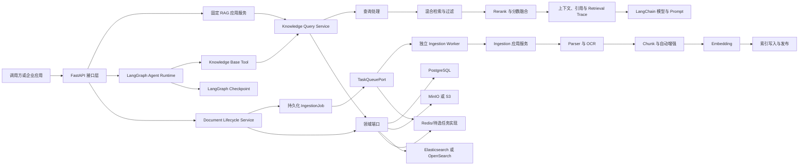

# Agent + RAG 项目总纲

## 0. 文档用途与阅读规则

本文件是 Codex 进入本项目时必须首先读取的文档。它定义项目目标、范围、职责边界、目标架构、统一术语、开发阶段、当前状态和长期维护规则。

新加入的 Codex 必须按以下顺序建立上下文：

1. 读取本文件。
2. 读取 [`docs/07-decisions-and-risks.md`](./07-decisions-and-risks.md)；独立 `docs/adr/` 文件当前尚未生成。
3. 根据任务读取本文件第 18 节索引中的专项文档；未生成的文档不得被当成已有事实。
4. 实施某个阶段前读取对应 `docs/phases/` 文件；Phase 00 至 Phase 05 已完成，Phase 06 至 Phase 10 为“预规划草案/未执行”，真正执行前必须复审并确认。
5. 检查实际代码、数据库迁移和自动化测试，确认“已实现状态”没有与文档漂移。

### 0.1 状态标签

本文使用以下标签，后续维护时不得省略或混用：

- **[事实]**：已通过用户确认、当前项目文件检查或固定版本源码检查得到。
- **[决策]**：用户已经明确接受，后续实现必须遵守，除非新决策替代。
- **[规划]**：目标设计或计划能力，尚未实现。
- **[待确认]**：尚未获得用户决定，不得擅自固化为实现约束。
- **[范围外]**：明确不在当前项目范围内。
- **[风险]**：可能影响正确性、进度、许可证合规、稳定性或可维护性的事项。

### 0.2 事实优先级

发生冲突时按以下规则处理：

1. 用户最新的明确指令优先。
2. 已接受且未被替代的 ADR 优先于一般规划描述。
3. 本文件定义目标、范围和当前阶段。
4. 专项文档定义对应领域的详细设计，但不得扩大本文件确定的范围。
5. 阶段文档定义阶段任务和验收条件，但不得修改总体架构。
6. 代码、数据库迁移和测试是“当前实际实现”的事实依据；代码存在不代表其设计合理，也不自动改变目标架构。

发现冲突时，Codex 必须指出冲突、确认正确来源并同步更新受影响文档，不能静默选择其中一个版本。

---

## 1. 项目背景与最终目标

### 1.1 背景

- **[事实]** 项目根目录是 `D:/download/ragflow-agent`。
- **[决策]** 项目名和发行包名为 `ragflow-agent`，import package 为 `ragflow_agent`，计划源码根目录为 `src/ragflow_agent`。
- **[事实]** 本项目不是对 RAGFlow 仓库的二次部署，而是一个独立运行的 Agent + RAG 项目。
- **[事实]** 初期展示数据可以使用轨道交通智能运维场景，包括运维手册、告警日志、历史工单、故障案例、设备图片和其他多模态资料。
- **[决策]** 底层架构必须保持行业无关，未来可扩展到 OA、财务、采购、HR、生产工艺和其他企业知识场景。

### 1.2 最终目标

**[规划]** 建设一个可独立部署、可持续演进、可评测、可追踪的企业级 Agent + RAG 系统，形成下列完整能力：

1. 基于 LangGraph 的流程编排、条件路由、状态管理、循环、重试、Checkpoint、Human-in-the-loop 和多 Agent 协作。
2. 基于 LangChain 的模型适配、Embedding、Retriever、Tool、Prompt、结构化输出和通用组件集成。
3. PDF、Word、PowerPoint、Excel、文本、Markdown、HTML、图片、音频和邮件的解析入口。
4. OCR、版面分析、表格识别、图片内容处理和统一文档结构输出。
5. 针对通用文档、论文、书籍、手册、法律法规、问答、表格、简历、图片、音频和邮件的 Chunk Method。
6. Chunk 自动关键词、自动问题、摘要、标题和 TOC 生成。
7. Embedding 生成、批处理、索引写入、索引版本管理和模型切换后的重建。
8. 全文检索、向量检索和混合检索。
9. 查询改写、独立问题生成、跨语言查询和关键词扩展。
10. 元数据过滤、权限过滤、空结果降级、候选去重和无效结果清理。
11. Reranker、全文与向量分数融合、阈值、候选 TopK 和最终 TopN。
12. 引用、来源定位、文档版本定位和 Retrieval Trace。
13. 文档上传、更新、删除、重新解析、失败重试、取消任务和索引同步。
14. GraphRAG、RAPTOR、多模态 RAG、时序 RAG 和 Agentic RAG。
15. 固定 RAG 问答和 Agent 调用知识库 Tool 两条使用路径。
16. FastAPI 接口、后台任务、日志、指标、链路追踪、RAG 评测、权限控制和生产部署。

所有能力必须区分“目标存在”和“当前已实现”。未通过代码、迁移和测试验证的能力只能标记为 **[规划]**。

---

## 2. 明确不做什么

1. **[范围外]** 不直接修改、部署或运营 RAGFlow。
2. **[范围外]** 不把调用 RAGFlow HTTP API 作为本项目知识库实现。
3. **[范围外]** 不将 RAGFlow 作为运行时强依赖或隐藏在本项目后的黑盒服务。
4. **[范围外]** 不复制 RAGFlow 完整仓库后进行删减式开发。
5. **[范围外]** 不复现或分析 RAGFlow 的 Go 实现；RAGFlow 分析范围仅限 Python 路径、相关文档、配置和测试。
6. **[范围外]** 不采用 RAGFlow Canvas 作为本项目 Agent 编排核心。
7. **[规划]** 时序 RAG 作为 Phase 09 的低优先级实验性自研能力；RAGFlow 的 timeline knowledge compilation 只作为局部设计证据，不能被描述成完整时序 RAG。
8. **[范围外]** 不把轨道交通字段写死在通用领域模型、统一检索接口或基础设施接口中。
9. **[范围外]** 不把规划能力描述成已完成能力。
10. **[范围外]** 不在没有许可证和依赖审计的情况下复制 RAGFlow 源文件。

---

## 3. 当前项目状态与 RAGFlow 双基线

### 3.1 当前项目状态

- **[事实]** Phase 00 最初在 `D:/download/myself` 建立文档基线；该原始目录状态属于历史快照，详见 [`docs/research/project-baseline.md`](./research/project-baseline.md)。
- **[事实]** 当前项目已迁移并初始化在 `D:/download/ragflow-agent`，默认分支为 `main`，远程 `origin` 实际配置为 `https://github.com/haonanhu02-jpg/ragflow-agent.git`。
- **[事实]** P01-T01 开始前，`main` 与 `origin/main` 均指向 Phase 00 基线 commit `5c015405e4c25346999cbb21736c61a87d5f8cbe`，工作树干净。
- **[事实]** 当前项目已有 Git 元数据、`AGENTS.md`、总体/阶段文档、可安装 `src/ragflow_agent` 包、类型化配置、日志/Trace、基础设施端口、SQLAlchemy/Alembic 空基线、FastAPI 与 Worker 进程入口、LangGraph Agent Runtime、测试、GitHub Actions 和 Docker 开发拓扑。
- **[事实]** Phase 01 使用 Python 3.13 和 `uv` 建立项目 `.venv` 与可复现 `uv.lock`，配置 pytest、ruff、strict mypy、导入边界和密钥卫生门禁；`.venv` 是本地忽略产物。
- **[事实]** 项目已实现与知识库解耦的最小 Agent 基础：AgentState/Event v1、Graph/Node/Edge/Router、结构化模型/Tool 端口、重试/超时/取消、官方 PostgreSQL Checkpointer 的租户作用域适配、Trace 和确定性最小闭环。
- **[事实]** 项目已实现 Phase 03 知识领域模型、状态机、AuthorizationContext/PermissionChecker、统一 Ports、KnowledgeService/KnowledgeQueryService 和内存契约 Adapter。
- **[事实]** Phase 04 已实现最小 ingestion、模型 Provider、Elasticsearch BM25/KNN/RRF、固定 RAG、Citation/Trace、知识 API 和 Redis/ARQ Worker；真实 PostgreSQL/MinIO/Redis/Elasticsearch 测试通过。
- **[事实]** Phase 05 已实现 TXT、Markdown、HTML、DOCX、PPTX、XLSX、PDF、图片八类 Parser，外部 Tesseract CPU OCR，统一 ParsedDocument/Chunk schema v2，General/Paper/Book/Manual/Laws/QA/Table/Resume/Picture 九种 Chunk Method，以及 bbox/来源元数据到 Elasticsearch/Citation 的闭环。
- **[事实]** 外部 DeepSeek/BGE-M3 服务、模型型复杂版面、完整在线检索策略、KnowledgeBaseTool、生命周期一致性和生产部署仍未实现；CI 的 Chat/Embedding 仍只使用 Fake/Stub Provider，Tesseract 则使用真实运行时。
- **[事实]** Phase 00 至 Phase 05 已完成；当前处于 Phase 06 计划复审门禁。

### 3.2 双基线定义

#### 冻结事实基线

- **[决策]** 仓库：`infiniflow/ragflow`
- **[决策]** 完整 commit：`cd846cc9d4e32a19e684c59a1f302601027ef976`
- **[事实]** 观察日期：2026-07-27
- **[事实]** 该 commit 的 `pyproject.toml` 标识 RAGFlow 版本为 `0.26.4`，Python 要求为 `>=3.13,<3.14`。
- **[决策]** 所有长期保留的 RAGFlow 源码结论必须优先链接到此 commit，而不是浮动 `main`。

#### 滚动跟踪基线

- **[决策]** 跟踪分支：`main`
- **[事实]** 2026-07-30 最后观察到的 `main` commit 为 `0cb4039be9c0691f89c391c5cc28ab40682a8163`，已不同于冻结事实基线；该滚动提交的最新变化涉及 Go ingestion 修复，不改变本项目 Python-only 冻结结论。
- **[决策]** 后续跟踪只记录与冻结基线相关的能力变化、修复、迁移和删除，不自动改变本项目设计。
- **[决策]** 升级冻结基线必须形成 ADR，并重新检查源码路径、调用关系、复用判断和许可证。

#### 本地辅助快照

- **[事实]** 本地 RAGFlow 位于 `D:/ragflow/ragflow-main`。
- **[事实]** 本地目录没有 `.git`，不能确定准确来源 commit。
- **[事实]** 本地 `pyproject.toml` 标识版本为 `0.26.4`。
- **[事实]** 与冻结 commit 对比时，`agent/tools/retrieval.py` 和 `rag/advanced_rag/agentic_rag_graph.py` 的 Git blob 一致；`pyproject.toml`、`AGENTS.md`、`rag/svr/task_executor_refactor/task_handler.py`、`rag/nlp/search.py` 和 `api/db/db_models.py` 不一致。
- **[决策]** 本地快照只用于快速阅读和搜索。结论无法在冻结 commit 验证时，必须显式标记为“本地快照事实”。
- **[事实]** 完整双基线、63 个相关变更路径摘要和关键文件 blob 对比见 [`docs/research/ragflow-baseline.md`](./research/ragflow-baseline.md)。

---

## 4. RAGFlow 在本项目中的定位

### 4.1 定位

RAGFlow 在本项目中承担四种参考角色：

1. **[决策] 功能蓝本**：确定成熟知识库系统需要覆盖的解析、Chunk、索引、检索、引用、生命周期和高级 RAG 能力。
2. **[决策] 源码候选库**：识别可直接复用或经过适配后复用的 Python 实现。
3. **[决策] 设计参考**：对于与 RAGFlow 内部框架深度耦合的代码，只提取设计思想、数据流和算法，不复制运行时架构。
4. **[决策] 差距证据**：记录 RAGFlow、LangChain 和 LangGraph 都无法完整提供的能力，转入本项目自研范围。

### 4.2 已确认的 RAGFlow Python 架构事实

- **[事实]** Python API 使用 Quart，数据访问主要使用 Peewee，后台解析使用异步 Task Executor。
- **[事实]** `api/` 负责接口、服务和关系数据库代码。
- **[事实]** `rag/` 负责 ingestion、检索、模型集成、Prompt 和高级 RAG。
- **[事实]** `deepdoc/` 负责深度文档解析、OCR 和版面相关处理。
- **[事实]** `agent/` 负责 Canvas、组件、Tool、插件和 Agent 模板。
- **[事实]** `common/settings.py` 初始化数据库、对象存储、Redis、DocStore 和 Retriever 全局连接。
- **[事实]** 关系数据库保存 Knowledgebase、Document、File、Task、Dialog、Conversation 和 UserCanvas；Chunk 主要作为搜索引擎文档管理。
- **[事实]** RAGFlow 的主要 Agent 运行时是自研 Canvas DSL；LangGraph 只用于 `rag/advanced_rag/agentic_rag_graph.py` 的高级检索图。

---

## 5. LangChain、LangGraph、RAGFlow 和自研代码的职责边界

| 能力域 | LangChain 职责 | LangGraph 职责 | RAGFlow 参考或复用职责 | 本项目自研职责 |
|---|---|---|---|---|
| 模型调用 | Chat Model、Embedding、Reranker 适配；Prompt；结构化输出 | 不负责模型驱动实现 | 参考 `LLMBundle` 的模型分类和租户配置思路 | 模型注册、密钥策略、配额、降级、成本记录 |
| Agent 编排 | Tool、Retriever、Runnable 标准组件 | 状态、节点、路由、循环、重试、Checkpoint、HITL、多 Agent | 参考 Retrieval Tool 的输入、输出和引用回写；不复用 Canvas 运行时 | AgentState、图定义、运行记录、Tool 权限、失败恢复 |
| 文档解析 | 可使用标准 Loader 作为简单格式适配 | 不负责 | 重点分析 `deepdoc/`、`rag/app/` 和 Parser/Chunk 路由 | 统一 ParsedDocument、隔离适配、错误模型、资源治理 |
| Chunk | Text Splitter 可承接基础切分 | 不负责 | 参考或抽取针对论文、手册、表格、图片和邮件的策略 | ChunkStrategy 接口、版本、稳定 ID、领域无关配置 |
| Embedding | Embeddings 标准接口 | 不负责 | 参考标题与正文组合、批处理和索引字段生成 | Embedding 任务、模型版本、重建和索引发布 |
| 检索 | Retriever、VectorStore 组件 | Agent 检索循环和路由 | 参考全文、向量、混合检索、融合、过滤、Rerank、TOC 和子块召回 | 统一 RetrievalQuery/Result、SearchPort、降级、Trace |
| 生成与引用 | Chat Model、Prompt、输出解析 | 决定何时生成、何时继续搜索 | 参考 `kb_prompt`、`citation_prompt` 和引用修复流程 | Citation 数据模型、来源定位、版本定位、证据审计 |
| 文档生命周期 | 无完整覆盖 | 可编排但不负责一致性 | 参考上传、解析任务、删除、重解析和索引更新流程 | 版本状态机、幂等、补偿、原子发布、索引同步 |
| 高级 RAG | 提供部分组件 | 适合编排 Agentic RAG | 参考 GraphRAG、RAPTOR、多模态和高级检索图 | 统一集成、质量评测、资源限制、失败降级 |
| API 与运行平台 | 不负责完整服务 | 不负责 HTTP 服务 | API 和 Service 只参考调用关系 | FastAPI、持久化、后台任务、日志、权限、部署 |
| 评测 | 可接入外部评测组件 | 可记录图执行 | RAGFlow benchmark 主要提供性能压测参考 | 检索、生成、引用、Agent、性能和回归评测体系 |

边界规则：

1. **[决策]** LangGraph 是目标 Agent 运行时，不能由 RAGFlow Canvas 替代。
2. **[决策]** LangChain 组件必须通过本项目应用服务使用，不能直接承担领域状态和文档生命周期。
3. **[决策]** RAGFlow 代码必须经过“直接复用、适配复用、设计参考、自研替代”分类后才能进入实现。
4. **[规划]** 业务层只依赖统一接口，不依赖 RAGFlow `common.settings`、Peewee Model、Quart Request 或全局单例。

---

## 6. 目标系统总体架构

以下架构同时表达已经确认的第一版运行拓扑：模块化单体、同一代码仓库、FastAPI API 进程与独立 Ingestion Worker 进程通过任务队列协作。它不表示已经拆分微服务。



### 6.1 架构层次

1. **接口层**：FastAPI 路由、请求校验、认证上下文、流式响应。
2. **应用层**：固定 RAG、Agent、知识库管理、文档生命周期、Ingestion、检索和评测用例。
3. **领域层**：KnowledgeBase、Document、DocumentVersion、Chunk、IngestionJob、RetrievalTrace、Citation 和状态规则。
4. **端口层**：存储、解析、Chunk、Embedding、索引、检索、Rerank、任务、权限和追踪接口。
5. **基础设施层**：PostgreSQL、Redis、MinIO/S3、Elasticsearch/OpenSearch、模型供应商和 RAGFlow 适配代码。

### 6.2 已接受技术基线

- **[决策]** Python 3.13。
- **[决策]** `uv` 负责 Python 环境和依赖锁定。
- **[决策]** FastAPI。
- **[决策]** LangChain。
- **[决策]** LangGraph。
- **[决策]** PostgreSQL。
- **[决策]** SQLAlchemy 2 和 Alembic。
- **[决策]** Redis。
- **[决策]** MinIO/S3 兼容对象存储。
- **[决策]** Elasticsearch 或 OpenSearch 必须通过统一 SearchPort 使用。

### 6.3 已接受的第一版运行与权限边界

- **[决策]** 第一版采用“模块化单体 FastAPI + 独立 Ingestion Worker”。
- **[决策]** API 与 Worker 位于同一代码仓库，复用统一领域模型、应用服务和基础设施端口；它们是不同进程入口，不通过内部 HTTP 相互调用。
- **[决策]** API 负责认证、命令校验、原始文件登记、`IngestionJob` 持久化和任务投递；Worker 负责 Parser、OCR、Chunk、Embedding、索引写入、进度与补偿。
- **[决策]** 第一版不拆微服务。允许 API 与 Worker 分别启动和扩缩容，但不建立独立版本、重复领域模型或服务间 REST 契约。
- **[决策]** 第一版领域模型和端口必须保留多租户、ACL 与数据权限演进空间。
- **[决策]** 第一版至少实现强制 `tenant_id` 隔离、`owner_id`、`visibility`、`AuthorizationContext` 和 `PermissionChecker`。
- **[决策]** 复杂 RBAC、部门权限和动态数据规则不在第一版实现，保留到后续阶段。

### 6.4 尚未接受的架构事项

- **[待确认]** RAGFlow 复用代码采用内部包、独立适配包还是独立 Worker。
- **[待确认]** 首个搜索引擎选择 Elasticsearch 还是 OpenSearch。
- **[待确认]** 后台任务库和可靠消息方案。

这些事项在解释并得到用户确认前，不得写成既定实现。任务队列是已确认的进程边界，但具体任务库、投递语义、重试和死信实现仍待决定。

---

## 7. 离线知识库构建链路

### 7.1 RAGFlow 已确认链路

RAGFlow Python 标准链路为：

```text
Document API 上传
→ FileService 写入对象存储并创建 File/Document
→ DocumentService.run
→ TaskService.queue_tasks 拆分任务并写入队列
→ Task Executor 收取任务
→ TaskHandler 选择标准、GraphRAG、RAPTOR 或 Pipeline 分支
→ ChunkService.build_chunks
→ chunk_builder.get_parser / run_chunking
→ rag.app 对应 Chunk Method
→ deepdoc 执行解析、OCR 和版面处理
→ 自动关键词、自动问题、元数据、标签和 TOC
→ EmbeddingService.embed_chunks
→ ChunkService.insert_chunks
→ DocStore 写入搜索引擎
→ 更新 Document/Knowledgebase 统计和任务状态
```

关键源码位置见第 19 节 `RF-OFF-*` 条目。

### 7.2 本项目目标链路

以下步骤均为 **[规划]**：

1. 接收文件、外部数据源记录或重新解析请求。
2. 校验文件类型、大小、内容哈希、调用权限和重复上传策略。
3. 将原始文件写入 ObjectStoragePort。
4. 创建带 `tenant_id` 的 Document、DocumentVersion 和 IngestionJob。
5. API 通过 TaskQueuePort 投递只含 `tenant_id + job_id` 等稳定标识的版本化任务。
6. 独立 Ingestion Worker 校验消息 tenant，并按 `tenant_id + job_id` 从关系库加载完整业务状态。
7. 根据文件格式、知识库配置和显式 Chunk Method 选择 ParserPort。
8. 解析为统一 ParsedDocument，保留页码、标题层级、段落、表格、图片、坐标和解析警告。
9. 通过 ChunkerPort 生成稳定 Chunk，记录解析版本、Chunk 策略版本和父子关系。
10. 按配置生成关键词、问题、摘要、标题和 TOC。
11. 生成 Embedding，记录模型标识、维度和 Embedding 版本。
12. 将全文字段、向量字段、元数据、强制 tenant/权限字段和来源字段写入候选索引版本。
13. 完成完整性检查后原子激活新 DocumentVersion 和索引版本。
14. 更新任务、文档和知识库统计，写入 Ingestion Trace，并按任务协议 ACK。
15. 失败时保留旧的可用版本，记录失败阶段，并支持从安全检查点重试。

### 7.3 生命周期要求

- **[规划]** 更新文档必须产生新版本，不能直接破坏当前可检索版本。
- **[规划]** 删除必须同时处理关系数据、对象存储、搜索索引、GraphRAG/RAPTOR 派生数据和引用可见性。
- **[规划]** 重新解析必须复用原始文件并生成新的 IngestionJob。
- **[规划]** 每个写入步骤必须幂等，重复消费任务不能产生重复 Chunk。
- **[规划]** Embedding 模型或维度变更必须触发独立索引版本和重建流程。

---

## 8. 在线检索与回答链路

### 8.1 RAGFlow 已确认链路

RAGFlow Python 在线链路的核心为：

```text
Chat API / DialogService.async_chat
→ 模型和知识库配置解析
→ 问题独立化、关键词和跨语言处理
→ 元数据过滤
→ Dealer.retrieval
→ Dealer.search 构造全文和向量检索
→ 删除孤儿 Chunk
→ 外部 Reranker 或本地全文/向量融合
→ 相似度阈值、TopK 和 TopN
→ TOC、子 Chunk、Web 或 GraphRAG 补充
→ kb_prompt 构造上下文
→ LLM 流式生成
→ citation_prompt 和引用匹配
→ 返回答案、Chunk、文档聚合和引用
```

`rag/nlp/search.py::Dealer.retrieval` 明确包含 `similarity_threshold`、`vector_similarity_weight`、`top`、`doc_ids`、`rerank_mdl` 和 `trace_id`，并按搜索引擎类型选择不同融合路径。

### 8.2 本项目目标链路

以下步骤均为 **[规划]**：

1. 接收 RetrievalQuery 或固定 RAG 问题。
2. 从可信认证结果建立 `AuthorizationContext`，由 `PermissionChecker` 注入不可删除的 tenant、owner 和 visibility 条件。
3. 将多轮问题改写为独立问题。
4. 按配置执行跨语言查询和关键词扩展。
5. 规范化元数据过滤表达式并验证允许过滤的字段。
6. 并行或按后端能力执行全文检索和向量检索。
7. 对空结果执行配置化降级，包括降低阈值、放宽改写条件或返回明确空结果；具体策略为 **[待确认]**。
8. 删除无效、已删除、版本失效和重复候选。
9. 进行全文分数、向量分数、PageRank 或业务特征融合。
10. 按配置调用 Reranker。
11. 应用相似度阈值、候选 TopK、每文档限额和最终 TopN。
12. 按需要执行父子 Chunk、邻近 Chunk、TOC、GraphRAG 或 RAPTOR 补充。
13. 生成有预算限制的 ContextBundle。
14. 固定 RAG 路径调用生成模型；Tool 路径返回结构化证据给 Agent。
15. 构建 Citation，定位知识库、文档、文档版本、Chunk、页码和内容片段。
16. 持久化 RetrievalTrace，记录查询变换、过滤条件、候选、各阶段分数、模型、延迟和最终选中结果。

---

## 9. Agent 运行链路

### 9.1 RAGFlow Agent 事实

- **[事实]** `agent/canvas.py::Graph` 读取组件和上下游关系。
- **[事实]** `agent/canvas.py::Canvas.run/_run_impl` 负责 Canvas DSL 的组件执行、历史、变量、检索引用和流式事件。
- **[事实]** `agent/tools/retrieval.py::Retrieval._retrieve_kb` 解析知识库、Embedding 模型、Reranker、元数据过滤和跨语言配置，并调用公共 Retriever。
- **[事实]** `rag/advanced_rag/agentic_rag_graph.py` 使用 LangGraph StateGraph，节点包括 `formalize_question`、`route`、`pre_search`、`planner`、`orchestrator_loop` 和 `formalize_answer`。
- **[事实]** 冻结基线中该图直接调用 `g.compile()`，没有传入 Checkpointer。

### 9.2 Phase 02 已实现的 Agent 基础

- **[事实]** `src/ragflow_agent/agent/graphs/minimal_agent.py::build_minimal_agent_graph` 实现 `normalize_input → decide → execute_tool → observe → decide/finish` 的最小 LangGraph。
- **[事实]** `AgentRuntime.run/resume` 使用版本化 AgentState、租户绑定恢复令牌、有限重试/超时/取消和 Trace 事件；真实 PostgreSQL 测试证明失败节点可由重建后的 Runtime 恢复。
- **[事实]** `LangChainStructuredModelAdapter` 和 `LangChainToolAdapter` 隔离标准组件；阶段门禁使用确定性模型和无副作用 Tool，没有绑定真实 Provider。
- **[事实]** 本阶段没有实现知识检索路由、KnowledgeBaseTool、HITL、记忆、多 Agent 或业务预算。

### 9.3 本项目目标 Agent 链路

下列完整业务链路仍为 **[规划]**；其中状态、基础 Tool 路由、Checkpoint 和技术运行限额已有 Phase 02 基础实现：

1. FastAPI 创建或恢复 Agent thread/run。
2. LangGraph 从 Checkpoint 加载 AgentState。
3. 输入规范化节点整理消息、`AuthorizationContext` 和运行配置；Checkpoint 恢复不能改变 tenant。
4. Router 判断直接回答、固定 RAG、知识库 Tool、其他 Tool、澄清问题或人工确认。
5. Planner 生成结构化计划；不需要规划的请求跳过 Planner。
6. Agent 选择 KnowledgeBaseTool 时，携带同一 `AuthorizationContext` 通过统一 KnowledgeQueryService 检索。
7. KnowledgeBaseTool 返回 RetrievalResult、Citation 和 RetrievalTrace 标识，不直接拼接不可追踪字符串。
8. Agent 观察 Tool 结果并决定生成答案、继续检索、改写问题、调用其他 Tool、请求人工介入或终止。
9. 循环和重试必须具有最大次数、超时、取消和错误分类。
10. 每个有恢复价值的节点写入 Checkpoint。
11. 最终回答附带 Citation、运行标识、使用的 Tool 和必要的 Retrieval Trace。
12. 多 Agent 仅在单 Agent + Tool 无法清晰完成的任务中引入，并要求独立状态、消息边界和终止条件。

---

## 10. 固定 RAG 与知识库 Tool

两条路径必须共享同一个知识库核心，不能各自实现检索算法。

| 项目 | 固定 RAG | 知识库 Tool |
|---|---|---|
| 调用入口 | 固定问答 API 或应用服务 | LangGraph Agent 节点 |
| 知识库范围 | 预配置或请求显式指定 | Agent 配置、Tool 参数或受控路由指定 |
| 检索实现 | KnowledgeQueryService | 同一个 KnowledgeQueryService |
| 生成 | 检索后直接进入固定 Prompt 和 LLM | Agent 决定是否继续调用 Tool 或生成 |
| 输出 | Answer、Citation、RetrievalTrace | RetrievalResult、Citation、RetrievalTrace；最终 Answer 由 Agent 生成 |
| 适用场景 | 稳定、可预测、低延迟知识问答 | 多步骤任务、动态路由、多 Tool、HITL |
| 失败行为 | 空结果响应或配置化降级 | 将结构化空结果或错误返回 Agent 决策 |

约束：

1. **[规划]** `KnowledgeQueryService.retrieve()` 是两条路径的共同入口。
2. **[事实]** Phase 04 固定 RAG 不经过 Agent 图，以避免不必要的延迟和不确定性。
3. **[规划]** Agent 不得绕过知识库服务直接访问搜索引擎。
4. **[规划]** 两条路径使用同一 RetrievalQuery、RetrievalResult、Citation 和 RetrievalTrace。

---

## 11. 模块与目录规划

以下是总体目录目标。`bootstrap/`、`api/`、`agent/`、`observability/`、`knowledge/{domain,ports,application,infrastructure}` 和部分顶层 `infrastructure/` 已由 Phase 01 至 Phase 04 创建；其余目录仍属 **[规划]**。ADR-016 已冻结 Python 包路径为 `src/ragflow_agent`，目录出现不表示对应完整业务能力已经实现。

```text
D:/download/ragflow-agent/
├── pyproject.toml
├── uv.lock
├── README.md
├── AGENTS.md
├── .env.example
├── src/
│   └── ragflow_agent/
│       ├── bootstrap/
│       │   ├── api.py
│       │   └── ingestion_worker.py
│       ├── api/
│       ├── agent/
│       ├── knowledge/
│       │   ├── domain/
│       │   ├── application/
│       │   └── ports/
│       ├── ingestion/
│       ├── parsing/
│       ├── chunking/
│       ├── enrichment/
│       ├── embedding/
│       ├── indexing/
│       ├── retrieval/
│       ├── generation/
│       ├── citations/
│       ├── lifecycle/
│       ├── advanced_rag/
│       ├── evaluation/
│       ├── observability/
│       ├── security/
│       └── infrastructure/
│           ├── database/
│           ├── object_storage/
│           ├── search/
│           ├── queue/
│           ├── models/
│           └── ragflow_adapters/
├── migrations/
├── tests/
│   ├── unit/
│   ├── integration/
│   ├── contract/
│   ├── e2e/
│   ├── evaluation/
│   └── fixtures/
├── scripts/
├── deployments/
└── docs/
```

目录规则：

1. `domain/` 不得导入 FastAPI、SQLAlchemy、Redis、Elasticsearch、OpenSearch、MinIO 或 RAGFlow。
2. `ports/` 只定义稳定接口和领域数据结构。
3. `bootstrap/api.py` 和 `bootstrap/ingestion_worker.py` 是同一模块化单体的两个进程入口；二者使用同一领域模型、应用服务和端口。
4. API 与 Worker 之间只传递版本化任务消息和稳定 ID，不传递不可控的大型 Python 对象，也不通过内部 HTTP 形成伪微服务。
5. `infrastructure/ragflow_adapters/` 是未来允许出现 RAGFlow 派生代码和适配依赖的唯一默认位置；Phase 04 没有任何派生代码，后续首次复制或修改前必须重新进行许可证审查并形成 ADR。
6. `api/` 不包含解析、检索融合或 Agent 业务算法。
7. `agent/` 通过 Tool 和应用服务访问知识库，不直接调用基础设施。
8. `tests/contract/` 验证不同搜索、对象存储、模型和 RAGFlow 适配实现遵守统一接口。

---

## 12. 核心统一接口和数据结构

本节同时记录 Phase 03 已实现契约与后续目标；实际 v1 字段、状态机和端口以 [`docs/08-domain-model-and-contracts.md`](./08-domain-model-and-contracts.md) 及通过测试的源码为准，未出现于 v1 的字段仍是 **[规划]**。

### 12.1 统一接口

| 接口 | 最小职责 |
|---|---|
| `KnowledgeBaseRepository` | 创建、读取、更新知识库配置和统计 |
| `DocumentRepository` | 管理 Document、DocumentVersion、状态和内容哈希 |
| `IngestionJobRepository` | 管理任务状态、阶段、重试次数、错误和检查点 |
| `ObjectStoragePort` | tenant-namespaced 原始/派生对象的流式 put/read/delete |
| `ParserPort` | `ParseRequest -> ParsedDocument` |
| `ChunkerPort` | `ChunkingRequest -> tuple[ChunkRecord, ...]` |
| `EnrichmentPort` | 生成关键词、问题、摘要、标题和 TOC |
| `EmbeddingPort` | `EmbeddingRequest -> EmbeddingResult` |
| `SearchIndexPort` | 创建索引版本、批量写入、删除、搜索、激活和回收 |
| `RetrieverPort` | `RetrievalQuery -> RetrievalResult` |
| `RerankerPort` | `RerankRequest -> list[ScoredCandidate]` |
| `CitationPort` | 根据最终证据生成和验证 Citation |
| `IngestionQueuePort` | 发布版本化 `IngestionEnvelope`；消费、ACK、DLQ 和取消属于后续 Adapter |
| `PermissionChecker` | 使用 `AuthorizationContext` 验证租户、所有者和可见性，并生成不可被调用方删除的检索权限约束 |
| `TraceSink` | 写入 Ingestion Trace、Retrieval Trace、Agent Trace 和模型调用指标 |

LangChain 的 Chat Model、Embedding、Tool、Prompt 和 Structured Output 优先使用标准接口；LangGraph 的 Checkpointer 优先使用官方协议。只有出现明确的业务语义缺口时才增加包装层。

### 12.2 核心数据结构

| 数据结构 | 关键字段 |
|---|---|
| `AuthorizationContext` | v1：`tenant_id`、`actor_id`、`request_id`；Phase 02 Agent 快照 `user_id` 由 Adapter 显式映射 |
| `KnowledgeBase` | v1：`id`、`tenant_id`、`owner_id`、`visibility`、`name`、`description`、`status`、时区时间 |
| `Document` | v1：`id`、`tenant_id`、`owner_id`、`visibility`、`knowledge_base_id`、`name`、`current_version_id`、`status`、时区时间 |
| `DocumentVersion` | v1：`id`、`tenant_id`、`knowledge_base_id`、`document_id`、对象键、MIME、内容哈希/算法、大小、状态、时区时间 |
| `IngestionJob/Task` | v1：tenant/job/document_version、stage、status、attempt、progress、结构化 error、idempotency、trace 和时间 |
| `ParsedDocument/ParsedBlock` | v1：tenant/document_version、parser identity、顺序 Block、页码、显式坐标系/bbox、heading、表格和图片 |
| `ChunkRecord` | v1：稳定 `sha256-v1` ID、tenant/document_version、content、source_block_ids、parent、页范围和 token_count |
| `IndexVersion/IndexRecord` | v1：tenant/KB、Embedding 兼容身份；Record 含 owner/visibility、文档版本、Chunk、MIME、时间、向量和来源元数据 |
| `RetrievalQuery` | v1：`tenant_id`、`text`、KB IDs、白名单 MetadataFilter、`top_k`、`top_n`、`trace_id` |
| `RetrievalCandidate` | v1：tenant/KB/DocumentVersion/Chunk、内容、分项分数和同范围 Citation |
| `RetrievalResult` | v1：原查询、候选、Trace、派生 citations 和结构化 `empty_reason` |
| `Citation` | `tenant_id`、`knowledge_base_id`、`document_id`、`document_version_id`、`chunk_id`、`page`、`bbox`、`quote`、`source_uri` |
| `RetrievalTrace` | `tenant_id`、原始查询、改写查询、权限与元数据过滤条件、候选阶段、各阶段分数、模型、参数、延迟、错误、最终选择 |
| `AgentState` | `AuthorizationContext`、消息、用户输入、计划、当前节点、Tool 调用、Retrieval Trace、Citation、重试计数、HITL 状态、最终答案 |

第一版 `visibility` 已由 ADR-018 固化为 `private|tenant`。`tenant_id` 是不可绕过的第一层过滤条件；跨租户访问默认拒绝，不能仅依赖调用方传入的知识库 ID、搜索索引命名或生成后的结果清理。

### 12.3 已实现状态机与后续边界

Phase 03 `DocumentVersion` v1 已实现：

```text
REGISTERED -> INGESTING -> READY -> SUPERSEDED -> DELETED
                    |         \---------------> DELETED
                    +-> FAILED -> INGESTING
                    |       \------------------> DELETED
                    \--------------------------> DELETED
```

Phase 03 `IngestionJob/Task` v1 已实现 `PENDING -> RUNNING -> SUCCEEDED|FAILED|CANCELLED`，retryable FAILED task 以递增 attempt 返回 RUNNING；阶段为 REGISTER/PARSE/CHUNK/EMBED/INDEX。完整更新、删除、原子索引发布、补偿、残留清理和批量状态属于 Phase 07，不能把 v1 状态函数描述为生命周期已完成。

---

## 13. RAGFlow 代码复用原则

### 13.1 四级分类

#### A. 直接复用

- 仅限依赖边界清晰、输入输出明确、没有全局状态、许可证完整、可由独立测试覆盖的 Python 代码。
- **[事实]** 当前尚未批准任何 RAGFlow 文件直接进入本项目。

#### B. 抽取并适配后复用

优先评估：

1. `deepdoc/` 的 OCR、版面分析和文档解析能力。
2. `rag/app/` 的格式与场景 Chunk Method。
3. `rag/svr/task_executor_refactor/chunk_builder.py` 的 Parser 路由思想。
4. `rag/svr/task_executor_refactor/chunk_service.py` 的 Chunk 增强顺序。
5. `rag/svr/task_executor_refactor/embedding_service.py` 的标题/正文 Embedding 和批处理逻辑。
6. `rag/nlp/query.py` 和 `rag/nlp/search.py` 的全文、向量、融合、阈值和 Rerank 算法。
7. `rag/prompts/generator.py` 的上下文与引用提示。
8. GraphRAG、RAPTOR、TOC 和多模态中的独立算法模块。

适配代码必须将 RAGFlow 的 `common.settings`、Peewee Service、LLMBundle、对象存储全局变量、Redis 全局连接和 DocStore 具体实现替换为本项目端口。

#### C. 只参考设计

1. Quart API 路由和请求上下文。
2. Peewee 数据模型和 Service 层。
3. `common/settings.py` 全局初始化方式。
4. `rag/svr/task_executor.py` 进程级 Worker 组织。
5. `agent/canvas.py` Canvas DSL 和运行时。
6. `Dialog`、`Conversation`、`UserCanvas` 的产品数据模型。

这些代码与 RAGFlow 产品形态和运行时耦合，不作为目标架构基础。

#### D. 本项目自行开发

1. 领域模型和统一端口。
2. FastAPI 应用层。
3. LangGraph AgentState、Checkpoint、HITL 和多 Agent 运行治理。
4. 文档版本、幂等任务、原子索引发布和一致性补偿。
5. 固定 RAG 与 KnowledgeBaseTool 的共享服务。
6. Retrieval Trace 和引用审计。
7. 权限模型与检索权限过滤；第一版实现 tenant 强制隔离、owner/visibility、`AuthorizationContext` 和 `PermissionChecker`，复杂权限后置。
8. 检索、生成、引用、Agent、性能和回归评测框架。
9. 生产配置、健康检查、指标、告警、备份和恢复。

### 13.2 许可证规则

- **[事实]** RAGFlow 冻结基线使用 Apache License 2.0。
- **[决策]** 复制或修改 RAGFlow 源码时必须保留适用的版权、专利、商标和归属声明。
- **[决策]** 修改后的文件必须明确标注已经修改。
- **[决策]** 分发时必须满足 Apache-2.0 的许可证副本和 NOTICE 条件。
- **[决策]** RAGFlow 的许可证不自动覆盖第三方 Python 包、模型权重、OCR 模型、字体、测试数据和原生二进制。
- **[规划]** 每个复用文件记录上游仓库、完整 commit、原始路径、许可证、修改说明、依赖和本项目测试。
- **[风险]** 本文是工程治理要求，不替代正式法律意见。

---

## 14. 开发阶段与阶段依赖

Phase 00 至 Phase 05 已完成；Phase 06 至 Phase 10 均为 **[规划]**。生成或确认计划不等于执行阶段，也不自动开始业务代码。

| 阶段 | 名称 | 主要产出 | 依赖 | 当前状态 |
|---|---|---|---|---|
| Phase 00 | 研究与基线 | RAGFlow Python 架构、能力矩阵、源码地图、复用分类、目标边界 | 无 | 已完成 |
| Phase 01 | 项目骨架 | Python 包、配置、FastAPI、独立 Worker、基础设施端口、测试与开发环境 | Phase 00 | 已完成；P01-T01 至 P01-T10 验收通过 |
| Phase 02 | Agent基础 | LangGraph State、Graph、Node、Edge、Router、Checkpoint、Tool、Trace 和最小 Agent 闭环 | Phase 01 | 已完成；P02-T01 至 P02-T10 验收通过 |
| Phase 03 | 知识库统一接口 | 核心实体、状态机、统一 Ports、第一版权限契约和契约测试 | Phase 02 | 已完成；P03-T01 至 P03-T11 验收通过 |
| Phase 04 | 最小RAG闭环 | 上传、TXT/Markdown/PDF、General Chunk、Embedding、Elasticsearch BM25/KNN/RRF、固定回答、引用和端到端测试 | Phase 03 | 已完成；P04-T01 至 P04-T12 验收通过 |
| Phase 05 | Parser与Chunk | 八类格式、OCR、版面、表格、Chunk 策略映射和元数据保留 | Phase 04 | 已完成；P05-T01 至 P05-T12 验收通过 |
| Phase 06 | 在线检索 | 查询改写、跨语言、全文/向量/混合检索、过滤、Rerank、融合、降级、Citation、Trace | Phase 04、Phase 05 | 预规划草案/未执行 |
| Phase 07 | 文档生命周期 | 更新、删除、重解析、索引版本、幂等、补偿和一致性 | Phase 05、Phase 06 | 预规划草案/未执行 |
| Phase 08 | Agentic RAG | KnowledgeBaseTool、查询规划、多次检索、Tool 选择、SQL/API Tool、HITL、记忆和预算 | Phase 02、Phase 06 | 预规划草案/未执行 |
| Phase 09 | 高级RAG | 自动关键词、自动问题、摘要、TOC、父子 Chunk、多模态 RAG、GraphRAG、RAPTOR、时序 RAG、开关和索引兼容 | Phase 05、Phase 06、Phase 08 | 预规划草案/未执行 |
| Phase 10 | 评测与生产化 | 质量/性能回归门禁、全链路观测、安全、部署、伸缩、备份恢复和运行手册 | Phase 07、Phase 08、Phase 09 | 预规划草案/未执行 |

依赖原则：

1. Phase 02 只建立 Agent Runtime，不绑定具体知识库或搜索引擎。
2. Phase 03 的统一接口完成前，不得让 Agent、API 或适配器直接绑定具体搜索引擎。
3. Phase 04 必须形成端到端可运行垂直切片，不能只创建抽象类。
4. Phase 05 和 Phase 06 完成后，Phase 07 才能验证完整生命周期一致性。
5. Phase 08 复用 Phase 02 的 Agent Runtime 和 Phase 06 的 `KnowledgeQueryService`，不能创建第二套检索实现。
6. Phase 10 虽然统一评测与生产化，但每个前置阶段都必须同时交付基础测试和可观测数据；部署完成不得以牺牲质量、引用正确性、权限或可恢复性为代价。

---

## 15. 当前阶段、已完成项和下一步

### 15.1 当前阶段

- **[事实]** Phase 00 的 `P00-T01` 至 `P00-T13` 已全部执行、验证并通过验收；用户于 2026-07-30 确认 Phase 00 完成。
- **[事实]** Phase 01 的 `P01-T01` 至 `P01-T10` 已全部执行并通过阶段验收。
- **[事实]** Phase 02 的 `P02-T01` 至 `P02-T10` 已全部执行并通过阶段验收。
- **[事实]** Phase 03 的 `P03-T01` 至 `P03-T11` 已全部执行并通过阶段验收。
- **[事实]** Phase 04 的 `P04-T01` 至 `P04-T12` 已全部执行并通过阶段验收。
- **[事实]** Phase 05 的 `P05-T01` 至 `P05-T12` 已全部执行并通过阶段验收；当前处于 Phase 06 计划复审门禁。
- **[事实]** Phase 06 至 Phase 10 为“预规划草案/未执行”。

### 15.2 已完成

1. **[事实]** 确认当前项目根目录为 `D:/download/ragflow-agent`；Git 仓库、`main` 和 `origin` 已存在。
2. **[事实]** 确认 RAGFlow 本地辅助快照和远程仓库。
3. **[决策]** 确认采用冻结 commit + 滚动 `main` 的双基线。
4. **[决策]** 确认只深入分析 RAGFlow Python，不分析或复现 Go。
5. **[决策]** ADR-014 恢复时序 RAG 为 Phase 09 实验性自研能力，并替代原 ADR-006；RAGFlow timeline 代码不构成完整实现。
6. **[事实]** 初步梳理 RAGFlow 离线构建、在线检索、固定问答和 Agent Knowledge Retrieval 主链路。
7. **[事实]** 初步确认 RAGFlow 核心模型、对象存储、Redis/Valkey、搜索引擎和模型适配依赖。
8. **[事实]** 初步确认 RAGFlow 主要 Agent 使用 Canvas，LangGraph 仅用于高级 Agentic RAG 图。
9. **[事实]** 初步确认 RAGFlow benchmark 主要统计 HTTP 性能，不是完整 RAG 质量评测。
10. **[决策]** 接受第 6.2 节技术基线。
11. **[事实]** 创建本项目主文档。
12. **[事实]** 创建 `01-ragflow-architecture.md` 至 `07-decisions-and-risks.md` 七份辅助文档。
13. **[决策]** 确认第一版采用模块化单体 FastAPI 与独立 Ingestion Worker，同仓库并通过任务队列连接。
14. **[决策]** 确认第一版强制租户隔离并实现 `tenant_id`、`owner_id`、`visibility`、`AuthorizationContext` 和 `PermissionChecker`；复杂 RBAC、部门权限和动态数据规则后置。
15. **[事实]** 补充核验 RAGFlow Python 的 API/Worker 启动、Redis Stream、任务 ACK/重试、Tenant/UserTenant、知识库可见性和检索索引隔离源码。
16. **[事实]** 创建并确认 `docs/phases/phase-00-research-and-baseline.md` 详细实施计划。
17. **[事实]** 已执行并验证 P00-T01 至 P00-T11：双基线、项目盘点、架构/数据/依赖、离线/在线/Agent/生命周期/权限/高级 RAG、当时范围内 42 项能力矩阵和 50 个复用源路径登记。
18. **[事实]** 已生成 `docs/research/ragflow-baseline.md`、`project-baseline.md` 和 `ragflow-source-map.md`；源码结论固定到 commit `cd846cc9d4e32a19e684c59a1f302601027ef976`。
19. **[事实]** P00-T12 原始跨文档一致性审计通过；14 个 Markdown 文件、当时 42 项能力、阶段编号、链接、表格和固定源码链接检查为零错误。
20. **[事实]** 用户随后确认 Phase 00 出口；ADR-013 将“研究阶段完成”和“下一阶段执行准入”分离，Phase 00 已完成。
21. **[事实]** Phase 01 至 Phase 10 详细计划已生成；Phase 01 至 Phase 05 已执行，Phase 06 至 Phase 10 未执行。
22. **[事实]** 用户最新明确要求 Phase 09 规划时序 RAG；能力矩阵新增 `CAP-43`，不追溯改变 Phase 00 原始 42 项验收快照。
23. **[决策]** ADR-016 已解决 O-001 与 O-012：冻结项目/包/服务命名、Git 仓库、GitHub Actions 和 `mypy`；这些 Phase 01 工程配置现已落地。
24. **[事实]** Phase 01 已建立可安装包、类型化配置、日志/Trace、端口边界、可逆空迁移、FastAPI/Worker 空壳、Docker 开发环境和 CI 质量门禁。
25. **[事实]** Phase 01 验收没有创建 Agent、知识库、Parser、Embedding、检索或 RAG 业务功能；搜索、模型和可靠消息待决策仍未被擅自固化。
26. **[事实]** Phase 02 已实现最小 Agent Runtime、PostgreSQL Checkpoint 恢复、Tool policy、Trace 和错误治理；未实现真实模型、知识库或后续 Agentic RAG 能力。
27. **[决策]** ADR-017 冻结官方 PostgreSQL Checkpointer、AgentState/Event v1、租户作用域和确定性测试模型基线。
28. **[事实]** Phase 03 已实现知识领域/状态机、统一 Ports、`AuthorizationContext`、`PermissionChecker`、tenant-scoped Repository/UoW、`KnowledgeService`、`KnowledgeQueryService` 和契约/权限负向测试；没有创建业务表或真实基础设施 Adapter。
29. **[决策]** ADR-018 冻结 `private|tenant`、显式 `actor_id`、`sha256-v1` Chunk ID、受控 MetadataFilter、共享知识查询入口和 Agent 快照映射边界。
30. **[决策]** ADR-019 冻结 Phase 04 的 Elasticsearch 8.19、Redis/ARQ、DeepSeek OpenAI-compatible、BGE-M3、PostgreSQL、S3/MinIO 和无 RAGFlow 源码抽取边界。
31. **[事实]** Phase 04 已实现知识迁移、S3 Adapter、Redis/ARQ Adapter、Ingestion pipeline、TXT/Markdown/PDF、General Chunk、模型 Provider Adapter、Elasticsearch BM25/KNN/RRF、FixedRagService、知识 API、Citation/Trace 和评测基线。
32. **[事实]** Phase 04 本地真实后端验收为 153 passed、0 skipped；默认无外部基础设施环境为 143 passed、10 个显式 skip；代码提交 `0732d47` 的 [GitHub Actions Phase 04 quality gate](https://github.com/haonanhu02-jpg/ragflow-agent/actions/runs/30533783441) 成功；外部 DeepSeek/BGE-M3 未调用，不得把 Fake Provider 验证描述为真实模型验证。
33. **[决策]** ADR-020 冻结 Phase 05 零 RAGFlow 源码复制、独立 Parser/Chunk、外部 Tesseract CPU OCR、生成式二进制样本和资源 Profile。
34. **[事实]** Phase 05 已落地八格式 Parser、九种 Chunk Method、schema v2、稳定来源/bbox/warning、OOXML/PDF/图片/XLSX 资源门禁、真实 Tesseract CI 及真实 PostgreSQL/MinIO/Redis/Elasticsearch E2E。

### 15.3 下一步

下一步必须按阶段门禁执行：

1. 根据 Phase 05 的实际 `ParserRegistry`、`ChunkerRegistry`、schema v2、Citation bbox 和 Elasticsearch mapping 复审 `phase-06-online-retrieval.md`。
2. Phase 06 仍是预规划草案；必须先确认查询改写、跨语言、过滤、融合、Reranker、空结果降级和评测门禁，不能因 Phase 05 完成自动执行。
3. Phase 06 必须把 Phase 04/05 的 Elasticsearch BM25/KNN/RRF 和统一 SearchPort 当作基线增强，不得重新实现第二套主检索链路。
4. 每个后续阶段执行前，继续根据上一阶段实际结果重新审查其“预规划草案”。

---

## 16. 技术决策、风险和待确认问题

### 16.1 已确认决策

| 编号 | 决策 |
|---|---|
| D-001 | 项目是独立 Agent + RAG 系统，不部署、不修改、不调用 RAGFlow 作为知识库后端 |
| D-002 | Agent 使用 LangChain + LangGraph，LangGraph 是流程和状态运行时 |
| D-003 | RAGFlow 是功能蓝本、源码候选库、设计参考和差距证据 |
| D-004 | RAGFlow 分析和复用范围只包含 Python，不包含 Go |
| D-005 | 使用冻结 commit + 滚动 `main` 双基线 |
| D-006 | 已被 ADR-014 替代：时序 RAG 恢复为 Phase 09 实验性自研能力 |
| D-007 | Python 3.13、uv、FastAPI、LangChain、LangGraph、PostgreSQL、SQLAlchemy 2、Alembic、Redis、MinIO/S3 |
| D-008 | 搜索引擎必须通过 SearchPort 使用 |
| D-009 | 固定 RAG 和 KnowledgeBaseTool 共享同一知识查询核心 |
| D-010 | 规划能力不能写成已实现能力 |
| D-011 | 第一版采用模块化单体 FastAPI + 独立 Ingestion Worker；同仓库、统一领域模型和基础设施端口、通过任务队列连接，不拆微服务 |
| D-012 | 第一版强制 `tenant_id` 隔离并实现 `owner_id`、`visibility`、`AuthorizationContext`、`PermissionChecker`；复杂 RBAC、部门权限和动态数据规则后置 |
| D-013 | 阶段计划生成与阶段执行门禁分离；后续草案必须在执行前按上一阶段实际结果复审 |
| D-014 | 时序 RAG 作为 Phase 09 默认关闭的实验性自研能力；RAGFlow timeline 仅作局部参考 |
| D-015 | Phase 02/08 与 Phase 05/09 的职责按 ADR-015 分离，禁止重复实现 HITL/预算或生成式 Chunk 增强 |
| D-016 | 项目/发行包为 `ragflow-agent`，import package 为 `ragflow_agent`；仓库使用 `main` + GitHub `origin`，首个 CI 为 GitHub Actions，类型检查器为 `mypy` |
| D-017 | Phase 02 使用 LangGraph StateGraph、官方异步 PostgreSQL Checkpointer + 租户作用域适配、AgentState/Event v1 和确定性模型门禁；Phase 04 的真实模型选择后由 D-019 补充 |
| D-018 | Phase 03 使用自研知识领域/Ports；AuthorizationContext 为 tenant/actor/request，visibility 为 private/tenant，Repository/Storage/Queue/Search/Citation/Trace 强制 tenant，固定 RAG 与 Tool 共用 KnowledgeQueryService |
| D-019 | Phase 04 使用 Elasticsearch 8.19、Redis + ARQ 0.28、DeepSeek OpenAI-compatible、BGE-M3 1024 维、PostgreSQL、S3/MinIO；CI 使用 Fake Provider；本阶段不复制、抽取或改写 RAGFlow 源码 |

### 16.2 已解决的原待确认问题

| 编号 | 处理结果 |
|---|---|
| O-003 | 已由 D-011/ADR-011 解决 |
| O-005 | 已由 D-012/ADR-012 和 D-018/ADR-018 解决 |
| O-001 | 已由 D-016/ADR-016 解决 |
| O-012 | 已由 D-016/ADR-016 解决 |
| O-002 | 已由 D-019/ADR-019 解决：首个且本阶段唯一搜索实现为 Elasticsearch |
| O-004 | Phase 04 已由 D-019/ADR-019 按“不抽取源码”解决；后续首次复制前重开 |
| O-006 | 已由 D-019/ADR-019 解决：Redis + ARQ 最小可靠任务链路 |
| O-007 | Phase 04 已由 D-019/ADR-019 解决：DeepSeek + BGE-M3；Reranker/OCR/Vision 后续另审 |

### 16.3 仍待确认问题

| 编号 | 问题 | 未确认前的处理 |
|---|---|---|
| O-008 | 空结果降级的默认行为 | RetrievalResult 保留 `empty_reason` |
| O-009 | GraphRAG 和 RAPTOR 的首个落地范围 | Phase 09 前通过评测需求决定 |
| O-010 | 前端或管理控制台范围 | 当前只规划 API，不假定 UI 已确定 |
| O-011 | 时序 RAG 数据模型、存储后端和查询协议 | Phase 09 前只保留端口、能力开关和实验验收要求 |

### 16.4 主要风险

| 编号 | 风险 | 控制措施 |
|---|---|---|
| R-001 | RAGFlow `main` 快速变化导致源码结论漂移 | 固定 commit；升级必须 ADR 和差异审计 |
| R-002 | 本地 RAGFlow 没有 Git 元数据 | 本地只辅助阅读；长期引用使用固定上游 commit |
| R-003 | Parser/OCR 依赖模型文件、原生库、GPU 或特殊运行环境 | 在复用前建立最小依赖清单、隔离测试和容器验证 |
| R-004 | 抽取代码仍依赖 `common.settings`、Peewee、LLMBundle 或全局连接 | 使用端口替换并执行 import 边界检查 |
| R-005 | PostgreSQL、对象存储和搜索索引状态不一致 | 文档版本、幂等任务、原子激活、补偿和审计 |
| R-006 | 不同搜索引擎的 KNN、BM25 和过滤语义不同 | SearchPort 契约测试和固定评测集 |
| R-007 | Embedding 模型变化使旧索引不可用 | 记录模型与维度，采用索引版本和重建流程 |
| R-008 | 引用指向错误版本、错误页码或已删除内容 | Citation 固定 document_version_id/chunk_id 并进行验证 |
| R-009 | Agent 循环失控、成本不可控或无法恢复 | 最大循环、超时、预算、Checkpoint、取消和 Trace |
| R-010 | 权限过滤遗漏造成跨范围数据泄露 | `AuthorizationContext`、`PermissionChecker`、Repository 强制 tenant 条件、索引 tenant 过滤和跨租户负向测试 |
| R-011 | 高级 RAG 增加复杂度但没有质量收益 | Phase 09 必须由 Phase 10 的评测数据证明收益 |
| R-012 | RAGFlow 和第三方资源许可证不完整 | 建立来源清单、修改记录、许可证扫描和人工复核 |
| R-013 | 预生成计划随上一阶段实现漂移 | 每阶段入口按 ADR-013 复审并更新路线图、矩阵和风险 |
| R-014 | 时序 RAG 范围/后端未定义导致高级阶段失控 | ADR-014、O-011、默认关闭、独立数据集和兼容门禁 |
| R-015 | 官方 PostgreSQL Checkpointer 升级导致内部 schema 或恢复语义漂移 | 依赖锁定、真实 PostgreSQL 恢复回归、不手改上游表、升级前审查 |

---

## 17. 开发过程中必须遵守的规则

### 17.1 文档与事实

1. Codex 开始任务前必须读取本文件和任务对应专项文档。
2. 使用状态标签区分事实、决策、规划、待确认、范围外和风险。
3. 未通过代码、迁移和测试验证的能力不得标记为完成。
4. RAGFlow 结论必须记录仓库、完整 commit、路径、类或函数和调用关系。
5. RAGFlow `main` 的新代码不得自动替代冻结基线。
6. 架构决策变化必须先更新 ADR，再同步本文件和专项文档。
7. 不得使用“等等”或“类似功能”代替能力、接口、状态、阶段和验收项清单。
8. 请求体、路径参数、Tool 参数或队列消息中的资源 ID 不能替代服务端建立的 `AuthorizationContext`。

### 17.2 实现边界

1. 不编写 Go，不分析 Go 路径，不创建 Go 兼容层。
2. 不把事件 timeline 编译、普通结构化查询或日志时间字段冒充完整时序 RAG；Phase 09 必须独立定义数据模型、检索语义和验收集。
3. 不直接依赖 RAGFlow Quart API、Peewee Model、`common.settings` 或 Canvas Runtime。
4. Agent 不直接访问数据库、对象存储或搜索引擎。
5. API 路由不包含解析、Chunk、检索融合和 Agent 规划算法。
6. 领域层不得导入基础设施框架。
7. 固定 RAG 和 KnowledgeBaseTool 不得复制检索实现。
8. 行业字段必须进入扩展元数据或行业适配层，不能进入通用核心契约。
9. API 和 Ingestion Worker 不得复制领域模型或通过内部 HTTP 调用彼此；共享代码不等于共享进程。
10. 所有租户范围 Repository、任务消息、缓存 key、对象 key、索引记录、Trace 和 Agent Tool 调用必须携带或可验证 `tenant_id`。

### 17.3 数据与任务

1. 原始文档、解析结果、Chunk、Embedding 和索引必须可追溯到 DocumentVersion。
2. 任务必须具有稳定 ID、状态、尝试次数、错误分类、Trace 和取消语义。
3. 重试必须幂等。
4. 新版本未完成前不能破坏旧的可检索版本。
5. 删除、更新、重解析和 Embedding 重建必须定义跨存储一致性行为。
6. 破坏性索引操作必须具有明确目标、备份或可恢复方案。
7. API 持久化 `IngestionJob` 后再投递轻量任务消息；Worker 必须按 `tenant_id + job_id` 重新加载业务状态。
8. Worker 只有在任务达到可重试或终态并持久化结果后才能 ACK；异常路径不得无条件吞掉消息。

### 17.4 测试与质量

1. 每个端口至少有契约测试。
2. 每个解析器和 Chunk Method 必须有固定输入与黄金输出。
3. 检索必须覆盖全文、向量、混合、过滤、空结果、Rerank、阈值和 TopK/TopN。
4. 引用必须验证文档版本、Chunk、页码和引用文本。
5. Agent 必须测试路由、循环上限、重试、Checkpoint、HITL、取消和 Tool 错误。
6. 文档生命周期必须测试重复消费、部分失败、更新、删除和重建。
7. 性能测试不能替代检索质量、答案忠实度和引用正确性评测。

### 17.5 安全与运维

1. 密钥不得写入代码、文档、测试 fixture 或提交历史。
2. 日志不得记录完整密钥、敏感原文或不必要的个人信息。
3. Tool、Parser 和文件处理必须有输入限制、超时、资源限制和错误隔离。
4. 所有外部模型调用必须记录供应商、模型、延迟、Token 和错误，不记录密钥。
5. 数据库迁移、索引版本和配置变化必须可回滚或有补偿方案。

---

## 18. 相关文档索引

项目文档状态如下。标记为“未生成”的文件仍属于 **[规划]**。

| 文档 | 作用 | 状态 |
|---|---|---|
| `docs/00-project-master.md` | 项目首要入口、范围和总体事实 | 已生成 |
| [`docs/01-ragflow-architecture.md`](./01-ragflow-architecture.md) | RAGFlow Python 架构、主链路、数据和依赖 | 已生成 |
| [`docs/02-ragflow-capability-matrix.md`](./02-ragflow-capability-matrix.md) | 能力到源码、LangChain、LangGraph、复用和自研映射 | 已生成 |
| [`docs/03-target-architecture.md`](./03-target-architecture.md) | 目标架构、模块、运行链路和部署边界 | 已生成 |
| [`docs/04-code-reuse-strategy.md`](./04-code-reuse-strategy.md) | 复用分类、抽取方法、许可证和依赖隔离 | 已生成 |
| [`docs/05-development-roadmap.md`](./05-development-roadmap.md) | 阶段、依赖、里程碑和验收顺序 | 已生成 |
| [`docs/06-engineering-standards.md`](./06-engineering-standards.md) | 编码、测试、配置、日志、迁移和安全标准 | 已生成 |
| [`docs/07-decisions-and-risks.md`](./07-decisions-and-risks.md) | 决策索引、开放问题和风险登记 | 已生成 |
| [`docs/08-domain-model-and-contracts.md`](./08-domain-model-and-contracts.md) | Phase 03 实际领域模型、状态机、接口和数据契约 | 已生成 |
| `docs/09-evaluation-and-observability.md` | 评测数据、指标、Trace、日志和门禁 | 未生成 |
| [`docs/research/ragflow-baseline.md`](./research/ragflow-baseline.md) | 冻结基线、滚动基线和差异记录 | 已生成 |
| [`docs/research/project-baseline.md`](./research/project-baseline.md) | 当前项目源码、Git、工具链和实现差距基线 | 已生成 |
| [`docs/research/ragflow-source-map.md`](./research/ragflow-source-map.md) | 能力、文件、符号、调用关系和复用判断 | 已生成 |
| [`docs/research/phase-00-consistency-audit.md`](./research/phase-00-consistency-audit.md) | P00-T12 文档、能力、阶段、链接和状态一致性审计 | 已生成；检查通过 |
| `docs/adr/README.md` | ADR 规则和索引 | 未生成 |
| [`docs/phases/README.md`](./phases/README.md) | 阶段计划与执行状态索引 | 已生成 |
| [`docs/phases/phase-00-research-and-baseline.md`](./phases/phase-00-research-and-baseline.md) | Phase 00 详细计划和执行记录 | 已完成 |
| [`docs/phases/phase-01-project-skeleton.md`](./phases/phase-01-project-skeleton.md) | Phase 01 详细规划与执行记录 | 已完成 |
| [`docs/phases/phase-02-agent-foundation.md`](./phases/phase-02-agent-foundation.md) | Phase 02 详细规划与执行记录 | 已完成 |
| [`docs/phases/phase-03-knowledge-interface.md`](./phases/phase-03-knowledge-interface.md) | Phase 03 详细规划与执行记录 | 已完成 |
| [`docs/phases/phase-04-minimum-rag.md`](./phases/phase-04-minimum-rag.md) | Phase 04 详细规划与执行记录 | 已完成 |
| [`docs/phases/phase-05-parser-and-chunk.md`](./phases/phase-05-parser-and-chunk.md) | Phase 05 详细规划与执行记录 | 已完成 |
| [`docs/phases/phase-06-online-retrieval.md`](./phases/phase-06-online-retrieval.md) | Phase 06 详细规划 | 预规划草案/未执行 |
| [`docs/phases/phase-07-document-lifecycle.md`](./phases/phase-07-document-lifecycle.md) | Phase 07 详细规划 | 预规划草案/未执行 |
| [`docs/phases/phase-08-agentic-rag.md`](./phases/phase-08-agentic-rag.md) | Phase 08 详细规划 | 预规划草案/未执行 |
| [`docs/phases/phase-09-advanced-rag.md`](./phases/phase-09-advanced-rag.md) | Phase 09 详细规划 | 预规划草案/未执行 |
| [`docs/phases/phase-10-evaluation-and-production.md`](./phases/phase-10-evaluation-and-production.md) | Phase 10 详细规划 | 预规划草案/未执行 |

---

## 19. RAGFlow Python 关键源码索引

本节所有链接固定到 commit `cd846cc9d4e32a19e684c59a1f302601027ef976`。行号可能因链接渲染方式不可见，类名和函数名是检索依据。

### 19.1 架构、依赖和许可证

| 编号 | 能力 | 固定源码位置 |
|---|---|---|
| RF-BASE-01 | Python 版本、依赖、LangGraph | [`pyproject.toml`](https://github.com/infiniflow/ragflow/blob/cd846cc9d4e32a19e684c59a1f302601027ef976/pyproject.toml) |
| RF-BASE-02 | Python 目录职责和运行依赖 | [`AGENTS.md`](https://github.com/infiniflow/ragflow/blob/cd846cc9d4e32a19e684c59a1f302601027ef976/AGENTS.md) |
| RF-BASE-03 | Apache License 2.0 | [`LICENSE`](https://github.com/infiniflow/ragflow/blob/cd846cc9d4e32a19e684c59a1f302601027ef976/LICENSE) |
| RF-BASE-04 | 全局数据库、存储、Redis、DocStore 和 Retriever 初始化 | [`common/settings.py`](https://github.com/infiniflow/ragflow/blob/cd846cc9d4e32a19e684c59a1f302601027ef976/common/settings.py)；`StorageFactory`、`init_settings` |

### 19.2 离线构建

| 编号 | 能力 | 固定源码位置 |
|---|---|---|
| RF-OFF-01 | 文档上传 API | [`api/apps/restful_apis/document_api.py`](https://github.com/infiniflow/ragflow/blob/cd846cc9d4e32a19e684c59a1f302601027ef976/api/apps/restful_apis/document_api.py)；`upload_document` |
| RF-OFF-02 | 对象存储、File 和 Document 创建 | [`api/db/services/file_service.py`](https://github.com/infiniflow/ragflow/blob/cd846cc9d4e32a19e684c59a1f302601027ef976/api/db/services/file_service.py)；`FileService.upload_document` |
| RF-OFF-03 | 启动和取消解析 | [`api/db/services/document_service.py`](https://github.com/infiniflow/ragflow/blob/cd846cc9d4e32a19e684c59a1f302601027ef976/api/db/services/document_service.py)；`DocumentService.run` |
| RF-OFF-04 | 创建和拆分任务 | [`api/db/services/task_service.py`](https://github.com/infiniflow/ragflow/blob/cd846cc9d4e32a19e684c59a1f302601027ef976/api/db/services/task_service.py)；`queue_tasks` |
| RF-OFF-05 | Worker 收取和处理 | [`rag/svr/task_executor.py`](https://github.com/infiniflow/ragflow/blob/cd846cc9d4e32a19e684c59a1f302601027ef976/rag/svr/task_executor.py)；`collect`、`handle_task` |
| RF-OFF-06 | 标准 Chunk/Embedding/Insert 主链路 | [`rag/svr/task_executor_refactor/task_handler.py`](https://github.com/infiniflow/ragflow/blob/cd846cc9d4e32a19e684c59a1f302601027ef976/rag/svr/task_executor_refactor/task_handler.py#L534)；`TaskHandler._run_standard_chunking_impl` |
| RF-OFF-07 | Parser/Chunk Method 路由 | [`rag/svr/task_executor_refactor/chunk_builder.py`](https://github.com/infiniflow/ragflow/blob/cd846cc9d4e32a19e684c59a1f302601027ef976/rag/svr/task_executor_refactor/chunk_builder.py)；`get_parser`、`run_chunking` |
| RF-OFF-08 | Chunk 构建、自动增强和索引写入 | [`rag/svr/task_executor_refactor/chunk_service.py`](https://github.com/infiniflow/ragflow/blob/cd846cc9d4e32a19e684c59a1f302601027ef976/rag/svr/task_executor_refactor/chunk_service.py)；`ChunkService.build_chunks`、`insert_chunks` |
| RF-OFF-09 | Embedding | [`rag/svr/task_executor_refactor/embedding_service.py`](https://github.com/infiniflow/ragflow/blob/cd846cc9d4e32a19e684c59a1f302601027ef976/rag/svr/task_executor_refactor/embedding_service.py)；`EmbeddingService.embed_chunks` |
| RF-OFF-10 | 格式与场景 Chunk Method | [`rag/app/`](https://github.com/infiniflow/ragflow/tree/cd846cc9d4e32a19e684c59a1f302601027ef976/rag/app) |
| RF-OFF-11 | OCR 和深度文档解析 | [`deepdoc/`](https://github.com/infiniflow/ragflow/tree/cd846cc9d4e32a19e684c59a1f302601027ef976/deepdoc) |
| RF-OFF-12 | 自定义 ingestion pipeline | [`rag/flow/`](https://github.com/infiniflow/ragflow/tree/cd846cc9d4e32a19e684c59a1f302601027ef976/rag/flow) |
| RF-OFF-13 | API 与 Task Executor 独立进程启动 | [`docker/launch_backend_service.sh`](https://github.com/infiniflow/ragflow/blob/cd846cc9d4e32a19e684c59a1f302601027ef976/docker/launch_backend_service.sh)；`run_server`、`task_exe` |
| RF-OFF-14 | Redis Stream 生产、consumer group、pending 与 ACK | [`rag/utils/redis_conn.py`](https://github.com/infiniflow/ragflow/blob/cd846cc9d4e32a19e684c59a1f302601027ef976/rag/utils/redis_conn.py)；`queue_product`、`queue_consumer`、`get_unacked_iterator`、`RedisMsg.ack` |

### 19.3 在线检索与生成

| 编号 | 能力 | 固定源码位置 |
|---|---|---|
| RF-ON-01 | 固定 RAG 对话主链路 | [`api/db/services/dialog_service.py`](https://github.com/infiniflow/ragflow/blob/cd846cc9d4e32a19e684c59a1f302601027ef976/api/db/services/dialog_service.py)；`async_chat`、`rag_agent` |
| RF-ON-02 | 全文和向量检索构造 | [`rag/nlp/search.py`](https://github.com/infiniflow/ragflow/blob/cd846cc9d4e32a19e684c59a1f302601027ef976/rag/nlp/search.py)；`Dealer.search` |
| RF-ON-03 | 检索、候选清理、融合和 Rerank | [`rag/nlp/search.py`](https://github.com/infiniflow/ragflow/blob/cd846cc9d4e32a19e684c59a1f302601027ef976/rag/nlp/search.py#L549)；`Dealer.retrieval` |
| RF-ON-04 | 全文查询分析 | [`rag/nlp/query.py`](https://github.com/infiniflow/ragflow/blob/cd846cc9d4e32a19e684c59a1f302601027ef976/rag/nlp/query.py)；`FulltextQueryer` |
| RF-ON-05 | 上下文和引用 Prompt | [`rag/prompts/generator.py`](https://github.com/infiniflow/ragflow/blob/cd846cc9d4e32a19e684c59a1f302601027ef976/rag/prompts/generator.py)；`kb_prompt`、`citation_prompt` |
| RF-ON-06 | 搜索引擎统一抽象 | [`common/doc_store/doc_store_base.py`](https://github.com/infiniflow/ragflow/blob/cd846cc9d4e32a19e684c59a1f302601027ef976/common/doc_store/doc_store_base.py)；`DocStoreConnection` |

### 19.4 Agent

| 编号 | 能力 | 固定源码位置 |
|---|---|---|
| RF-AG-01 | Canvas 图结构 | [`agent/canvas.py`](https://github.com/infiniflow/ragflow/blob/cd846cc9d4e32a19e684c59a1f302601027ef976/agent/canvas.py)；`Graph` |
| RF-AG-02 | Canvas 执行 | [`agent/canvas.py`](https://github.com/infiniflow/ragflow/blob/cd846cc9d4e32a19e684c59a1f302601027ef976/agent/canvas.py)；`Canvas.run`、`Canvas._run_impl` |
| RF-AG-03 | Agent 知识库 Tool | [`agent/tools/retrieval.py`](https://github.com/infiniflow/ragflow/blob/cd846cc9d4e32a19e684c59a1f302601027ef976/agent/tools/retrieval.py#L82)；`Retrieval._retrieve_kb` |
| RF-AG-04 | LangGraph Agentic RAG 构图 | [`rag/advanced_rag/agentic_rag_graph.py`](https://github.com/infiniflow/ragflow/blob/cd846cc9d4e32a19e684c59a1f302601027ef976/rag/advanced_rag/agentic_rag_graph.py#L156)；`build_agentic_graph` |
| RF-AG-05 | Agentic RAG 图编译 | [`rag/advanced_rag/agentic_rag_graph.py`](https://github.com/infiniflow/ragflow/blob/cd846cc9d4e32a19e684c59a1f302601027ef976/rag/advanced_rag/agentic_rag_graph.py#L284)；`StateGraph` 和 `g.compile()` |
| RF-AG-06 | Agentic RAG Tool 集 | [`rag/advanced_rag/agentic_rag.py`](https://github.com/infiniflow/ragflow/blob/cd846cc9d4e32a19e684c59a1f302601027ef976/rag/advanced_rag/agentic_rag.py)；`RAGTools` |

### 19.5 数据与评测

| 编号 | 能力 | 固定源码位置 |
|---|---|---|
| RF-DATA-01 | Knowledgebase、Document、File、Task | [`api/db/db_models.py`](https://github.com/infiniflow/ragflow/blob/cd846cc9d4e32a19e684c59a1f302601027ef976/api/db/db_models.py#L837) |
| RF-DATA-02 | Dialog、Conversation、UserCanvas | [`api/db/db_models.py`](https://github.com/infiniflow/ragflow/blob/cd846cc9d4e32a19e684c59a1f302601027ef976/api/db/db_models.py) |
| RF-DATA-03 | Tenant、UserTenant、Knowledgebase permission | [`api/db/db_models.py`](https://github.com/infiniflow/ragflow/blob/cd846cc9d4e32a19e684c59a1f302601027ef976/api/db/db_models.py)；`Tenant`、`UserTenant`、`Knowledgebase` |
| RF-DATA-04 | 知识库可见性与访问判断 | [`api/db/services/knowledgebase_service.py`](https://github.com/infiniflow/ragflow/blob/cd846cc9d4e32a19e684c59a1f302601027ef976/api/db/services/knowledgebase_service.py)；`_visibility_and_status_filter`、`accessible` |
| RF-DATA-05 | 检索 tenant index 选择 | [`rag/nlp/search.py`](https://github.com/infiniflow/ragflow/blob/cd846cc9d4e32a19e684c59a1f302601027ef976/rag/nlp/search.py#L549)；`index_name`、`Dealer.retrieval` |
| RF-EVAL-01 | HTTP Chat/Retrieval benchmark | [`test/benchmark/README.md`](https://github.com/infiniflow/ragflow/blob/cd846cc9d4e32a19e684c59a1f302601027ef976/test/benchmark/README.md) |
| RF-EVAL-02 | 延迟统计 | [`test/benchmark/metrics.py`](https://github.com/infiniflow/ragflow/blob/cd846cc9d4e32a19e684c59a1f302601027ef976/test/benchmark/metrics.py)；`ChatSample`、`RetrievalSample`、`summarize` |

---

## 20. 文档维护记录

| 日期 | 版本 | 变更 |
|---|---|---|
| 2026-07-27 | 0.1.0 | 创建项目主文档；记录目标、范围、双基线、Python 主链路、目标架构、阶段、规则和源码索引 |
| 2026-07-27 | 0.2.0 | 更新 01–07 辅助文档状态、互链和下一步 |
| 2026-07-27 | 0.3.0 | 接受模块化单体 API + 独立 Ingestion Worker 与第一版强制租户隔离决策；同步源码证据、权限契约、阶段门禁和风险 |
| 2026-07-28 | 0.3.1 | 生成 Phase 00 详细实施计划；修正权限旧状态并同步文档索引和下一步 |
| 2026-07-29 | 0.4.0 | 执行 Phase 00 源码研究与登记；对齐 Phase 00–10，更新研究产物、能力、复用、权限、高级 RAG 和当前状态 |
| 2026-07-29 | 0.4.1 | 完成 P00-T12 一致性审计和 P00-T13 出口审查；记录 Phase 00 出口阻塞与 Phase 01 不准入 |
| 2026-07-30 | 0.5.0 | 用户确认 Phase 00 完成；生成 Phase 01 至 Phase 10 详细计划；按 ADR-014 恢复时序 RAG 为 CAP-43；更新滚动 main 基线和当前状态 |
| 2026-07-30 | 0.5.1 | 记录 Phase 01 执行仓库与 ADR-016；冻结项目、包、服务、CI 和类型检查器命名；同步 P01-T01 当前状态 |
| 2026-07-30 | 0.5.2 | 完成 P01-T02；建立可安装包、Python 3.13 项目环境、依赖锁定、最小测试和 pytest/ruff/mypy 本地质量基线 |
| 2026-07-30 | 0.6.0 | 完成 P01-T03 至 P01-T10 和 Phase 01 阶段验收；建立配置、观测、端口、迁移、API/Worker 空壳、Docker 与 GitHub Actions 门禁 |
| 2026-07-31 | 0.8.0 | 完成 Phase 05：八格式 Parser、Tesseract OCR、schema v2、九种 Chunk Method、资源/黄金/真实后端/CI 验收；进入 Phase 06 计划复审门禁 |
