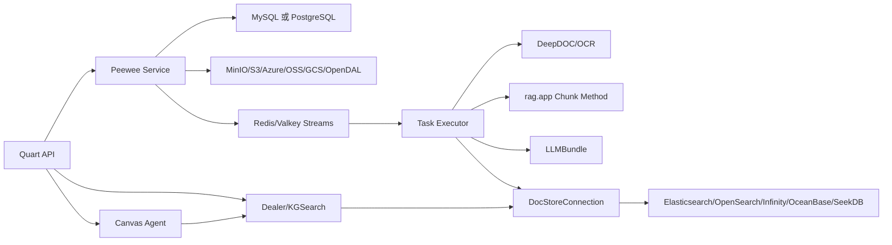

# RAGFlow Python 架构与主链路

## 文档导航

[项目总纲](./00-project-master.md) · [能力矩阵](./02-ragflow-capability-matrix.md) · [目标架构](./03-target-architecture.md) · [代码复用策略](./04-code-reuse-strategy.md) · [开发路线图](./05-development-roadmap.md) · [工程标准](./06-engineering-standards.md) · [决策与风险](./07-decisions-and-risks.md)

## 1. 目的与证据边界

本文展开 RAGFlow Python 的目录职责、运行依赖、数据模型、离线知识库构建、在线检索与回答、Agent 和高级 RAG。目标项目的设计见[目标架构](./03-target-architecture.md)，逐项采用结论见[能力矩阵](./02-ragflow-capability-matrix.md)。

- **冻结事实基线**：[`cd846cc9d4e32a19e684c59a1f302601027ef976`](https://github.com/infiniflow/ragflow/tree/cd846cc9d4e32a19e684c59a1f302601027ef976)。
- **滚动基线**：`main`，2026-07-30 最后观察到 `0cb4039be9c0691f89c391c5cc28ab40682a8163`，已不同于冻结 commit；最新变化涉及 Go ingestion 修复，本项目不分析 Go，差异不自动替代冻结事实。
- **本地辅助快照**：`D:/ragflow/ragflow-main`，版本标识 `0.26.4`，没有 `.git`，不是权威来源。
- **范围**：只分析 Python、相关配置、测试和文档；不分析 Go。
- **限制**：部分本地文件与冻结 commit 不同。长期结论以固定上游链接为准。
- **基线核验记录**：[双基线与本地快照核验](./research/ragflow-baseline.md)。
- **源码级证据索引**：[RAGFlow Python 源码证据地图](./research/ragflow-source-map.md)。该索引记录实际读取的类、函数、调用和持久化边界。

## 2. Python 目录职责

| 目录 | 主要职责 | 关键内容 | 对目标项目的意义 |
|---|---|---|---|
| `api/apps/` | Quart API、SDK API、管理入口 | document、dataset、chat、agent、task 路由 | 只参考用例入口和调用顺序 |
| `api/db/db_models.py` | Peewee 关系模型 | Knowledgebase、Document、File、Task、Dialog、Conversation、UserCanvas | 参考产品数据，不直接复用 |
| `api/db/services/` | 事务脚本和业务服务 | FileService、DocumentService、TaskService、DialogService、LLMBundle | 识别调用链和内部耦合 |
| `api/db/joint_services/` | 跨模型服务 | 模型配置解析、关系操作 | 参考模型注册，不直接引入 |
| `common/` | 配置、常量、DocStore 抽象、通用工具 | `settings.py`、`doc_store/`、metadata、token 工具 | 抽取时最主要的全局依赖来源 |
| `deepdoc/parser/` | 文档格式解析 | PDF、DOCX、Excel、PPT、HTML、Markdown | Parser 复用候选 |
| `deepdoc/vision/` | OCR、版面和表格视觉处理 | OCR、LayoutRecognizer、TableStructureRecognizer | 高价值、高依赖复用候选 |
| `rag/app/` | 场景化 Chunk Method | naive、paper、book、manual、laws、qa、table、resume、picture、audio、email | Chunk 策略蓝本 |
| `rag/svr/` | 后台解析 Worker | Task Executor、TaskHandler、TaskContext | 参考任务阶段和失败行为 |
| `rag/svr/task_executor_refactor/` | 重构后的离线流水线 | ChunkService、EmbeddingService、ChunkBuilder | 离线主链路核心 |
| `rag/nlp/` | 查询、检索、融合和 Token 处理 | `query.py`、`search.py`、tokenizer | 在线检索核心 |
| `rag/prompts/` | Prompt 与查询增强 | `kb_prompt`、`citation_prompt`、`full_question`、`cross_languages` | 改造复用或参考重写 |
| `rag/graphrag/` | GraphRAG 构建和查询 | 抽取、实体消歧、社区、KGSearch | Phase 09 候选 |
| `rag/advanced_rag/` | Agentic RAG、RAPTOR、知识编译 | StateGraph、RAGTools、RAPTOR | Phase 08/09 参考 |
| `rag/flow/` | 自定义 ingestion pipeline | Pipeline DSL 和执行 | 参考可配置流水线，不复用运行时 |
| `rag/utils/` | 搜索、存储、Redis 连接 | ES、Infinity、OpenSearch、MinIO、Redis | 基础设施适配参考 |
| `agent/` | Canvas Agent、组件、Tool、插件 | Canvas、Retrieval Tool、Agent with tools | Tool 契约参考；Canvas 不复用 |
| `memory/` | 对话记忆检索 | 独立 DocStore 连接和服务 | 后续按 Agent 需求评估 |
| `test/benchmark/` | Chat/Retrieval HTTP 压测 | 延迟、并发、P50/P90/P95 | 性能基线参考，不是质量评测 |

上游固定入口：

- [`AGENTS.md`](https://github.com/infiniflow/ragflow/blob/cd846cc9d4e32a19e684c59a1f302601027ef976/AGENTS.md)
- [`pyproject.toml`](https://github.com/infiniflow/ragflow/blob/cd846cc9d4e32a19e684c59a1f302601027ef976/pyproject.toml)
- [`common/settings.py`](https://github.com/infiniflow/ragflow/blob/cd846cc9d4e32a19e684c59a1f302601027ef976/common/settings.py)

## 3. 运行组件与依赖



### 3.1 全局初始化

[`common/settings.py`](https://github.com/infiniflow/ragflow/blob/cd846cc9d4e32a19e684c59a1f302601027ef976/common/settings.py) 同时承担：

1. 读取数据库、模型、搜索和存储配置。
2. 构造 `StorageFactory`。
3. 维护 `docStoreConn`、`retriever`、`kg_retriever` 等全局对象。
4. 暴露 Redis 连接和任务队列名称。

这种方式让 API、Worker、检索和 Agent 可以直接使用全局连接，但也造成抽取困难。本项目不复制该初始化方式。

### 3.2 关系数据库

[`api/db/db_models.py`](https://github.com/infiniflow/ragflow/blob/cd846cc9d4e32a19e684c59a1f302601027ef976/api/db/db_models.py#L837) 的核心模型关系如下：

```text
User ─ UserTenant ─ Tenant
Tenant
  ├─ Knowledgebase(permission=me|team, created_by)
  │    ├─ Document
  │    │    ├─ Task
  │    │    └─ File2Document ─ File
  │    └─ GraphRAG/RAPTOR/结构任务状态
  ├─ Dialog ─ Conversation
  └─ UserCanvas ─ CanvasVersion
```

重要事实：

- `Knowledgebase` 保存 Embedding、Parser、检索阈值、向量权重和高级任务状态。
- `UserTenant` 保存用户加入 Tenant 的关系和角色；`Knowledgebase.tenant_id` 在部分服务逻辑中同时承担所有者/团队范围语义。
- `Document` 保存源文件位置、Parser 配置、内容哈希、进度、Chunk/Token 统计和运行状态。
- `Task` 保存页范围、任务类型、优先级、重试、进度和 Chunk ID。
- `Document` 和 `Task` 没有独立 `tenant_id` 字段；任务消费时通过 `Task → Document → Knowledgebase → Tenant` 联查取得 tenant 和模型配置。
- `Dialog` 保存固定 RAG 的模型、Prompt、元数据过滤、阈值、权重、TopK、TopN、Reranker 和知识库范围。
- `Conversation` 保存消息和引用。
- 没有与上述模型同级的关系型 `Chunk` 模型；Chunk 由 DocStore 维护。

因此，RAGFlow 的租户边界并非所有实体自包含：`Document` 与 `Task` 没有独立 `tenant_id`，需要沿 `Task → Document → Knowledgebase` 取得租户。目标项目不照搬该字段布局，队列任务、Repository 和搜索请求都必须显式携带并复核 tenant scope。

### 3.3 对象存储

`common/settings.py::StorageFactory` 可构造 MinIO、S3、Azure、OSS、GCS 和 OpenDAL 实现。上传链路通过 `FileService` 写入对象存储，再用 `File2Document` 保存文件与 Document 的关系。

### 3.4 队列与任务

[`rag/utils/redis_conn.py`](https://github.com/infiniflow/ragflow/blob/cd846cc9d4e32a19e684c59a1f302601027ef976/rag/utils/redis_conn.py) 的 `RedisDB` 提供：

- `queue_product`
- `queue_consumer`
- `get_unacked_iterator`
- `get_pending_msg`
- `requeue_msg`
- `queue_info`
- `RedisDistributedLock`

`TaskService` 和 `DocumentService` 将任务写入队列；Task Executor 使用 consumer group 消费、ACK 和处理未确认消息。任务取消通过 Redis cancel key 和数据库状态联合判断。

进程与可靠性事实：

1. [`docker/launch_backend_service.sh`](https://github.com/infiniflow/ragflow/blob/cd846cc9d4e32a19e684c59a1f302601027ef976/docker/launch_backend_service.sh) 分别启动 `api/ragflow_server.py` 和一个或多个 `rag/svr/task_executor.py`，说明 Python API 与 ingestion executor 可以在同一仓库中作为不同进程运行。
2. [`TaskService.queue_tasks`](https://github.com/infiniflow/ragflow/blob/cd846cc9d4e32a19e684c59a1f302601027ef976/api/db/services/task_service.py) 先批量写入 `Task`，再调用 `RedisDB.queue_product` 用 Redis Stream `XADD` 投递轻量任务消息。
3. [`task_executor.py::collect`](https://github.com/infiniflow/ragflow/blob/cd846cc9d4e32a19e684c59a1f302601027ef976/rag/svr/task_executor.py) 先扫描当前 consumer 的未确认消息，再用 consumer group 读取新消息，并通过 `TaskService.get_task` 联查完整业务上下文。
4. `TaskService.get_task` 在领取时增加 `retry_count`，超过三次后把任务和 Document 标为失败。
5. `task_executor.py::handle_task` 在 `finally` 后无条件执行 `redis_msg.ack()`；处理异常虽然会写失败进度，但消息仍被确认。这一行为不能直接作为本项目可靠重试语义，本项目必须区分成功、可重试失败、不可重试失败和死信。

因此 RAGFlow 证明了“同仓库、API 与 Worker 分进程、队列连接”的可行边界，但其 Task/Redis/ACK 组合只适合参考重写。

### 3.5 模型

[`api/db/services/llm_service.py::LLMBundle`](https://github.com/infiniflow/ragflow/blob/cd846cc9d4e32a19e684c59a1f302601027ef976/api/db/services/llm_service.py) 统一暴露：

- `encode`、`encode_queries`
- `similarity`
- `describe`
- `transcription`
- `tts`
- `async_chat`
- `async_chat_streamly`
- `async_chat_streamly_delta`

它同时依赖租户模型配置、Token 统计和 Langfuse。目标项目使用 LangChain 模型接口，并自行实现模型注册、配额和审计。

### 3.6 搜索引擎

[`common/doc_store/doc_store_base.py`](https://github.com/infiniflow/ragflow/blob/cd846cc9d4e32a19e684c59a1f302601027ef976/common/doc_store/doc_store_base.py) 定义：

- `MatchTextExpr`
- `MatchDenseExpr`
- `MatchSparseExpr`
- `FusionExpr`
- `OrderByExpr`
- `DocStoreConnection`

这是值得参考的统一表达式层，但其字段命名、索引命名和全局连接仍与 RAGFlow 绑定。

具体实现不是完全同构：`ESConnection.search` 转换 ES 查询，`OSConnection.search` 在可用时使用 OpenSearch BM25 + KNN normalization pipeline、不可用时退化为 plain KNN，`InfinityConnectionBase` 则使用表和 DataFrame 结果。因此目标 `SearchPort` 必须定义后端无关契约和可观测降级，不能假定各后端分数与融合语义天然一致。源码定位见[证据 RF-S01 至 RF-S04](./research/ragflow-source-map.md#23-docstore-和搜索表达式)。

## 4. 离线知识库构建完整链路

### 4.1 上传与建档

1. `document_api.py::upload_document` 接收上传。
2. `FileService.upload_document` 校验并把二进制写入对象存储。
3. 创建 `File`、`Document` 和 `File2Document`。
4. Document 保存 `kb_id`、`parser_id`、`pipeline_id`、`parser_config`、`content_hash` 和存储位置。

源码：

- [`document_api.py::upload_document`](https://github.com/infiniflow/ragflow/blob/cd846cc9d4e32a19e684c59a1f302601027ef976/api/apps/restful_apis/document_api.py)
- [`file_service.py::FileService.upload_document`](https://github.com/infiniflow/ragflow/blob/cd846cc9d4e32a19e684c59a1f302601027ef976/api/db/services/file_service.py)

### 4.2 触发解析与任务拆分

1. API 调用 `DocumentService.run`。
2. 清理或重置旧任务状态。
3. `TaskService.queue_tasks` 按 Parser、文件类型和页范围生成 Task。
4. Task 写入 Peewee 表并通过 `REDIS_CONN.queue_product` 投递。

源码：

- [`document_service.py::DocumentService.run`](https://github.com/infiniflow/ragflow/blob/cd846cc9d4e32a19e684c59a1f302601027ef976/api/db/services/document_service.py)
- [`task_service.py::queue_tasks`](https://github.com/infiniflow/ragflow/blob/cd846cc9d4e32a19e684c59a1f302601027ef976/api/db/services/task_service.py)

### 4.3 消费与路由

1. `task_executor.py::collect` 从优先级队列读取消息。
2. `task_executor.py::handle_task` 交给重构后的 TaskManager/TaskHandler。
3. `TaskHandler.handle` 根据 `task_type`、`pipeline_id`、GraphRAG、RAPTOR 和标准解析进行分支。
4. 标准路径进入 `_run_standard_chunking_impl`。

源码：

- [`task_executor.py`](https://github.com/infiniflow/ragflow/blob/cd846cc9d4e32a19e684c59a1f302601027ef976/rag/svr/task_executor.py)
- [`task_handler.py::_run_standard_chunking_impl`](https://github.com/infiniflow/ragflow/blob/cd846cc9d4e32a19e684c59a1f302601027ef976/rag/svr/task_executor_refactor/task_handler.py#L534)

### 4.4 Parser 与 Chunk Method

`chunk_builder.py::get_parser` 映射：

| Parser ID | 模块 |
|---|---|
| `general`、`naive`、`kg` | `rag.app.naive` |
| `paper` | `rag.app.paper` |
| `book` | `rag.app.book` |
| `presentation` | `rag.app.presentation` |
| `manual` | `rag.app.manual` |
| `laws` | `rag.app.laws` |
| `qa` | `rag.app.qa` |
| `table` | `rag.app.table` |
| `resume` | `rag.app.resume` |
| `picture` | `rag.app.picture` |
| `one` | `rag.app.one` |
| `audio` | `rag.app.audio` |
| `email` | `rag.app.email` |
| `tag` | `rag.app.tag` |

`run_chunking` 调用模块级 `chunk()`，并传入 binary、页范围、语言、回调、知识库和 Parser 配置。

[`rag/app/naive.py`](https://github.com/infiniflow/ragflow/blob/cd846cc9d4e32a19e684c59a1f302601027ef976/rag/app/naive.py) 还可选择 DeepDOC、MinerU、Docling、OpenDataLoader、TCADP、PaddleOCR、Somark 和纯文本路径，说明“格式 Parser”和“Chunk Method”在当前代码中部分混合。

### 4.5 DeepDOC

[`deepdoc/parser/pdf_parser.py::RAGFlowPdfParser`](https://github.com/infiniflow/ragflow/blob/cd846cc9d4e32a19e684c59a1f302601027ef976/deepdoc/parser/pdf_parser.py) 直接依赖：

- `pdfplumber`
- `pypdf`
- Pillow、NumPy、scikit-learn、XGBoost
- `deepdoc.vision.OCR`
- LayoutRecognizer、TableStructureRecognizer
- RAGFlow tokenizer、Prompt 和 `common.settings`

DOCX、Excel 和 PPT Parser 的依赖较轻，但仍会产生 RAGFlow 特有的结构和图片对象。

### 4.6 Chunk 后处理

`ChunkService.build_chunks` 在 Parser 输出后执行：

1. 统一基础字段和稳定 Chunk ID。
2. 上传或关联 Chunk 图片。
3. `extract_keywords`。
4. `generate_questions`。
5. `generate_metadata` 和 `apply_built_in_metadata`。
6. `apply_tags`。

源码：

- [`chunk_service.py::ChunkService`](https://github.com/infiniflow/ragflow/blob/cd846cc9d4e32a19e684c59a1f302601027ef976/rag/svr/task_executor_refactor/chunk_service.py)
- [`chunk_post_processor.py`](https://github.com/infiniflow/ragflow/blob/cd846cc9d4e32a19e684c59a1f302601027ef976/rag/svr/task_executor_refactor/chunk_post_processor.py)

### 4.7 Embedding 与写入

1. `EmbeddingService.embed_chunks` 处理标题和正文、批量调用 Embedding，并把向量写入 Chunk 字典。
2. `ChunkService.insert_chunks` 批量写入 DocStore。
3. Summary/mother Chunk、RAPTOR Chunk 和取消回滚存在独立处理。
4. 完成后更新 Task、Document、Knowledgebase 的 Chunk/Token 统计。

这条链路证明 RAGFlow 的 Chunk 是“携带索引字段的字典”，不是独立领域实体。

## 5. 文档生命周期

### 5.1 更新与重新解析

相关入口和服务：

- `document_api.py::update_document`
- `document_api.py::_run_sync`
- `DocumentService.update_parser_config`
- `DocumentService.clear_chunk_num_when_rerun`
- `DocumentService.run`

重新解析会重置状态、清理或替换旧 Chunk 并创建新 Task。RAGFlow 主要围绕单个 Document 当前状态工作，没有本项目计划中的显式 `DocumentVersion` 和“候选索引原子激活”模型。

### 5.2 取消

- `DocumentService.do_cancel`
- `TaskService.do_cancel`
- `TaskService.cancel_all_task_of`
- `TaskService.has_canceled`

取消检查分散在数据库状态、Redis cancel key、Parser 回调和高级任务中。

### 5.3 删除

- `document_api.py::delete_documents`
- `DocumentService.remove_document`
- `DocumentService.delete_chunk_images`
- `DocumentService.delete_document_and_update_kb_counts`
- `TaskService.delete_by_doc_ids`
- `FileService.delete_docs`
- DocStore `delete`

`Dealer.retrieval` 仍包含 `_prune_deleted_chunks` 防御性清理，说明跨关系库与搜索索引的删除一致性需要额外保护。

冻结源码的实际顺序更具体：`DocumentService.remove_document` 先以关系库事务删除 Document 并扣减 KB 统计，再 best-effort 取消/删除 Task、Chunk 图片、缩略图、导航、搜索 Chunk、派生产物、metadata 和 Graph 引用；大量后续异常只记录并继续。因此 RAGFlow 的“删除完成”可能仍留孤儿数据，目标项目必须使用幂等补偿和 reconciliation。

### 5.4 可靠任务边界

- `queue_tasks` 先写 Task/Document 状态，后逐条 `XADD`，没有同一事务覆盖数据库和 Stream。
- `collect` 先读取当前 consumer 的 pending，再读新消息；主路径未自动 claim 其他死亡 consumer 的 pending。
- `TaskService.get_task` 在每次领取时增加 `retry_count`，领取前值达到 3 就放弃并标失败；它不是按错误分类、backoff 和 next-attempt 驱动的重试策略。
- `handle_task` 对成功、取消和异常处理后均执行 `redis_msg.ack()`；异常后的 ACK 不会触发 Redis pending 重试。
- `requeue_msg` 辅助函数存在，但主 Worker 调用链未形成统一死信、退避和失败分类。

目标任务端口必须明确 lease/claim、retryable/permanent/cancelled、ACK、backoff、dead-letter、shutdown 和 stale-job reconciliation；ADR-019 已选择 Redis/ARQ 作为 Phase 04 最小实现，完整可靠性语义仍由 Phase 07 验收。

## 6. 在线检索与回答完整链路

### 6.1 固定 RAG 入口

[`dialog_service.py::async_chat`](https://github.com/infiniflow/ragflow/blob/cd846cc9d4e32a19e684c59a1f302601027ef976/api/db/services/dialog_service.py) 读取：

- Dialog 模型和 Prompt 配置
- Knowledgebase 列表
- Embedding 和 Reranker
- `similarity_threshold`
- `vector_similarity_weight`
- `top_k`
- `top_n`
- 元数据过滤和引用开关

### 6.2 查询处理

按配置执行：

1. `full_question`：将对话问题独立化。
2. `cross_languages`：生成跨语言查询。
3. `apply_meta_data_filter`：生成或执行文档元数据过滤。
4. `keyword_extraction`：追加关键词。

源码：

- [`rag/prompts/generator.py`](https://github.com/infiniflow/ragflow/blob/cd846cc9d4e32a19e684c59a1f302601027ef976/rag/prompts/generator.py)
- [`common/metadata_utils.py`](https://github.com/infiniflow/ragflow/blob/cd846cc9d4e32a19e684c59a1f302601027ef976/common/metadata_utils.py)

### 6.3 候选检索

`Dealer.search`：

1. 使用 `FulltextQueryer` 生成全文 Match 表达式。
2. 使用 Embedding 生成 Dense Match 表达式。
3. 构造候选召回用 `FusionExpr("weighted_sum", topk, {"weights": "0.001,1"})`；这不是 Dialog 的最终全文/向量融合权重。
4. 把 knowledgebase、document、available、metadata 和 PageRank 条件交给 DocStore。

`Dealer.retrieval`：

1. 建立候选窗口。
2. 调用 `search`。
3. `_prune_deleted_chunks` 清除父 Document 已不存在的 Chunk。
4. 有外部 Reranker 时调用 `rerank_by_model`。
5. 有外部 Reranker 时，把模型分数与 token similarity 按 Dialog 权重融合；无外部 Reranker 时按搜索引擎选择 Infinity `_score`、OceanBase 本地向量融合或其他后端的 KNN 二次分数。
6. 稳定排序后应用相似度阈值，再按候选窗口切页得到 TopN。`top_k` 是后端候选上限，`top_n` 是最终页大小。

源码：

- [`rag/nlp/query.py::FulltextQueryer`](https://github.com/infiniflow/ragflow/blob/cd846cc9d4e32a19e684c59a1f302601027ef976/rag/nlp/query.py)
- [`rag/nlp/search.py::Dealer`](https://github.com/infiniflow/ragflow/blob/cd846cc9d4e32a19e684c59a1f302601027ef976/rag/nlp/search.py#L39)
- [`rag/nlp/search.py::Dealer.retrieval`](https://github.com/infiniflow/ragflow/blob/cd846cc9d4e32a19e684c59a1f302601027ef976/rag/nlp/search.py#L549)

### 6.4 补充检索

固定 RAG 可继续执行：

- `retrieval_by_toc`
- `retrieval_by_children`
- `kg_retriever.retrieval`
- Web 内容合并

这些是基础候选之后的二级召回，不应混入 SearchPort 的最底层查询表达式。

实际空结果并非一个统一类型：`Dealer.search` 会降低 min-match/向量相似度重查；metadata manual 无匹配使用 `[-999]` 哨兵，auto/semi 无匹配返回 `None`；`async_chat` 只在配置了非空 `empty_response` 时直接返回，否则仍可能让 LLM 在空 knowledge 上生成。目标项目必须把 `empty_reason`、降级步骤和错误分开建模。详见[RF-Q07、RF-Q11、RF-Q17](./research/ragflow-source-map.md)。

### 6.5 Context、生成和引用

1. `kb_prompt` 按 Token 预算格式化 Chunk。
2. 无知识且设置 `empty_response` 时直接返回空结果响应。
3. `citation_prompt` 要求模型生成引用标记。
4. `LLMBundle.async_chat_streamly_delta` 或 `async_chat` 生成答案。
5. `Dealer.insert_citations` 使用文本和向量相似度补充引用。
6. `repair_bad_citation_formats` 修复引用格式。
7. 返回答案、Chunk、文档聚合和引用。

RAGFlow 的引用逻辑具有实际价值，但其引用主要绑定当前 Chunk 字段；本项目还必须绑定 `document_version_id`。

`Dealer.insert_citations` 的引用是答案句子与 Chunk 的 token/Embedding 相似度匹配，阈值会从 `0.63` 递减到 `0.3`，每句最多追加 4 个 Chunk ID；这不是逐字蕴含证明。目标 Citation 必须另外保存 quote、页码/bbox、版本和验证状态。

## 7. Agent 架构

### 7.1 主要运行时：Canvas

[`agent/canvas.py`](https://github.com/infiniflow/ragflow/blob/cd846cc9d4e32a19e684c59a1f302601027ef976/agent/canvas.py)：

- `Graph` 加载 DSL、组件、上下游和变量。
- `Canvas.run/_run_impl` 执行组件、历史、路径、流式事件、检索引用和取消。
- 组件通过 `component_class` 动态构造。

Canvas 同时依赖 `FileService`、`LLMBundle`、`task_service.has_canceled`、Redis cancel/log、TTS 和 Langfuse 上下文，因此不适合成为本项目 LangGraph 运行时。它的 `userfillup`/`user_inputs` 是 Canvas 自有暂停/继续语义，不是 LangGraph durable interrupt。

### 7.2 Knowledge Retrieval Tool

[`agent/tools/retrieval.py::Retrieval._retrieve_kb`](https://github.com/infiniflow/ragflow/blob/cd846cc9d4e32a19e684c59a1f302601027ef976/agent/tools/retrieval.py#L90)：

1. 解析知识库名称、ID 或 Canvas 变量。
2. 检查知识库 Embedding 模型一致。
3. 构造 Embedding 和 Reranker。
4. 应用元数据过滤。
5. 执行跨语言处理。
6. 调用 `settings.retriever.retrieval`。
7. 可追加 TOC、子 Chunk 和 GraphRAG。
8. `Canvas.add_reference` 回写引用。
9. `kb_prompt` 生成 Tool 文本输出。

RAGFlow 的固定 RAG 与 Retrieval Tool 共同使用 `settings.retriever`，但分别实现模型绑定、过滤和输出逻辑，并没有共享应用层查询服务。目标项目必须让两条路径都调用同一个 `KnowledgeQueryService`，不复用 Canvas 变量和 Service 依赖。

### 7.3 LangGraph Agentic RAG

[`rag/advanced_rag/agentic_rag_graph.py`](https://github.com/infiniflow/ragflow/blob/cd846cc9d4e32a19e684c59a1f302601027ef976/rag/advanced_rag/agentic_rag_graph.py#L156) 包含：

```text
formalize_question
→ route
→ pre_search
→ planner
→ orchestrator_loop
→ formalize_answer
```

`AgenticState` 保存问题、关键词、种子 Chunk、路由、计划、证据、部分回答、拒答、循环和反馈。实际代码注册六个节点（尽管 docstring 仍写“4-node”），节点间是固定边，复杂循环在 `orchestrator_loop` 内部。冻结基线最终使用无参数 `g.compile()`，`ainvoke` 只传 recursion limit，未配置 Checkpointer、thread_id 或 interrupt。它证明 RAGFlow 已使用 LangGraph 做高级检索编排，但不提供本项目要求的持久恢复、HITL 和运行治理。

## 8. 高级 RAG

### 8.1 GraphRAG

- 构建：`rag/graphrag/general/index.py::run_graphrag_for_kb`
- 查询：`rag/graphrag/search.py::KGSearch`
- 子阶段：实体/关系抽取、实体消歧、图合并、社区和报告
- 依赖：LLM、Embedding、DocStore、Redis lock/checkpoint、DocumentService、TaskService

冻结版本的实际构建链是 `TaskHandler._run_graphrag → run_graphrag_for_kb → generate_subgraph → merge_subgraph → resolve_entities? → extract_community?`。subgraph、全局 graph、entity、relation 和 community report 均以 `knowledge_graph_kwd` 区分写入 DocStore；KB 级 Redis lock 串行 merge/post-merge，多处 `has_canceled` 终止，实体消歧和社区 checkpoint/phase marker 均为 7 天 TTL。`KGSearch.retrieval` 将实体、关系、n-hop 和社区报告拼成合成 Chunk。

这套功能完整度较高，但直接依赖 DocumentService、全局 Retriever/DocStore、Redis lock/checkpoint、RAGFlow 字段、LLM/Embedding 和 Task callback，归类为“改造复用”。上述 checkpoint 是 GraphRAG 构建恢复，不是 Agent 的 LangGraph Checkpointer。

### 8.2 RAPTOR

`rag/advanced_rag/knowlege_compile/raptor.py::RecursiveAbstractiveProcessing4TreeOrganizedRetrieval` 支持 classic/PSI tree builder、GMM/AHC 等聚类路径，逐层摘要并重新 Embedding；输入/输出保留叶 `source_chunk_ids`，classic 可物化树，且在聚类不缩小时强制收敛。`TaskHandler._run_raptor → RaptorService._generate_raptor → ChunkService.insert_chunks` 将摘要或不可检索的 `raptor_tree` row 写入 DocStore，再清理 stale rows。目录名中的 `knowlege_compile` 是上游现状，引用时不得擅自更正源码路径。

### 8.3 多模态

- `rag/app/picture.py`：OCR 或 Vision LLM 图片解析。
- `deepdoc/parser/figure_parser.py`：PDF、DOCX、Excel 图片包装与描述。
- `rag/app/audio.py`：ASR 后 Chunk。
- `LLMBundle.describe/transcription`：Vision/ASR 模型调用。

多模态能力跨 Parser、模型服务和 Chunk 字段，不是单一模块。

### 8.4 Timeline 编译与时序 RAG 边界

冻结源码中的 [`api/db/init_data/compilation_templates/timeline.yaml`](https://github.com/infiniflow/ragflow/blob/cd846cc9d4e32a19e684c59a1f302601027ef976/api/db/init_data/compilation_templates/timeline.yaml) 定义 timeline knowledge compilation 模板；[`runner.py::run_structure_compile_over_batches/_compile_batch/_flush`](https://github.com/infiniflow/ragflow/blob/cd846cc9d4e32a19e684c59a1f302601027ef976/rag/advanced_rag/knowlege_compile/runner.py) 编排批次并调用 [`structure.py::compile_structure_from_text/merge_compiled_structures/cleanup_timeline_isolated_entities`](https://github.com/infiniflow/ragflow/blob/cd846cc9d4e32a19e684c59a1f302601027ef976/rag/advanced_rag/knowlege_compile/structure.py) 编译、合并和清理 timeline 结构。

这些源码只证明 RAGFlow 具备事件时间线结构编译和清理能力，没有证明它完整提供面向数值时序、时间窗口、聚合、降采样、异常区间和时态过滤的时序 RAG。目标项目的 `CAP-43` 因此采用“参考后自研”，并在 Phase 09 执行前重新验证数据模型和存储方案。

## 9. 评测、日志与权限现状

### 9.1 评测

`test/benchmark` 可以：

- 创建知识库
- 上传并解析文档
- 发起 Chat/Retrieval 请求
- 设置并发和迭代次数
- 统计首 Token、总延迟和 P50/P90/P95

`metrics.py::summarize` 和 `report.py` 实际只计算 success/failure、首 Token/总延迟、avg/min/P50/P90/P95、总时长和 QPS。对该目录全文件扫描未发现 Recall、MRR、NDCG、答案忠实度、引用正确率和 Agent 任务成功率实现。

### 9.2 可观测性

RAGFlow 使用日志、`common/token_utils.py::token_usage_sink`、Langfuse generation/trace，并在 Docker 配置中暴露 OTEL host/port 及可选 Jaeger 容器。`trace_id` 已进入检索参数和权重日志，但配置/容器存在不等于全链路 span 完整；源码中也没有统一、持久、可重放的 Retrieval Trace 数据模型。

### 9.3 权限

Knowledgebase 存在 `permission=me|team`，API 和 Service 具有 Tenant/User 上下文。具体调用关系为：

1. [`api/utils/api_utils.py::add_tenant_id_to_kwargs`](https://github.com/infiniflow/ragflow/blob/cd846cc9d4e32a19e684c59a1f302601027ef976/api/utils/api_utils.py) 把 `current_user.id` 写入名为 `tenant_id` 的参数；这里的变量名没有清晰区分“当前用户”和“租户”。
2. [`KnowledgebaseService._visibility_and_status_filter`](https://github.com/infiniflow/ragflow/blob/cd846cc9d4e32a19e684c59a1f302601027ef976/api/db/services/knowledgebase_service.py) 允许当前用户自己的知识库，或用户已加入 Tenant 下 `permission=team` 的知识库。
3. `KnowledgebaseService.accessible` 执行单知识库检查；`DocumentService.accessible` 继续委托知识库权限。
4. [`rag/nlp/search.py::index_name`](https://github.com/infiniflow/ragflow/blob/cd846cc9d4e32a19e684c59a1f302601027ef976/rag/nlp/search.py#L35) 生成 `ragflow_{uid}`，`Dealer.retrieval` 根据已解析的 `tenant_ids` 选择索引，再用 `kb_ids` 过滤。

限制也很明确：

- Tenant、用户、所有者和可见性在命名与数据模型中没有完全分离。
- Document、Task 和搜索 Chunk 没有统一的 `AuthorizationContext` 或 `PermissionChecker` 契约。
- API/Service 中存在分散的 `accessible` 和 team permission 检查。
- 检索侧的细粒度 Chunk ACL 不是独立、统一的领域能力。

因此[能力矩阵](./02-ragflow-capability-matrix.md)仍将“权限过滤”标记为“部分具备”。目标项目只参考 Tenant/UserTenant、可见性过滤和 tenant index 思路，不复用其权限模型；第一版将明确分离 `tenant_id`、`owner_id` 和 `visibility`。

## 10. 对目标项目最重要的源码结论

1. Parser、Chunk Method、检索算法和引用是最有价值的复用来源。
2. API、Peewee Service、全局 settings、Task Executor 和 Canvas 是耦合中心，主要参考设计。
3. Chunk 是搜索文档字典，目标项目必须重新建立领域 Chunk 和索引记录的分界。
4. 固定 RAG 和 Agent Retrieval Tool 共用 Dealer，证明共享知识查询核心是正确边界。
5. RAGFlow 的 LangGraph 使用范围窄，Checkpoint、HITL、多 Agent 治理需要本项目实现。
6. 生命周期存在删除防御和分散取消逻辑，目标项目必须使用版本、幂等和补偿加强一致性。
7. 性能 benchmark 可参考，但质量评测必须自行建设。
8. RAGFlow 的 API/Task Executor 分进程拓扑与目标第一版相近，但无条件 ACK 和分散状态规则要求本项目自研可靠任务协议。
9. RAGFlow 的 tenant/user/owner 语义部分混用，目标项目必须通过 `AuthorizationContext`、`PermissionChecker` 和所有数据面的强制 tenant 条件建立清晰边界。

### 10.1 Phase 06 采用结果（目标项目事实，不是 RAGFlow 上游事实）

- 目标项目没有复制或改写上述 RAGFlow 文件；只参考调用顺序和行为目标。
- `OnlineRetrievalService` 独立实现查询变体、硬过滤、Elasticsearch 双路召回、
  RRF、Reranker 回退、有限空结果降级和结构化 `no_evidence`。
- 目标项目通过 PostgreSQL `RetrievalTraceStorePort` 补足上游没有提供的统一、
  内容最小化、tenant 隔离、TTL 可清理 Trace；该能力不得反向表述为 RAGFlow 已具备。
- 实际代码和验证见[Phase 06 执行记录](./phases/phase-06-online-retrieval.md)与
  [Phase 06 评测](./research/phase-06-retrieval-evaluation.md)。

详细采用分类见[代码复用策略](./04-code-reuse-strategy.md)，目标落点见[目标架构](./03-target-architecture.md)。
