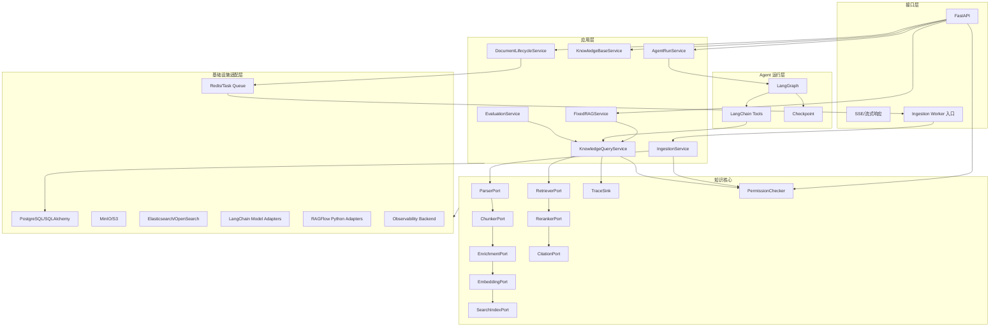
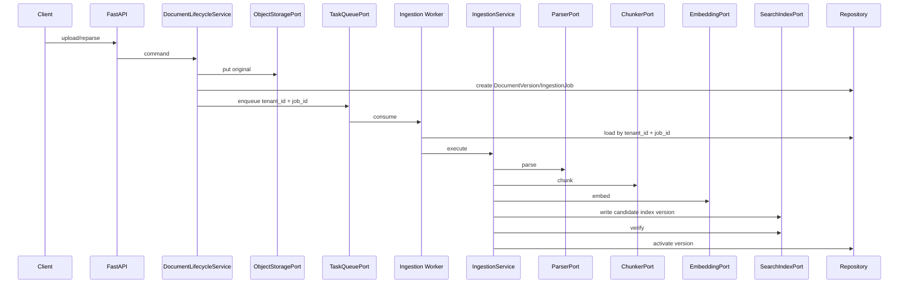

# 目标系统架构

## 文档导航

[项目总纲](./00-project-master.md) · [RAGFlow 架构](./01-ragflow-architecture.md) · [能力矩阵](./02-ragflow-capability-matrix.md) · [代码复用策略](./04-code-reuse-strategy.md) · [开发路线图](./05-development-roadmap.md) · [工程标准](./06-engineering-standards.md) · [决策与风险](./07-decisions-and-risks.md)

## 1. 架构状态

- **[事实]** Phase 01 已实现工程骨架，Phase 02 已实现与知识库解耦的 LangGraph Agent Runtime；知识库、RAG 和 ingestion 业务仍未实现。
- **[决策]** 目标项目独立运行，不以 RAGFlow API 或 RAGFlow 服务为运行时依赖。
- **[决策]** Agent 使用 LangChain + LangGraph。
- **[决策]** 第一版是模块化单体：FastAPI 与独立 Ingestion Worker 同仓库、共享领域模型和基础设施端口、通过任务队列连接，不拆微服务。
- **[决策]** 第一版强制 tenant 隔离并实现 owner/visibility、`AuthorizationContext` 和 `PermissionChecker`。
- **[规划]** 本文定义逻辑组件、依赖方向、端口、数据所有权和运行链路。
- **[待确认]** RAGFlow 适配代码的物理隔离、首个搜索引擎和具体任务队列实现。

## 2. 架构原则

1. **一个知识查询核心**：`CAP-27 固定 RAG 问答`和`CAP-28 KnowledgeBaseTool`共享 `KnowledgeQueryService`。
2. **领域与基础设施分离**：领域模型不导入 FastAPI、SQLAlchemy、Redis、MinIO、Elasticsearch、OpenSearch 或 RAGFlow。
3. **数据面与控制面分离**：LangGraph 决定 Agent 流程，不承担文件解析、Embedding 批处理和搜索写入。
4. **版本优先**：DocumentVersion、Parser 版本、Chunker 版本、Embedding 版本和索引版本必须可追溯。
5. **先正确后高级**：Phase 04 完成最小 RAG 闭环，Phase 06 完成可评测检索，Phase 09 才引入 GraphRAG、RAPTOR 和多模态 RAG。
6. **端口替代全局连接**：不复制 RAGFlow `common.settings` 的全局对象模式。
7. **证据是一等数据**：Citation 和 Retrieval Trace 不是响应装饰，而是持久、可验证的运行产物。
8. **行业无关**：轨道交通内容进入 metadata、数据集和行业适配层，不进入核心实体字段。
9. **同仓库不同进程**：API 和 Worker 共享代码与契约，但长耗时 ingestion 只在 Worker 执行。
10. **租户条件不可选**：tenant 条件由服务端 `AuthorizationContext` 和 `PermissionChecker` 注入，调用方不能关闭。
11. **任务信封自包含安全上下文**：RAGFlow 的 `Task`/`Document` 需要联查 Knowledgebase 才能取得 tenant；目标 `IngestionJob` 必须显式携带 `tenant_id`、`job_id` 和幂等信息，并在 Worker 读取数据库后再次校验。源码依据见[RF-D03、RF-D05](./research/ragflow-source-map.md#22-关系数据模型和-chunk-存储边界)。
12. **Chunk 是领域实体而非后端文档形状**：RAGFlow 将 Chunk 保存在 DocStore 而非 Peewee 表；目标项目以 `ChunkRecord` 作为统一模型，再由 Search Adapter 映射后端字段。

## 3. 逻辑组件



### 3.1 接口层

职责：

- 请求与响应 Schema。
- 从可信认证结果建立 `AuthorizationContext`，不接受客户端自行指定有效 tenant。
- 文件上传和流式下载。
- SSE 或其他流式协议。
- 错误码和 Trace ID。

禁止：

- 在路由中解析文档。
- 在路由中构造搜索 DSL。
- 在路由中直接执行 Agent 节点。
- 在路由中跨 PostgreSQL、对象存储和搜索引擎做事务脚本。

对应能力：`CAP-37 FastAPI 服务接口`。

### 3.2 应用层

| 服务 | 责任 | 不负责 |
|---|---|---|
| `KnowledgeBaseService` | 知识库配置、模型和检索 Profile | 搜索引擎 DSL |
| `DocumentLifecycleService` | 上传、更新、删除、重解析、版本激活 | Parser 算法 |
| `IngestionService` | 由独立 Worker 调用；离线阶段编排、任务状态和补偿 | API 路由和 Agent 对话 |
| `KnowledgeQueryService` | 查询处理、检索、Rerank、上下文、Citation、Trace | Agent 路由 |
| `FixedRAGService` | 固定 Prompt、生成、空结果响应 | 复制检索 |
| `AgentRunService` | thread/run 生命周期、图调用、流式事件 | 搜索后端访问 |
| `EvaluationService` | 运行固定数据集、聚合指标、比较基线 | 修改生产数据 |

### 3.3 Agent 运行层

`AgentRunService` 使用：

- LangGraph `StateGraph`
- LangGraph Checkpointer
- LangChain Tool
- LangChain Chat Model 和结构化输出

**[事实]** Phase 02 已在 `src/ragflow_agent/agent/` 实现上述基础边界：AgentState/Event v1、最小 StateGraph、模型/Tool 端口与 LangChain Adapter、PostgreSQL Checkpointer、Trace 和错误治理。`AgentRunService` 的 FastAPI 业务入口、知识库 Tool 和完整授权服务仍属后续规划。

核心边界：

```text
KnowledgeBaseTool
  input  = RetrievalQuery
  call   = KnowledgeQueryService.retrieve()
  output = RetrievalResult + Citation + trace_id
```

Agent 不接收搜索引擎原始 hit，不直接修改 Document，不直接持久化 Chunk。

对应能力：`CAP-28` 至 `CAP-32`。

### 3.4 知识核心

知识核心由稳定端口和应用算法组成：

- Parser/Chunk/Enrichment：`CAP-01` 至 `CAP-07`
- Embedding/Index：`CAP-08`
- Retrieval：`CAP-09` 至 `CAP-22`
- 生命周期任务：`CAP-23` 至 `CAP-26`
- 高级 RAG：`CAP-33` 至 `CAP-35`

端口定义见主文档第 12 节；正式字段将在 `08-domain-model-and-contracts.md` 中展开。

### 3.5 基础设施适配层

每种外部系统必须有独立 Adapter：

- SQLAlchemy Repository Adapter
- MinIO/S3 ObjectStorage Adapter
- Elasticsearch Adapter
- OpenSearch Adapter
- Redis Adapter
- Task Queue Adapter
- LangChain Model Adapter
- RAGFlow Parser/Chunk/Retrieval Algorithm Adapter
- Observability Adapter

SearchIndexPort 和 RetrieverPort 可以由同一搜索后端类实现，但写入和查询接口必须分开测试。

## 4. 依赖方向

允许：

```text
api → application → domain/ports
agent → application → domain/ports
infrastructure → domain/ports
ragflow_adapters → domain/ports
api bootstrap → application → domain/ports
worker bootstrap → application → domain/ports
```

禁止：

```text
domain → infrastructure
domain → FastAPI/SQLAlchemy/LangGraph
application → concrete Elasticsearch/OpenSearch client
agent → database/object storage/search client
ragflow_adapters → api route
api → worker HTTP endpoint
worker → api route
```

LangChain 和 LangGraph 属于框架依赖：

- LangChain 可出现在 `agent/`、`generation/`、`embedding/` 和 `infrastructure/models/`。
- LangGraph只出现在 `agent/` 和与 Agent 运行相关的应用服务。
- 领域实体不继承 LangChain Document，也不把 LangGraph State 当数据库模型。

## 5. 数据所有权

### 5.1 PostgreSQL

规划保存：

- KnowledgeBase
- Document
- DocumentVersion
- IngestionJob
- Parser/Chunk/Embedding/Index 配置版本
- AgentThread/AgentRun 的业务索引
- Citation
- RetrievalTrace 索引或摘要
- `tenant_id`、`owner_id`、`visibility` 及最小权限审计数据

**[事实]** Phase 02 的官方 `AsyncPostgresSaver.setup()` 已创建并管理 LangGraph 内部 Checkpoint 表；这些表不属于项目 Alembic 业务模型。目标 AgentThread/AgentRun 业务索引仍未实现。

### 5.2 对象存储

规划保存：

- 原始文件
- Parser 派生文件
- 页图和 Chunk 图片
- 大型 ParsedDocument 工件
- 评测数据集附件

对象 key 必须使用 tenant-scoped 前缀并包含稳定 ID，不以用户可修改文件名作为唯一 key；Worker 必须在读取前核对对象所属 tenant。

### 5.3 搜索引擎

规划保存：

- 当前可检索 DocumentVersion 的 Chunk 索引记录
- 全文字段
- Dense vector
- 强制 `tenant_id` 以及 owner/visibility 过滤字段
- Citation 来源字段
- 父子/邻近/TOC 关系字段
- GraphRAG/RAPTOR 派生记录

搜索记录不是领域事实源。丢失后应能由 PostgreSQL、对象存储和版本配置重建。

### 5.4 Redis 与任务系统

规划保存短期状态：

- 任务消息
- 分布式锁
- 限流
- 短期缓存
- 取消信号

不能只把唯一业务状态存入 Redis。
任务消息只携带 `tenant_id`、`job_id`、任务类型、版本和 Trace/幂等标识；完整业务状态由 Worker 从 PostgreSQL 重新加载。

## 6. 核心数据结构边界

### 6.1 Document 与 DocumentVersion

```text
Document
  id
  tenant_id
  owner_id
  visibility
  knowledge_base_id
  current_version_id
  status

DocumentVersion
  id
  tenant_id
  document_id
  content_hash
  parser_version
  chunker_version
  embedding_version
  index_version
  object_key
  state
```

Document 是长期身份，DocumentVersion 是一次可追踪内容与索引产物。更新和重新解析不得覆盖旧版本事实。

### 6.2 ParsedDocument 与 Chunk

Parser 输出 `ParsedDocument`，Chunker 输入 `ParsedDocument` 并输出 `ChunkDraft`。Parser 不直接写搜索引擎，Chunker 不调用 API Service。

`Chunk.id` 应由 DocumentVersion、策略版本、来源 block 和顺序稳定生成；精确算法待 Phase 03 契约设计决定。

### 6.3 RetrievalCandidate 与 Citation

`RetrievalCandidate` 必须保留：

- 全文分数
- 向量分数
- Rerank 分数
- 最终分数
- 来源 DocumentVersion
- 选择或淘汰原因

`Citation` 只指向最终允许引用的候选，并绑定 DocumentVersion、Chunk、页码、bbox、quote 和 source URI。

### 6.4 AuthorizationContext 与 PermissionChecker

第一版最小契约：

```text
AuthorizationContext
  tenant_id
  user_id
  request_id

PermissionChecker
  require_same_tenant(context, resource_tenant_id)
  can_read(context, owner_id, visibility)
  can_write(context, owner_id, visibility)
  build_retrieval_constraint(context, requested_kb_ids, requested_doc_ids)
```

`KnowledgeBase` 和 `Document` 至少具有 `tenant_id`、`owner_id`、`visibility`。`DocumentVersion`、`IngestionJob`、`ParsedDocument`、`ParsedBlock`、`Chunk`、索引记录、Citation、RetrievalTrace 和 Agent/Tool 运行数据至少具有 `tenant_id`。复杂 RBAC、部门关系和动态数据规则只扩展 `PermissionChecker` 的实现，不改变调用方绕过权限的能力。

## 7. 离线链路设计



失败规则：

1. Parser 失败：DocumentVersion 为 FAILED，原始文件保留。
2. Embedding 失败：不激活索引版本，可从 Chunk 工件重试。
3. 部分写入失败：删除或覆盖候选索引中的同一任务记录。
4. 激活失败：旧 `current_version_id` 保持不变。
5. 重复消息：同一 IngestionJob 和阶段不重复产生 Chunk。
6. Worker 处理结束前持久化终态或可重试状态；只有符合任务协议的路径才 ACK。
7. 消息 tenant 与数据库 Job tenant 不一致：拒绝执行、记录安全事件，不自动改写 tenant。

## 8. 在线链路设计

```text
RetrievalQuery
→ QueryNormalizer
→ QueryRewrite/CrossLanguage/KeywordExpansion
→ MetadataFilter + AuthorizationConstraint
→ FulltextSearch + VectorSearch
→ CandidateCleaner
→ ScoreFusion
→ Reranker
→ Threshold/TopK/TopN
→ Parent/Neighbor/TOC/AdvancedRetrieval
→ ContextBuilder
→ CitationBuilder
→ RetrievalTrace
```

`CAP-17 空结果降级`必须作为显式策略执行，不允许通过捕获所有异常伪装为空结果。

固定 RAG 路径：

```text
RetrievalResult → Fixed Prompt → LLM → CitationValidator → Answer
```

KnowledgeBaseTool 路径：

```text
RetrievalResult → ToolMessage → LangGraph → 继续检索/其他 Tool/HITL/Answer
```

## 9. Agent 链路设计

Phase 02 当前已实现 `normalize_input → decide → execute_tool → observe → decide/finish` 的确定性基础图，以及 run/resume、技术上限和 Agent Trace。下列状态/节点清单是完整目标；`plan`、检索 Trace/Citation、HITL、记忆、业务预算、多 Agent 和知识库 Tool 尚未实现。

建议基础状态：

```text
messages
request_context
route
plan
tool_calls
retrieval_trace_ids
citations
retry_count
loop_count
budget
hitl_request
final_answer
error
```

基础节点：

1. `normalize_input`
2. `route`
3. `plan_if_needed`
4. `execute_tool`
5. `observe`
6. `decide_next`
7. `request_human`
8. `compose_answer`
9. `validate_answer`
10. `finish`

其中 `normalize_input`、模型决策、`execute_tool`、`observe` 和 `finish` 已有 Phase 02 最小实现；Planner、知识检索路由、`request_human`、答案证据校验和多 Agent 仍是规划。Phase 08 再完成 HITL、预算、记忆、Agentic RAG 和多 Agent。

## 10. 高级 RAG 接入

### 10.1 GraphRAG

作为独立派生索引：

- 输入：已激活 Chunk 版本。
- 输出：实体、关系、社区和报告记录。
- 查询：KnowledgeQueryService 的可选 AdvancedRetriever。
- 删除/重建：绑定 DocumentVersion 和派生索引版本。

### 10.2 RAPTOR

作为层级 Chunk 派生器：

- 输入：普通 Chunk。
- 输出：摘要树 Chunk，保留 children/source links。
- 写入：SearchIndexPort。
- 查询：普通混合检索候选的一部分或二级召回。

### 10.3 多模态 RAG

统一把图片和音频产物映射为带 modality、来源坐标和派生模型版本的 Chunk，不为不同模态建立完全独立的知识库核心。

### 10.4 时序 RAG

时序 RAG 是 Phase 09 的低优先级实验性能力，不进入第一版最小闭环。其目标边界至少包括：

1. 通用时序数据集、序列、观测点、事件、时间窗口和时区语义，不写死轨道交通字段。
2. `tenant_id` 强制隔离、数据源版本、采样频率、质量标记、单位和设备/业务实体关联。
3. 面向时间范围、窗口聚合、趋势、异常区间和事件关联的查询协议；不能仅依赖普通文本向量相似度。
4. 时序证据必须携带时间范围、聚合方式、来源数据版本和查询条件，进入 Citation 与 Retrieval Trace。
5. 普通知识索引与高级时序索引通过能力开关和统一 RetrievalResult 协议兼容；关闭时不得影响普通 RAG。

RAGFlow 的 `timeline.yaml → compile_structure_from_text/merge_compiled_structures → cleanup_timeline_isolated_entities` 只提供事件时间线结构编译参考，不能直接承担完整时序 RAG。目标项目采用参考后自研；时序存储后端和首批数据协议仍为待确认项。

## 11. 可恢复性与一致性

| 风险点 | 设计要求 |
|---|---|
| PostgreSQL 成功、对象存储失败 | 不创建可运行 IngestionJob，或记录可补偿失败 |
| 对象存储成功、数据库失败 | 使用 request/idempotency key 清理或重用孤儿对象 |
| 搜索部分写入 | candidate index version 不激活 |
| Worker 崩溃 | 从 IngestionJob stage/checkpoint 恢复 |
| 重复投递 | 同一 job/stage 幂等 |
| 文档删除与查询竞态 | 先取消可见性，再异步回收物理数据 |
| Embedding 模型变更 | 新 index_version，完成后切换 |
| Agent 进程重启 | LangGraph Checkpoint 恢复 |

## 12. 安全边界

1. `AuthorizationContext.tenant_id` 来自可信认证/服务身份，不能被请求体、URL、Tool 参数或队列 payload 覆盖。
2. 每个租户范围 Repository 方法必须要求 tenant/context；禁止不带 tenant 的通用 `get_by_id` 进入应用层。
3. 权限约束在检索前注入，不在回答生成后补救；Search Adapter 必须把 tenant 条件与业务过滤合并为不可删除的 AND 条件。
4. 对象 key、缓存 key、锁、Checkpoint、任务、索引记录、Trace 和审计事件必须 tenant-scoped。
5. Tool 调用携带同一 `AuthorizationContext`，子 Agent 不能扩张 tenant 或可见范围。
6. Parser、OCR、代码 Tool 和外部连接器具有超时、文件大小和资源限制。
7. 模型密钥通过配置/密钥系统注入，不进入 AgentState 或 Trace。
8. Citation 不泄露无权限 Document 的元数据。
9. 第一版实现 tenant/owner/visibility；复杂 RBAC、部门权限和动态数据规则后续扩展。

## 13. 第一版物理运行拓扑

已接受拓扑：

```text
同一 Git 仓库 / 同一 Python 发行单元
├── FastAPI API process
│   └── 持久化 IngestionJob → TaskQueuePort.publish
└── Ingestion Worker process
    └── TaskQueuePort.consume → IngestionService
```

约束：

- API 与 Worker 可以独立启动、健康检查和扩缩容。
- 二者共享领域模型、应用服务、端口和基础设施 Adapter，不复制代码。
- 二者之间不建立内部 REST/gRPC 服务调用；任务队列是 ingestion 命令边界。
- 第一版不拆独立微服务、独立仓库或独立版本发布。
- `O-006` 仍决定具体任务库和可靠消息方案；该开放项不改变已确认的进程拓扑。
- 后续如拆微服务，必须有新的 ADR、性能/组织证据和数据所有权迁移方案。

## 14. 与其他文档的契约

- 能力名称和阶段：以[能力矩阵](./02-ragflow-capability-matrix.md)为准。
- 上游事实：以[RAGFlow 架构](./01-ragflow-architecture.md)为准。
- 源码进入目标模块的办法：以[代码复用策略](./04-code-reuse-strategy.md)为准。
- 阶段依赖和门禁：以[开发路线图](./05-development-roadmap.md)为准。
- 实现规则：以[工程标准](./06-engineering-standards.md)为准。
- 已接受和待确认事项：以[决策与风险](./07-decisions-and-risks.md)为准。
