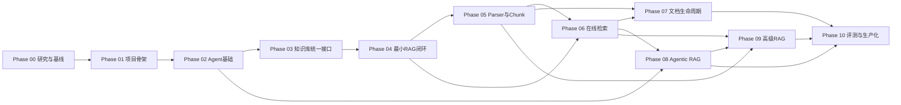

# 开发路线图与阶段依赖

## 文档导航

[项目总纲](./00-project-master.md) · [RAGFlow 架构](./01-ragflow-architecture.md) · [能力矩阵](./02-ragflow-capability-matrix.md) · [目标架构](./03-target-architecture.md) · [代码复用策略](./04-code-reuse-strategy.md) · [工程标准](./06-engineering-standards.md) · [决策与风险](./07-decisions-and-risks.md) · [阶段状态索引](./phases/README.md) · [Phase 00](./phases/phase-00-research-and-baseline.md) · [Phase 01](./phases/phase-01-project-skeleton.md)

## 0. 当前事实与证据边界

### 0.1 已确认事实

- **[事实]** 目标项目根目录为 `D:/download/ragflow-agent`。
- **[事实]** 目标项目是 Git 仓库，默认分支为 `main`，`origin` 实际配置为 `https://github.com/haonanhu02-jpg/ragflow-agent.git`；P01-T01 开始前 `HEAD` 与 `origin/main` 均为 Phase 00 基线 commit `5c015405e4c25346999cbb21736c61a87d5f8cbe`。
- **[事实]** 当前已有可安装包、类型化配置、日志/Trace、基础设施端口、空迁移、FastAPI/Worker 空壳、测试、GitHub Actions 和 Docker 开发拓扑；仍没有 Agent/RAG 业务功能。Phase 00 原始文件快照见 [`docs/research/project-baseline.md`](./research/project-baseline.md)。
- **[决策]** RAGFlow 冻结事实基线为 `cd846cc9d4e32a19e684c59a1f302601027ef976`，长期源码结论必须固定到该 commit。
- **[事实]** 本地 RAGFlow 快照位于 `D:/ragflow/ragflow-main`，没有 `.git`；其 `pyproject.toml` 标识版本 `0.26.4`、Python `>=3.13,<3.14`，不能据此证明本地快照 commit。
- **[事实]** 2026-07-30 通过 `git ls-remote` 观察到 RAGFlow 远程 `main` 为 `0cb4039be9c0691f89c391c5cc28ab40682a8163`，已不同于冻结基线；最新提交为 Go ingestion 修正，不改变 Python-only 冻结结论。
- **[决策]** 滚动 `main` 的变化不会自动替换冻结事实；是否升级冻结基线必须执行 Phase 00 差异审计并形成 ADR。
- **[事实]** Phase 00 和 Phase 01 已完成；Phase 02 至 Phase 10 未执行，所有 Agent/RAG 业务实现仍未开始。

Phase 00 已按详细计划执行并通过验收；Phase 01 至 Phase 10 的详细计划已生成。P01-T01 仅冻结执行基线和命名，不创建业务代码；阶段计划存在不等于阶段能力已经实现。

### 0.2 本次路线图校正

| 项目 | 原方案/历史状态 | 当前方案 | 依据 |
|---|---|---|---|
| 阶段计划生成门禁 | Phase 00 出口曾与 O-001、下一阶段计划形成循环依赖 | Phase 00 已归档；允许生成 Phase 01–10 计划，O-001 仅阻止 Phase 01 执行 | 用户确认；ADR-013 |
| Phase 01 执行门禁 | O-001、O-012 和计划确认尚未满足 | 三项门禁均已满足；项目名/包名、Git/GitHub Actions/`mypy` 已由 ADR-016 冻结 | 用户确认；实际 Git 检查；ADR-016 |
| Phase 02/08 Agent 能力 | 旧总览曾把基础 HITL 与预算放在 Phase 02 | Phase 02 只做 State/Graph/Router/Tool/模型/Checkpoint/Trace/错误/最小闭环；HITL、记忆和循环/Token/时间/费用预算统一在 Phase 08 | 用户本轮阶段范围；ADR-015；避免重复实现 |
| Phase 05/09 自动增强 | 旧路线图曾把关键词、问题、摘要和 TOC 放入 Phase 05 | Phase 05 只做八类格式、OCR、表格、Chunk Method、策略映射和元数据；自动关键词、自动问题、生成摘要、TOC、父子 Chunk 在 Phase 09 | 用户本轮阶段范围；ADR-015；能力矩阵映射同步 |
| 时序 RAG | ADR-006 曾将其排除 | 作为 Phase 09 P3 实验性自研能力恢复，默认关闭；新增 CAP-43 | 用户最新明确指令；ADR-014 |

以上校正不改变 Phase 01 至 Phase 10 的连续编号；P01-T01 只更新执行基线和文档事实，没有执行任何业务实现任务。

### 0.3 路线图规则

1. 本路线图按依赖和风险排序，不按工期或日期排序。
2. 阶段名称固定为 Phase 00 至 Phase 10 共 11 个阶段；不得创建 Phase 11。
3. 未满足入口条件不得开始，未满足验收和完成条件不得标记完成。
4. 能力名称使用[能力矩阵](./02-ragflow-capability-matrix.md)中的 `CAP-01` 至 `CAP-43` 名称；本路线图采用用户最新确认的阶段归属。
5. 规划、实现、验证和发布是不同状态；本文出现的交付物均为目标，不代表已经存在。
6. 每个阶段必须同时交付与风险相称的测试、文档和可观测性，不得把质量工作全部推迟到 Phase 10。
7. RAGFlow 结论只分析 Python，Go 为范围外；时序 RAG 已由 ADR-014 恢复为 Phase 09 自研高级能力。
8. RAGFlow 复用代码必须进入 `ragflow_adapters` 或经 ADR 确认的隔离层。
9. 固定 RAG 与 `KnowledgeBaseTool` 必须共享 `KnowledgeQueryService`。
10. Phase 01 至 Phase 10 的详细计划已按 ADR-013 预生成；每阶段执行前仍必须根据上一阶段实际结果复审并确认。

## 1. 阶段依赖

依赖解释：

- Phase 02 只建立通用 Agent 运行时，可以先于知识库实现；不得用长期 Mock 冒充 `KnowledgeBaseTool`。
- Phase 03 依赖 Agent 的认证上下文和 Tool 边界约束，但不依赖可运行 RAG；它为所有知识能力提供统一领域模型和端口。
- Phase 04 使用 Phase 03 的真实契约形成第一个端到端 RAG 垂直切片。
- Phase 05 和 Phase 06 可在 Phase 04 后准备不同工作，但完整在线检索验收依赖稳定的 Parser、Chunk、metadata 和来源字段。
- Phase 07 依赖 Phase 05 和 Phase 06，才能验证更新、删除和重建时的跨存储一致性。
- Phase 08 直接依赖 Phase 02 的 Agent Runtime 和 Phase 06 的知识查询能力；Phase 07 不是算法硬依赖，但进入生产门禁前必须完成。
- Phase 09 依赖 Parser、在线检索和 Agentic RAG 的稳定接口，高级能力必须与基础检索对照评测。
- Phase 10 是全项目质量与生产出口，依赖 Phase 07、Phase 08 和 Phase 09；基础评测数据必须从 Phase 04 开始持续积累。

## 2. 阶段总表

| 阶段 | 名称 | 直接依赖 | 核心能力 | 计划状态 | 执行状态 |
|---|---|---|---|---|---|
| Phase 00 | 研究与基线 | 无 | 全部能力的源码证据、边界、差距和采用分类 | 已确认 | 已完成 |
| Phase 01 | 项目骨架 | Phase 00 | `CAP-36 模型注册与调用`、`CAP-37 FastAPI 服务接口`、`CAP-40 日志、指标与链路追踪`基础 | 已确认 | 已完成 |
| Phase 02 | Agent基础 | Phase 01 | `CAP-29 LangGraph 状态、路由与循环`、`CAP-30 Checkpoint 与运行恢复`、`CAP-31 Human-in-the-loop`基础 | 预规划草案 | 未执行 |
| Phase 03 | 知识库统一接口 | Phase 02 | `CAP-03 统一文档结构`契约、`CAP-16 权限过滤`/`CAP-41 权限与安全`第一版边界、统一 Ports | 预规划草案 | 未执行 |
| Phase 04 | 最小RAG闭环 | Phase 03 | `CAP-01`/`CAP-04`基础；`CAP-08`、`CAP-09`、`CAP-10`、`CAP-21`、`CAP-23`、`CAP-27`、`CAP-38`基础 | 预规划草案 | 未执行 |
| Phase 05 | Parser与Chunk | Phase 04 | `CAP-01` 至 `CAP-04`完整；`CAP-07`结构契约和高级增强扩展点 | 预规划草案 | 未执行 |
| Phase 06 | 在线检索 | Phase 04、Phase 05 | `CAP-11` 至 `CAP-22` | 预规划草案 | 未执行 |
| Phase 07 | 文档生命周期 | Phase 05、Phase 06 | `CAP-24`、`CAP-25`、`CAP-26`、`CAP-38`可靠化 | 预规划草案 | 未执行 |
| Phase 08 | Agentic RAG | Phase 02、Phase 06 | `CAP-28`、`CAP-29` Agentic 扩展、`CAP-31`完整、`CAP-32`；SQL/API Tool 与记忆 | 预规划草案 | 未执行 |
| Phase 09 | 高级RAG | Phase 05、Phase 06、Phase 08 | `CAP-05`、`CAP-06`、`CAP-07`高级部分、`CAP-33`、`CAP-34`、`CAP-35`、`CAP-43` | 预规划草案 | 未执行 |
| Phase 10 | 评测与生产化 | Phase 07、Phase 08、Phase 09 | `CAP-39`、`CAP-40`完整、`CAP-42`；安全与权限生产门禁 | 预规划草案 | 未执行 |

## 3. Phase 00：研究与基线

### 目标与必要性

- **阶段目标**：建立 RAGFlow Python 冻结/滚动双基线、源码地图、能力矩阵、复用登记、目标边界、依赖和许可证事实，使后续实现不依赖印象。
- **为什么需要**：RAGFlow 的 Parser、Chunk、检索、任务、Peewee Service、全局 settings 和 Canvas 交叉耦合；没有实际调用链和许可证审计无法判断复用方式。

### 依赖与输入

- **前置阶段**：无。
- **输入**：本项目全部现有文档与文件；RAGFlow 冻结 commit、滚动 `main`、本地辅助快照；LangChain/LangGraph 等官方文档。

### 工作范围与明确排除

- **主要范围**：执行 `P00-T01` 至 `P00-T13`；核验项目现状、离线/在线/Agent/生命周期/权限/高级 RAG 主链路；完成当时已确认的 `CAP-01` 至 `CAP-42` 和复用/许可证登记。`CAP-43` 是 Phase 00 完成后根据用户最新范围要求和 ADR-014 追加的规划能力。
- **不包含**：业务代码、依赖安装、RAGFlow 运行或修改、源码复制、Parser 实验、Go、Phase 01 以后实现。Phase 00 执行时时序 RAG 尚属范围外；ADR-014 只恢复其后续规划，不追溯改变 Phase 00 的原执行范围。

### 主要交付物

- 经验证的 `docs/00-project-master.md` 至 `docs/07-decisions-and-risks.md`。
- `docs/research/ragflow-baseline.md`、`docs/research/ragflow-source-map.md` 等由 Phase 00 任务确认的研究产物。
- 完整任务验收记录、差异清单和 Phase 01 准入结论。

### 关键 RAGFlow 源码研究范围

| 范围 | 源码路径与符号 |
|---|---|
| 基线与依赖 | `LICENSE`；`pyproject.toml`；`common/settings.py::init_settings`、`StorageFactory` |
| 数据与权限 | `api/db/db_models.py::{Tenant,UserTenant,Knowledgebase,Document,Task}`；`api/db/services/knowledgebase_service.py::_visibility_and_status_filter`、`accessible` |
| 离线链路 | `api/db/services/document_service.py::DocumentService.run` → `api/db/services/task_service.py::queue_tasks` → `rag/svr/task_executor.py::collect/handle_task` → `rag/svr/task_executor_refactor/task_handler.py::TaskHandler._run_standard_chunking_impl` → `rag/svr/task_executor_refactor/chunk_service.py::ChunkService.build_chunks/insert_chunks` → `rag/svr/task_executor_refactor/embedding_service.py::EmbeddingService.embed_chunks` |
| 在线链路 | `api/db/services/dialog_service.py::async_chat`；`rag/nlp/search.py::Dealer.search/retrieval`；`rag/prompts/generator.py::kb_prompt/citation_prompt` |
| Agent | `agent/canvas.py::Graph/Canvas.run`；`agent/tools/retrieval.py::Retrieval._retrieve_kb`；`rag/advanced_rag/agentic_rag_graph.py::build_agentic_graph`、`g.compile()` |

### 责任边界

| 来源 | 本阶段职责 |
|---|---|
| LangChain | 核验标准模型、Embedding、Retriever、Tool、Prompt、结构化输出的实际边界 |
| LangGraph | 核验 StateGraph、路由、循环、Checkpoint、HITL、多 Agent 的实际边界 |
| RAGFlow | 提供 Python 功能和源码证据，不作为运行时，不复制代码 |
| 自研 | 形成领域、生命周期、权限、Trace、评测和生产缺口清单 |

### 验收、后续与状态

- **验收标准**：以[Phase 00 详细计划第 13、14 节](./phases/phase-00-research-and-baseline.md)为准；`P00-T01` 至 `P00-T13` 全部有实际验证和验收结果。
- **下一阶段进入条件**：Phase 00 DoD 完成；用户确认出口；`O-001` 和 `O-012` 已解决；Phase 01 详细计划已生成并确认。
- **当前状态**：P00-T01 至 P00-T13 均已完成并通过验收；用户于 2026-07-30 确认出口，Phase 00 已完成。
- **已知风险**：本地 RAGFlow 无 Git 元数据；远程 `main` 已漂移；文档可能先于源码验证；许可证可能分层不完整。
- **待确认技术决策**：是否升级冻结基线只可经 ADR 决定；O-001/O-012 已由 ADR-016 解决。

## 4. Phase 01：项目骨架

### 目标与必要性

- **阶段目标**：建立可安装、可测试、可分别启动 FastAPI API 与 Ingestion Worker 的同仓库模块化单体骨架。
- **为什么需要**：所有后续领域和 Agent/RAG 代码都需要稳定的包、配置、迁移、测试、日志和导入边界，避免先写业务后补工程底座。

### 依赖与输入

- **前置阶段**：Phase 00。
- **输入**：Phase 00 出口结论；ADR-007、ADR-011；Python 3.13、uv、FastAPI、PostgreSQL、SQLAlchemy 2、Alembic、Redis、MinIO/S3 技术基线。

### 工作范围与明确排除

- **主要范围**：项目/package 命名；`pyproject.toml` 与 `uv.lock`；配置 Schema；FastAPI/Worker bootstrap；日志与 Trace ID；数据库空基线；测试、lint、类型检查和导入边界；本地开发命令。
- **不包含**：知识库实体、Parser、Chunk、Embedding、索引、真实 ingestion、检索算法、Agent 业务图、微服务拆分。

### 主要交付物

- `src/ragflow_agent/bootstrap/api.py` 与 `src/ragflow_agent/bootstrap/ingestion_worker.py`。
- 配置、日志、健康检查、SQLAlchemy/Alembic 空基线、测试目录、质量命令和 CI 骨架。
- 更新后的根 `AGENTS.md` 与 README 开发入口。

### 关键 RAGFlow 源码研究范围

| 研究目的 | 源码路径与符号 |
|---|---|
| Python 依赖与版本 | `pyproject.toml` |
| API/Worker 分进程证据 | `docker/launch_backend_service.sh::run_server/task_exe` |
| 不采用的全局初始化模式 | `common/settings.py::init_settings`、`StorageFactory` |
| Quart 启动用例参考 | `api/ragflow_server.py` 的应用入口与 `settings.init_settings()` 调用 |

### 责任边界

| 来源 | 本阶段职责 |
|---|---|
| LangChain | 仅验证安装、标准模型接口和测试替身可加载 |
| LangGraph | 仅验证依赖和最小图测试环境，不实现业务图 |
| RAGFlow | 参考依赖分组和 API/Worker 拓扑；不复用 Quart、Peewee 或 settings |
| 自研 | FastAPI、配置、bootstrap、迁移、日志、测试和导入规则 |

### 验收、后续与状态

- **验收标准**：新环境可按锁文件安装；API/Worker 可独立启动和健康检查；Alembic upgrade/downgrade 可运行；测试和静态检查通过；无伪知识库响应。
- **下一阶段进入条件**：骨架验收通过；包名稳定；Phase 02 详细计划已生成并确认。
- **当前状态**：P01-T01 至 P01-T10 已完成并通过阶段验收；只实现工程骨架，没有 Agent/RAG 业务能力。
- **已知风险**：具体 Queue、Search 和 Model 适配器尚未选择；development-only Worker 空闲模式不得进入生产；后续仍需持续执行导入边界和 CI 门禁。
- **待确认技术决策**：Phase 01 无新增阻塞决策。O-002、O-006、O-007 保持原截止期限；Phase 02 执行前需复审 Checkpointer 与模型测试替身边界。

## 5. Phase 02：Agent基础

### 目标与必要性

- **阶段目标**：建立与知识库实现解耦的 LangGraph Agent Runtime，包括状态、Graph/Node/Edge/Router、Tool/模型适配、重试、Checkpoint、Trace、错误处理和最小执行闭环。
- **为什么需要**：先验证 Agent 运行治理可避免把知识库检索逻辑、数据库访问或 RAGFlow Canvas 耦合进图节点，并为后续 `KnowledgeBaseTool` 提供稳定边界。

### 依赖与输入

- **前置阶段**：Phase 01。
- **输入**：可运行项目骨架；ADR-002；LangGraph 官方 StateGraph/Checkpointer 协议；`AuthorizationContext` 的最小不可变要求。

### 工作范围与明确排除

- **主要范围**：版本化 `AgentState`；Graph/Node/Edge/Router；thread/run 标识；输入规范化；通用 Tool 执行；观察/终止；重试/超时/取消；持久 Checkpoint；流式事件、Trace、错误恢复和最小 Agent 闭环。
- **不包含**：真实 `KnowledgeBaseTool`、RAG 检索、文档 ingestion、HITL、多 Agent 协作、短期/长期记忆、循环/Token/时间/费用预算治理、RAGFlow Canvas 运行时；这些 Agentic 能力统一进入 Phase 08。

### 主要交付物

- Agent runtime、状态 Schema、图构建器、Checkpointer Adapter、通用 Tool 契约、事件 Schema。
- 路由、恢复、重试、超时、取消、错误 Tool、Trace 和权限恢复测试。

### 关键 RAGFlow 源码研究范围

| 研究目的 | 源码路径与符号 |
|---|---|
| Canvas 能力和耦合反例 | `agent/canvas.py::Graph`、`Canvas.run`、`Canvas._run_impl` |
| RAGFlow 的 LangGraph 图 | `rag/advanced_rag/agentic_rag_graph.py::AgenticState`、`build_agentic_graph`、`g.compile()` |
| Tool 边界参考 | `agent/tools/retrieval.py::RetrievalParam`、`Retrieval._retrieve_kb` |
| 产品状态仅作参考 | `api/db/db_models.py::{Dialog,Conversation,UserCanvas}` |

冻结基线的 `build_agentic_graph` 直接返回 `g.compile()`，没有传入 Checkpointer；这只证明 RAGFlow 使用 LangGraph 构图，不满足本项目持久恢复要求。

### 责任边界

| 来源 | 本阶段职责 |
|---|---|
| LangChain | Chat Model、Tool、Prompt、结构化输出和测试替身 |
| LangGraph | StateGraph、节点/边、路由、受控循环、Checkpointer 和流式事件 |
| RAGFlow | 参考问题规范化、路由、事件和 Tool 需求；Canvas 不复用 |
| 自研 | `AgentState` 业务字段、运行记录、权限恢复、错误模型、Tool policy 和审计 |

### 验收、后续与状态

- **验收标准**：确定性 Tool 图可运行；进程重启后恢复；重试/超时/取消有效；Trace 可还原路径；节点不能访问具体数据库、Redis 或搜索客户端。
- **下一阶段进入条件**：Agent 核心契约和恢复测试通过；Phase 03 详细计划已生成并确认。
- **当前状态**：预规划草案已生成，未执行；执行前必须根据 Phase 01 实际结果复审。
- **已知风险**：把测试 Tool 变成长期 Mock；Checkpoint 与业务表混淆；状态不可版本化；模型不稳定导致路由测试脆弱。
- **待确认技术决策**：Checkpointer 具体实现；Agent 状态序列化版本策略；首个 Chat Model 可延至 Phase 04 前确定。

## 6. Phase 03：知识库统一接口

### 目标与必要性

- **阶段目标**：定义并验证领域模型、状态机、知识库应用边界和统一 Ports，使固定 RAG、Agent Tool、API、Worker 和基础设施共享同一套契约。
- **为什么需要**：没有统一接口会导致 Agent、API、Parser 和搜索 Adapter 各自创建数据模型，并使 tenant/owner/visibility 在后期无法安全补齐。

### 依赖与输入

- **前置阶段**：Phase 02。
- **输入**：项目骨架；Agent 的 `AuthorizationContext`/Tool 边界；ADR-008、ADR-009、ADR-011、ADR-012；能力矩阵和目标架构。

### 工作范围与明确排除

- **主要范围**：KnowledgeBase、Document、DocumentVersion、IngestionJob、ParsedDocument、ParsedBlock、Chunk、Citation、RetrievalTrace、RetrievalQuery/Result；状态机；Repository/Parser/Chunk/Embedding/Search/Retriever/Reranker/TaskQueue/Permission/Trace Ports；第一版 tenant 强隔离、owner/visibility。
- **不包含**：具体 Parser、搜索 DSL、Embedding 模型、任务库、固定 RAG 生成、真实 `KnowledgeBaseTool`、复杂 RBAC/部门/动态规则。

### 主要交付物

- 领域实体、值对象、错误、状态机、Port/DTO 和契约测试套件。
- `AuthorizationContext`、`PermissionChecker`、tenant-scoped Repository 规则。
- `docs/08-domain-model-and-contracts.md` 或阶段详细计划确认的等价契约文档。

### 关键 RAGFlow 源码研究范围

| 研究目的 | 源码路径与符号 |
|---|---|
| 产品实体与缺口 | `api/db/db_models.py::{Tenant,UserTenant,Knowledgebase,Document,File,Task}` |
| 权限用例与混合语义 | `api/utils/api_utils.py::add_tenant_id_to_kwargs`；`KnowledgebaseService._visibility_and_status_filter/accessible` |
| 搜索抽象 | `common/doc_store/doc_store_base.py::{DocStoreConnection,MatchTextExpr,MatchDenseExpr,FusionExpr}` |
| tenant 索引与查询 | `rag/nlp/search.py::index_name`、`Dealer.retrieval` |
| 生命周期用例 | `api/db/services/file_service.py::FileService.upload_document`；`api/db/services/document_service.py::DocumentService.run`；`api/db/services/task_service.py::queue_tasks` |

RAGFlow 的关系模型和 Peewee Service 只提供用例证据；目标领域模型必须自行设计，不能复制其 tenant/user/owner 混合语义。

### 责任边界

| 来源 | 本阶段职责 |
|---|---|
| LangChain | 提供未来模型/Retriever/Tool 对接需要的标准接口参考，不作为领域模型 |
| LangGraph | 复用 `AuthorizationContext` 和 Retrieval DTO 的状态边界，不负责知识库状态机 |
| RAGFlow | 提供实体、检索表达式、权限和生命周期用例参考 |
| 自研 | 全部领域实体、Ports、版本状态、权限契约、Trace/Citation DTO 和契约测试 |

### 验收、后续与状态

- **验收标准**：领域层无基础设施导入；所有 Ports 有契约测试骨架；状态转换有单测；无 tenant 的通用数据访问不能进入应用层；跨租户负向测试通过；固定 RAG 和 Agent Tool 引用同一 Retrieval DTO。
- **下一阶段进入条件**：契约稳定；`O-002`、`O-006`、`O-007` 已在 Phase 04 开始前解决；如抽取 RAGFlow 代码，`O-004` 已解决；Phase 04 详细计划已确认。
- **当前状态**：预规划草案已生成，未执行；执行前必须根据 Phase 02 实际结果复审。
- **已知风险**：抽象过度；状态机过早固化；权限约束只留接口未测试；搜索后端细节泄漏进 DTO。
- **待确认技术决策**：`visibility` 枚举与继承；Repository 事务边界；Chunk 稳定 ID 算法；Filter AST；RAGFlow 代码物理隔离 `O-004`。

## 7. Phase 04：最小RAG闭环

### 目标与必要性

- **阶段目标**：交付上传到带引用回答的第一个真实垂直切片，证明 API、Worker、解析、Chunk、Embedding、索引、检索和生成可以端到端协作。
- **为什么需要**：先用最小闭环验证契约和基础设施，才能有证据地扩展复杂 Parser、混合检索和高级 RAG。

### 依赖与输入

- **前置阶段**：Phase 03。
- **输入**：统一领域/Ports；项目和 Agent 基础；已决定的搜索后端、任务方案和首批模型；最小黄金文档与问答集。

### 工作范围与明确排除

- **主要范围**：一种简单文本格式和一条 PDF 路径；General Chunk；一个 Embedding；一个 SearchPort Adapter；全文/向量基础检索；FastAPI 上传/状态/固定问答；独立 Worker；基础 Citation；最小模型注册和 Trace。
- **不包含**：完整 OCR/版面/多格式；混合融合、跨语言、Reranker；更新/删除一致性；正式 `KnowledgeBaseTool`；GraphRAG、RAPTOR、多模态。

### 主要交付物

- 上传、任务、固定 RAG API；可独立运行 Worker；最小 Parser/Chunk/Embedding/Search Adapter。
- `KnowledgeQueryService` 与 `FixedRAGService` 的首个实现。
- E2E、契约、跨租户和最小检索评测基线。

### 关键 RAGFlow 源码研究范围

| 研究目的 | 源码路径与符号 |
|---|---|
| 上传与任务 | `api/apps/restful_apis/document_api.py::upload_document` → `api/db/services/file_service.py::FileService.upload_document` → `api/db/services/document_service.py::DocumentService.run` → `api/db/services/task_service.py::queue_tasks` |
| Worker 与标准 ingestion | `rag/svr/task_executor.py::collect/handle_task`；`rag/svr/task_executor_refactor/task_handler.py::TaskHandler._run_standard_chunking_impl` |
| Parser/Chunk/Embedding/写入 | `rag/svr/task_executor_refactor/chunk_builder.py::get_parser/run_chunking`；`rag/svr/task_executor_refactor/chunk_service.py::ChunkService.build_chunks/insert_chunks`；`rag/svr/task_executor_refactor/embedding_service.py::EmbeddingService.embed_chunks` |
| 最小检索 | `rag/nlp/query.py::FulltextQueryer`；`rag/nlp/search.py::Dealer.search/retrieval` |
| 生成与引用 | `api/db/services/dialog_service.py::async_chat`；`rag/prompts/generator.py::kb_prompt/citation_prompt`；`rag/nlp/search.py::Dealer.insert_citations` |

### 责任边界

| 来源 | 本阶段职责 |
|---|---|
| LangChain | Chat Model、Embeddings、Prompt、结构化输出和标准模型适配 |
| LangGraph | 不进入固定 RAG 主链路；仅保持 Phase 02 Agent Runtime 可用 |
| RAGFlow | 参考或经隔离层改造最小 Parser/Chunk/检索/引用行为 |
| 自研 | FastAPI、Worker、领域状态、版本、SearchPort、FixedRAG、Citation、幂等和 tenant 隔离 |

### 验收、后续与状态

- **验收标准**：上传 → 解析 → Chunk → Embedding → 索引 → 检索 → 生成 → Citation 全链路通过；API/Worker 独立启动；结果可追溯到 DocumentVersion/Chunk；重复任务不产生重复数据；跨租户消息和查询被拒绝。
- **下一阶段进入条件**：最小链路与基线评测稳定；Parser/Chunk 扩展不会改变核心 DTO；Phase 05 详细计划已确认。
- **当前状态**：预规划草案已生成，未执行；执行前必须根据 Phase 03 实际结果复审。
- **已知风险**：外部模型不稳定；搜索后端语义差异；PDF 路径依赖过重；任务 ACK/重试错误；最小切片被过度扩张。
- **待确认技术决策**：`O-002` 搜索引擎；`O-006` 任务与可靠消息；`O-007` 首批 LLM/Embedding/OCR；`O-004` 如发生首次源码抽取。

## 8. Phase 05：Parser与Chunk

### 目标与必要性

- **阶段目标**：在统一文档结构上补齐八类格式解析、OCR、版面、表格、图片、场景化 Chunk Method、策略映射和来源元数据；只保留高级增强扩展点。
- **为什么需要**：企业知识质量高度依赖解析与切分；只有 Phase 04 已证明端到端链路后，复杂 Parser 投资才可被稳定验收。

### 依赖与输入

- **前置阶段**：Phase 04。
- **输入**：最小 ingestion；ParsedDocument/Chunk 契约；多格式黄金样本；RAGFlow 复用与许可证清单。

### 工作范围与明确排除

- **主要范围**：PDF、DOCX、PPTX、XLSX、TXT、Markdown、HTML 和图片；OCR、版面、表格、bbox；General、Paper、Book、Manual、Laws、QA、Table、Resume、Picture；Parser/Chunk 策略映射、稳定 ID 和元数据保留。
- **不包含**：自动关键词、自动问题、生成式摘要、生成式 TOC、父子 Chunk、音频/视频跨模态检索、GraphRAG、RAPTOR、时序 RAG；完整在线检索融合；文档版本切换；未审计模型权重直接分发。

### 主要交付物

- ParserRegistry、ChunkStrategyRegistry、`ragflow_adapters` 中获批的适配实现。
- 每种格式/策略的黄金样本、资源限制、错误降级和许可证 provenance。
- 稳定来源映射、可重建基础 Chunk 和 Phase 09 增强扩展点。

### 关键 RAGFlow 源码研究范围

| 研究目的 | 源码路径与符号 |
|---|---|
| PDF/OCR/版面/表格 | `deepdoc/parser/pdf_parser.py::RAGFlowPdfParser`；`deepdoc/vision/ocr.py::OCR`；`deepdoc/vision/layout_recognizer.py::LayoutRecognizer`；`deepdoc/vision/table_structure_recognizer.py::TableStructureRecognizer` |
| Office 格式 | `deepdoc/parser/docx_parser.py::RAGFlowDocxParser`；`deepdoc/parser/excel_parser.py::RAGFlowExcelParser`；`deepdoc/parser/ppt_parser.py::RAGFlowPptParser` |
| 路由 | `rag/svr/task_executor_refactor/chunk_builder.py::get_parser/run_chunking` |
| 场景策略 | `rag/app/naive.py::chunk`、`paper.py::chunk`、`book.py::chunk`、`manual.py::chunk`、`laws.py::chunk`、`qa.py::chunk`、`table.py::chunk`、`picture.py::chunk` |
| 高级增强扩展点 | `rag/svr/task_executor_refactor/chunk_post_processor.py::extract_keywords/generate_questions`；`TaskHandler._build_toc`；本阶段只研究接口边界，具体能力在 Phase 09 实现 |

### 责任边界

| 来源 | 本阶段职责 |
|---|---|
| LangChain | 简单 Loader 和 Token/Text Splitter 适配；本阶段不负责生成式自动增强 |
| LangGraph | 不负责任何 Parser 或 Chunk 数据面执行 |
| RAGFlow | DeepDOC 和场景规则的高价值候选；必须经 `ragflow_adapters` 与许可证审计 |
| 自研 | 统一 ParsedDocument、注册表、策略映射、稳定 ID、元数据、资源治理、错误模型和黄金测试 |

### 验收、后续与状态

- **验收标准**：八类目标格式和每个目标策略有黄金输入/输出；页码/bbox/层级/表图来源可追溯；资源、超时和清理测试通过；Phase 09 扩展点不改变基础 Chunk；无越层导入。
- **下一阶段进入条件**：Chunk/metadata/source 字段稳定；检索评测集包含多格式结果；Phase 06 详细计划已确认。
- **当前状态**：预规划草案已生成，未执行；执行前必须根据 Phase 04 实际结果复审。
- **已知风险**：模型权重与原生库许可；CPU/GPU/内存压力；Parser 输出差异；外部解析器版本漂移；复杂样本不足。
- **待确认技术决策**：首批默认 Parser/OCR/Vision；可选依赖分组；CPU/GPU Profile；哪些 RAGFlow 文件批准改造复用。

## 9. Phase 06：在线检索

### 目标与必要性

- **阶段目标**：完成可评测、可解释、可降级的在线检索与回答链路，包括混合检索、查询处理、权限/元数据过滤、Rerank、融合、完整引用和 Retrieval Trace。
- **为什么需要**：最小全文/向量召回不足以满足企业问答；完整在线链路必须在稳定 Chunk 和来源字段上统一验证。

### 依赖与输入

- **前置阶段**：Phase 04、Phase 05。
- **输入**：多格式 Chunk、SearchPort、最小检索基线、权限契约、固定评测集和模型 Adapter。

### 工作范围与明确排除

- **主要范围**：独立问题、跨语言、关键词扩展、Filter AST、强制权限条件、全文/向量混合、候选清理/去重、融合、Reranker、阈值、TopK/TopN、空结果降级、父子/邻近/TOC 补充、完整 Citation、Retrieval Trace。
- **不包含**：GraphRAG/RAPTOR 默认启用；Agent 多步循环；复杂文档更新/删除；权限降级。

### 主要交付物

- `KnowledgeQueryService` 完整实现与查询 Profile。
- QueryProcessor、CandidateCleaner、ScoreFusion、RerankerPort、Context/Citation Builder、RetrievalTrace。
- 检索/引用评测和不同 Search Adapter 契约测试。

### 关键 RAGFlow 源码研究范围

| 研究目的 | 源码路径与符号 |
|---|---|
| 全文分析 | `rag/nlp/query.py::FulltextQueryer` |
| 搜索与融合 | `rag/nlp/search.py::Dealer.search/retrieval/rerank/rerank_by_model` |
| 候选清理与引用 | `rag/nlp/search.py::Dealer._prune_deleted_chunks/insert_citations` |
| 查询与上下文 Prompt | `rag/prompts/generator.py::full_question/cross_languages/keyword_extraction/kb_prompt/citation_prompt` |
| metadata | `common/metadata_utils.py::apply_meta_data_filter` |
| 固定问答入口 | `api/db/services/dialog_service.py::async_chat` |

### 责任边界

| 来源 | 本阶段职责 |
|---|---|
| LangChain | 模型、Prompt、Embeddings、Reranker Adapter 和结构化查询输出 |
| LangGraph | 仅供 Phase 08 决定重试/改写路由，不承担基础检索算法 |
| RAGFlow | 改造复用或参考 Dealer、FulltextQueryer、Prompt、引用算法 |
| 自研 | Filter AST、权限合并、统一候选/分数、降级策略、Trace、版本化 Citation 和后端契约 |

### 验收、后续与状态

- **验收标准**：混合检索相对 Phase 04 基线有量化结果；后端契约一致；权限不可被 metadata/降级移除；单次查询可还原候选和分数变化；Citation 指标达标；后端错误不伪装为空结果。
- **下一阶段进入条件**：生命周期所需字段和检索可见性规则稳定，可进入 Phase 07；Agent Tool 可依赖统一查询服务，可进入 Phase 08。
- **当前状态**：预规划草案已生成，未执行；执行前必须根据 Phase 05 实际结果复审。
- **已知风险**：不同后端分数不可比；查询扩展引入噪声；Reranker 成本/超时；Trace 泄露敏感原文；降级扩大数据范围。
- **待确认技术决策**：`O-008` 空结果默认策略；融合算法与默认权重；Reranker 模型；Trace 内容/保留策略；父子/TOC 默认启用范围。

## 10. Phase 07：文档生命周期

### 目标与必要性

- **阶段目标**：完成文档更新、删除、重新解析、索引重建、任务重试/取消/幂等和跨存储补偿，保证旧版本在新版本失败时仍可用。
- **为什么需要**：PostgreSQL、对象存储和搜索引擎不存在跨系统原子事务；没有显式版本和补偿就无法安全运营知识库。

### 依赖与输入

- **前置阶段**：Phase 05、Phase 06。
- **输入**：稳定 Parser/Chunk/Index/Citation 字段；IngestionJob 状态；任务协议；检索可见性和版本规则。

### 工作范围与明确排除

- **主要范围**：DocumentVersion 激活；候选索引；更新、重解析、删除；Embedding 模型切换；ACK、retry、dead-letter、cancel、幂等、崩溃恢复、补偿和回收；并发/竞态测试。
- **不包含**：微服务分布式事务；复杂审批工作流；GraphRAG/RAPTOR 的新算法开发，但必须预留派生数据清理接口。

### 主要交付物

- DocumentLifecycleService、可靠 Worker 协议、补偿/回收任务、版本发布/回滚。
- 故障注入、重复投递、取消竞态、更新/删除/重建集成测试。
- 生命周期运行手册和状态迁移文档。

### 关键 RAGFlow 源码研究范围

| 研究目的 | 源码路径与符号 |
|---|---|
| 重解析/取消/删除 | `api/db/services/document_service.py::DocumentService.run/do_cancel/remove_document/delete_chunk_images/clear_chunk_num_when_rerun` |
| 任务与重试 | `api/db/services/task_service.py::TaskService.get_task/do_cancel/has_canceled/cancel_all_task_of`、模块函数 `queue_tasks` |
| Redis Stream | `rag/utils/redis_conn.py::queue_product/queue_consumer/get_unacked_iterator/requeue_msg/RedisMsg.ack` |
| Worker ACK | `rag/svr/task_executor.py::collect/handle_task`；本地快照 `handle_task` 末尾调用 `redis_msg.ack()` |
| 检索防御 | `rag/nlp/search.py::Dealer._prune_deleted_chunks` |

上述 RAGFlow Task/Redis/ACK 组合只作行为证据，不能直接作为本项目可靠消息实现。

### 责任边界

| 来源 | 本阶段职责 |
|---|---|
| LangChain | 模型/Embedding 调用，不承担生命周期一致性 |
| LangGraph | 仅用于 Agent 状态；不承担 ingestion 数据面恢复 |
| RAGFlow | 提供更新、取消、删除、pending 和 ACK 用例及反例 |
| 自研 | 版本、幂等、原子激活、补偿、可靠任务协议、死信、回收和审计 |

### 验收、后续与状态

- **验收标准**：新版本失败不影响旧版；重复消息无重复 Chunk；删除部分失败可恢复；取消后无非法写入；Embedding 重建可切换/回滚；ACK 只在安全持久化后发生。
- **下一阶段进入条件**：不是 Phase 08 的算法硬门槛；但 Phase 10 生产门禁要求本阶段完成。
- **当前状态**：预规划草案已生成，未执行；执行前必须根据 Phase 06 实际结果复审。
- **已知风险**：跨存储竞态；孤儿对象/索引；取消与写入竞争；死信积压；版本回收过早破坏引用。
- **待确认技术决策**：最终任务/消息实现细节；重试分类与次数；索引别名/激活机制；软删除和物理回收时限。

## 11. Phase 08：Agentic RAG

### 目标与必要性

- **阶段目标**：让 LangGraph Agent 通过知识库 Tool 或直接检索接口执行查询规划/分解、多次检索、证据检查和 Tool 选择，并受控调用 SQL/API Tool，支持 HITL、短期/长期记忆和循环/Token/时间/费用预算。
- **为什么需要**：固定 RAG 适合稳定问答，但多步骤任务需要 Agent 根据结构化检索结果决定是否继续、澄清、审批或调用其他 Tool。

### 依赖与输入

- **前置阶段**：Phase 02、Phase 06。
- **输入**：稳定 Agent Runtime、`KnowledgeQueryService`、Retrieval DTO、Citation/Trace、权限上下文和 Agent 评测场景。

### 工作范围与明确排除

- **主要范围**：正式 `KnowledgeBaseTool`；Agent 直接检索接口；查询规划与分解；多次检索；证据/结果检查；Tool 选择；受控 SQL Tool；allowlisted API Tool；完整 HITL；短期/长期记忆；循环次数、Token、时间和费用预算；结构化错误；可选 supervisor/worker 多 Agent；恢复与 Trace。
- **不包含**：复制 Canvas；Agent 直接访问搜索后端；默认启用多 Agent；GraphRAG/RAPTOR 构建；让固定 RAG 强制经过 Agent。

### 主要交付物

- LangChain `KnowledgeBaseTool`、Agent 直接检索 Gateway、SQL/API Tool、Agentic RAG 图、HITL/记忆/预算/错误策略。
- 与固定 RAG 的共享查询一致性测试、Agent 任务评测、恢复/终止/越权负向测试。

### 关键 RAGFlow 源码研究范围

| 研究目的 | 源码路径与符号 |
|---|---|
| 知识库 Tool | `agent/tools/retrieval.py::RetrievalParam`、`Retrieval._retrieve_kb` |
| Agentic 图 | `rag/advanced_rag/agentic_rag_graph.py::AgenticState/build_agentic_graph/run_agentic_rag` |
| Tool 集 | `rag/advanced_rag/agentic_rag.py::RAGTools` |
| Canvas 需求参考 | `agent/canvas.py::Canvas.run/_run_impl`；不复用运行时 |

### 责任边界

| 来源 | 本阶段职责 |
|---|---|
| LangChain | `KnowledgeBaseTool`、其他 Tool、模型、Prompt 和结构化输出 |
| LangGraph | 检索循环、路由、Checkpoint、HITL、多 Agent 与恢复 |
| RAGFlow | 参考 Retrieval Tool 参数、引用回写、Agentic 节点和证据充分性；不复用 Canvas |
| 自研 | Tool 权限、共享服务契约、SQL/API 沙箱、记忆治理、预算/终止、运行审计、结构化错误和任务评测 |

### 验收、后续与状态

- **验收标准**：Tool 与固定 RAG 在同配置下候选可对比；Agent 不能绕过权限或查询服务；规划/分解、多检索、结果检查、SQL/API、HITL、记忆、循环/预算/终止/恢复均有测试；多 Agent 仅在评测证明必要时启用。
- **下一阶段进入条件**：高级检索接口和 Agent Tool 稳定；Phase 09 详细计划已确认。
- **当前状态**：预规划草案已生成，未执行；执行前必须根据 Phase 02 和 Phase 06 实际结果复审。
- **已知风险**：循环失控；Prompt 注入导致 Tool 越权；多 Agent 复杂度无收益；Checkpoint 恢复权限漂移；成本不可控。
- **待确认技术决策**：多 Agent 首批场景；Tool 审批策略；证据充分性阈值；预算和最大循环；短期/长期记忆后端与保留策略；首批 SQL/API Tool 白名单。

## 12. Phase 09：高级RAG

### 目标与必要性

- **阶段目标**：以可插拔方式逐项实现并评测自动关键词、自动问题、摘要、TOC、父子 Chunk、多模态 RAG、GraphRAG、RAPTOR、时序 RAG以及高级能力开关/索引兼容，不破坏基础知识库核心和版本模型。
- **为什么需要**：高级方法只应解决基础混合检索无法解决的问题；必须有对照评测、资源限制和删除/重建语义。

### 依赖与输入

- **前置阶段**：Phase 05、Phase 06、Phase 08。
- **输入**：稳定 Chunk/来源/版本；AdvancedRetriever 扩展点；Agent Tool；高级场景数据集和成本预算。

### 工作范围与明确排除

- **主要范围**：自动关键词、自动问题、摘要、TOC、父子 Chunk、多模态 RAG、GraphRAG、RAPTOR、时序 RAG、高级能力开关及高级/普通索引兼容；逐项独立验收。
- **不包含**：默认对所有知识库开启；没有评测收益仍进入默认查询；复制 RAGFlow Service/settings/DocStore；把 timeline 编译冒充完整时序 RAG。

### 主要交付物

- GraphRAG/RAPTOR/多模态 Adapter 与派生索引。
- 构建/查询/删除/重建测试、资源 Profile、对照评测和启用策略。

### 关键 RAGFlow 源码研究范围

| 研究目的 | 源码路径与符号 |
|---|---|
| GraphRAG 构建 | `rag/graphrag/general/index.py::run_graphrag_for_kb/generate_subgraph/merge_subgraph/resolve_entities/extract_community` |
| GraphRAG 查询 | `rag/graphrag/search.py::KGSearch` |
| RAPTOR | `rag/advanced_rag/knowlege_compile/raptor.py::RecursiveAbstractiveProcessing4TreeOrganizedRetrieval` |
| 图片/音频 | `rag/app/picture.py::chunk/vision_llm_chunk`；`rag/app/audio.py::chunk`；`deepdoc/parser/figure_parser.py` |
| 时序参考 | `api/db/init_data/compilation_templates/timeline.yaml`；`runner.py::run_structure_compile_over_batches/_compile_batch/_flush` → `structure.py::compile_structure_from_text/merge_compiled_structures/cleanup_timeline_isolated_entities`；只证明事件时间线编译，不证明完整时序 RAG |

### 责任边界

| 来源 | 本阶段职责 |
|---|---|
| LangChain | LLM/Embedding/Vision/ASR 模型适配和 Prompt |
| LangGraph | 高级构建/查询路由与 Agent 使用条件编排 |
| RAGFlow | 改造复用 GraphRAG、RAPTOR、多模态算法候选 |
| 自研 | 统一版本/权限/索引接入、资源治理、删除重建、降级和评测门禁 |

### 验收、后续与状态

- **验收标准**：每项能力与 Phase 06 基线对比；构建/查询/删除/重建绑定版本；权限条件不丢失；资源和失败可控；无收益能力默认关闭。
- **下一阶段进入条件**：高级能力有稳定开关、基线和运行数据；Phase 10 详细计划已确认。
- **当前状态**：预规划草案已生成，未执行；执行前必须根据 Phase 05、Phase 06 和 Phase 08 实际结果复审。
- **已知风险**：成本高、构建慢、图质量不稳定、模型许可不清、多模态引用不准确、复杂度无收益。
- **待确认技术决策**：`O-009` GraphRAG/RAPTOR 范围；多模态首批模态/模型；高级索引存储；启用阈值和资源预算。

## 13. Phase 10：评测与生产化

### 目标与必要性

- **阶段目标**：建立统一质量门禁、生产安全与运维能力，使 API/Worker、固定 RAG、Agentic RAG 和高级 RAG 可发布、可观察、可恢复。
- **为什么需要**：能运行不等于能生产；必须用版本化评测、跨租户安全测试、部署/回滚和备份恢复证明系统可运营。

### 依赖与输入

- **前置阶段**：Phase 07、Phase 08、Phase 09。
- **输入**：各阶段测试和 Trace；固定数据集；生命周期/Agent/高级 RAG 稳定产物；部署环境与安全要求。

### 工作范围与明确排除

- **主要范围**：检索、答案、引用、Agent、性能与成本评测；回归门禁；日志/指标/Trace；安全加固；第一版 tenant/owner/visibility 全链路验证；部署、健康、伸缩、迁移、告警、备份、恢复、升级/回滚和运行手册。
- **不包含**：第一版拆微服务；未确认的 UI；自动实现复杂 RBAC、部门权限或动态规则；用性能压测替代质量评测。

### 主要交付物

- 版本化评测数据集、基线、报告和 CI/发布门禁。
- API/Worker 生产制品与部署清单、SLO/告警、容量和成本基线。
- 安全测试、备份恢复演练、升级回滚与灾难恢复手册。

### 关键 RAGFlow 源码研究范围

| 研究目的 | 源码路径与符号 |
|---|---|
| 性能 benchmark | `test/benchmark/metrics.py::{ChatSample,RetrievalSample,summarize}`；`test/benchmark/README.md` |
| 部署拓扑 | `docker/launch_backend_service.sh::run_server/task_exe`；`docker/`；`helm/` |
| 初始化和健康参考 | `common/settings.py::init_settings`；`api/ragflow_server.py` 应用入口 |
| 权限生产用例 | `KnowledgebaseService._visibility_and_status_filter/accessible`；`rag/nlp/search.py::index_name/Dealer.retrieval` |
| 队列指标参考 | `rag/utils/redis_conn.py::queue_info` |

RAGFlow benchmark 主要提供请求性能统计，不能替代 Recall、MRR、NDCG、答案忠实度、引用正确率和 Agent 成功率评测。

### 责任边界

| 来源 | 本阶段职责 |
|---|---|
| LangChain | 模型调用观测、评测组件接入和 Callback 数据 |
| LangGraph | 图事件、运行 Trace、恢复和 Agent 指标 |
| RAGFlow | benchmark、Docker/Helm、健康与权限用例参考；不复制产品部署 |
| 自研 | 质量体系、发布门禁、SLO、安全、部署、备份恢复、容量、成本和运行手册 |

### 验收、后续与状态

- **验收标准**：固定数据集和指标阈值版本化；回归门禁可执行；跨租户/owner/visibility 负向测试通过；API/Worker 可独立健康和扩缩；升级/回滚及备份恢复演练成功；敏感信息检查通过；高级 RAG 仅在有收益时启用。
- **下一阶段进入条件**：本路线图没有 Phase 11；满足发布门禁后进入版本发布、运营和下一轮 ADR/路线图，而非自动扩展范围。
- **当前状态**：预规划草案已生成，未执行；执行前必须根据 Phase 07、Phase 08 和 Phase 09 实际结果复审。
- **已知风险**：评测数据偏差；线上/离线指标不一致；Trace 泄密；恢复演练不完整；供应商/模型漂移；生产复杂度提前。
- **待确认技术决策**：部署平台；观测后端；SLO/保留策略；`O-010` UI；复杂 RBAC/部门/动态规则是否形成独立需求；备份 RPO/RTO。

## 14. 跨阶段门禁

1. Phase 00 未完成前不得创建 Phase 01 业务骨架。
2. Phase 01 未完成前不得实现 Agent 或知识库领域代码。
3. Phase 02 只允许通用 Agent Runtime，不允许用假知识库实现冒充 Agentic RAG。
4. Phase 03 统一接口完成前，API、Agent 或 Adapter 不得绑定具体搜索 DSL。
5. Phase 04 必须形成真实垂直切片，不能只交付抽象接口。
6. Phase 05 的 Parser/Chunk 必须有黄金样本和许可证登记。
7. Phase 06 的任何降级不得放宽权限条件。
8. Phase 07 必须用故障注入证明版本、幂等和补偿。
9. Phase 08 不得复制检索实现或让 Agent 直连搜索后端。
10. Phase 09 未经对照评测不得默认启用高级 RAG。
11. Phase 10 未通过安全、恢复和质量门禁不得宣称生产完成。

可以提前准备但不能提前完成：

- Phase 02 可准备 Agent 评测场景，Phase 04 才接入真实 RAG。
- Phase 05 可准备样本，Phase 04 出口前不得批量引入复杂 Parser。
- Phase 10 的数据集、指标和部署调研可从 Phase 04 开始，完成状态仍受 Phase 07–09 约束。

## 15. 当前进度与一致性债务

### 15.1 当前进度

- Phase 00：已完成。
- Phase 01：详细计划已确认，P01-T01 至 P01-T10 和阶段门禁已完成。
- Phase 02 至 Phase 10：详细计划已生成，状态“预规划草案/未执行”。
- 当前项目没有任何 Agent/RAG 业务能力实现；已经具备可安装包、配置/观测/基础设施边界、迁移、API/Worker 空壳、Docker 和 CI。
- O-001、O-012 和 Phase 01 计划确认均已解决；下一步是复审并确认 Phase 02，不自动执行。

### 15.2 Phase 00 一致性债务处理

P00-T10/P00-T12 已按本路线图处理此前发现的旧阶段编号：

| 文件 | 原冲突 | 当前处理 |
|---|---|---|
| `docs/00-project-master.md` 第 14、18 节 | Phase 00–11 和旧 Phase 02/03/04 名称 | 已改为 Phase 00–10 及规范阶段文件名 |
| `docs/02-ragflow-capability-matrix.md` | Agent/接口/最小 RAG/生产阶段错位 | CAP ID/名称不变，已映射到 Phase 01–10 |
| `docs/03-target-architecture.md` | Minimum RAG、Agent 基础使用旧阶段 | 已改为 Phase 04 和 Phase 02 |
| `docs/04-code-reuse-strategy.md` | Minimum RAG 指向 Phase 03 | 已改为 Phase 04 |
| `docs/07-decisions-and-risks.md` | 开放问题期限和风险责任阶段使用旧编号 | 已对齐 Phase 03/04/10；复杂权限与 UI 保持另行决策 |

自动链接、Markdown、阶段编号和能力矩阵检查的完整结果记录在[Phase 00 一致性审计](./research/phase-00-consistency-audit.md)。该处理只修正规划归属，不表示能力已经实现。

## 16. 维护规则

1. 阶段状态以[阶段状态索引](./phases/README.md)为入口，并与本文件、主文档和能力矩阵同步。
2. 当前阶段完成后，必须更新 `docs/00-project-master.md`、本文件和 `docs/02-ragflow-capability-matrix.md`。
3. 阶段归属变化必须同步能力矩阵、目标架构、复用策略和 ADR 中的期限/责任阶段。
4. 只有代码、迁移、测试和验收证据齐全时，执行状态才能改为“已完成”。
5. RAGFlow 远程 `main` 观察值变化只更新滚动基线记录；冻结基线变化必须 ADR。
6. Phase 01 至 Phase 10 详细计划虽已生成，但每阶段未按上一阶段实际结果复审确认前不得执行。
