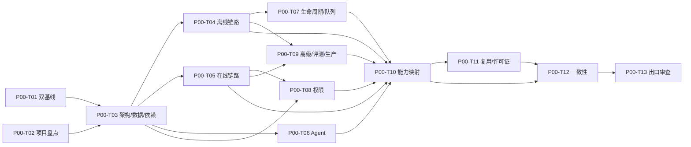

# Phase 00：研究与基线详细实施计划

## 文档导航

[项目总纲](../00-project-master.md) · [RAGFlow 架构](../01-ragflow-architecture.md) · [能力矩阵](../02-ragflow-capability-matrix.md) · [目标架构](../03-target-architecture.md) · [代码复用策略](../04-code-reuse-strategy.md) · [开发路线图](../05-development-roadmap.md) · [工程标准](../06-engineering-standards.md) · [决策与风险](../07-decisions-and-risks.md) · [阶段状态索引](./README.md)

## 0. 使用说明和执行状态

本文件是 Phase 00 的执行手册，不是项目概述。后续 Codex 执行 Phase 00 时，必须按任务依赖顺序工作，并在本文件中更新任务状态和验收结果。

当前约束：

- **[事实]** Phase 00 已于 2026-07-30 获得用户出口确认并完成；业务实现进度仍为 0。
- **[事实]** `00-project-master.md` 和 `01` 至 `07` 辅助文档已经存在，是本计划的输入。
- **[事实]** 本计划已经进入执行；任务状态和实际验证以第 10、11 节记录为准，未完成任务不得预填为完成。
- **[决策]** 本阶段只分析 RAGFlow Python，不分析、复现或适配 Go。
- **[决策]** 时序 RAG 不在项目范围内。
- **[决策]** 第一版采用模块化单体 FastAPI + 独立 Ingestion Worker；同仓库、统一领域模型和基础设施端口、任务队列连接，不拆微服务。
- **[决策]** 第一版必须保留并实现 `tenant_id` 强制隔离、`owner_id`、`visibility`、`AuthorizationContext` 和 `PermissionChecker`；复杂 RBAC、部门权限、动态数据规则后续实现。
- **[决策]** 当前没有批准任何 RAGFlow 源文件直接复用。
- **[决策]** 总体路线图固定为 Phase 00 至 Phase 10 共 11 个阶段：Phase 02 为“Agent基础”，Phase 03 为“知识库统一接口”，Phase 04 为“最小RAG闭环”，Phase 10 为“评测与生产化”；不存在 Phase 11。
- **[事实]** P00-T01 于 2026-07-29 只读观察到远程 `main` 为 `3c59b707c28f7d0ed2fb62135c661e7633537a1a`，已不同于冻结基线；精确记录见 `docs/research/ragflow-baseline.md`。

任务状态只允许：

| 状态 | 含义 |
|---|---|
| 未开始 | 尚未执行任务步骤 |
| 进行中 | 正在分析或验证，尚未满足验收标准 |
| 阻塞 | 缺少输入、权限、用户决策或外部状态，且已记录阻塞证据 |
| 已完成 | 输出、验证命令和验收结果均已记录 |

禁止使用“文档已经存在”作为任务完成证据。任务完成必须以本文件规定的验证和验收标准为准。

---

## 1. 阶段目标

Phase 00 必须形成可供 Phase 01 至 Phase 10 长期使用的事实基线和决策边界：

1. 固定 RAGFlow 冻结 commit 与滚动 `main` 双基线。
2. 核验本项目实际目录、已有文件和业务实现状态。
3. 以源码调用关系说明 RAGFlow Python 的整体架构、离线知识库构建、在线检索与生成、Agent、生命周期、队列、权限、高级 RAG、模型和存储依赖。
4. 对 `CAP-01` 至 `CAP-42` 逐项给出源码证据、LangChain/LangGraph 责任、采用分类、实施阶段、验收方法和当前状态。
5. 对每个 RAGFlow 复用候选记录源文件、符号、内部依赖、抽取难度、许可证、改造方案和目标模块。
6. 识别 RAGFlow、LangChain、LangGraph 都不能完整承担的自研能力。
7. 关闭已经获得用户结论的架构问题，保留仍开放的问题，禁止擅自作出实现选择。
8. 使 Phase 01 能在不重新猜测项目目标、模块边界和源码事实的情况下开始。

本阶段的成功结果是“研究事实和实施边界可验证”，不是“RAG 功能可以运行”。

---

## 2. 为什么需要这个阶段

1. RAGFlow 是大型产品代码库。Parser、Chunk、检索、任务、数据库、全局 settings 和 Agent Canvas 交叉依赖，不读取实际调用链就无法可靠判断复用方式。
2. RAGFlow `main` 会变化。没有冻结 commit，类名、函数、字段和行为会漂移，长期文档无法作为事实依据。
3. LangChain 和 LangGraph 只覆盖标准组件与 Agent 编排，不提供完整的企业知识库生命周期、版本一致性、引用审计和租户隔离。
4. 目标项目是独立系统，不运行 RAGFlow。若没有先划清边界，Phase 01 容易把 Quart、Peewee、`common.settings`、Canvas 或搜索字段字典带入领域层。
5. Parser/OCR、模型权重、原生库和第三方数据有独立许可证与部署风险，不能把 Apache-2.0 当成全部依赖的许可证结论。
6. 第一版 API/Worker 拓扑和 tenant 强隔离会影响所有后续实体、端口、消息、对象 key、索引过滤、Tool、Citation 和 Trace，必须在编码前成为硬约束。
7. Phase 04 必须交付“最小RAG闭环”垂直切片。Phase 00 必须帮助后续阶段选择最小可行路径，避免先建设庞大抽象或高级 RAG。

---

## 3. 前置条件

执行任何 Phase 00 任务前必须确认：

| 编号 | 条件 | 当前已知状态 | 未满足时处理 |
|---|---|---|---|
| PC-01 | 可读取 `D:/download/myself` | 已满足 | 阻塞并请求正确路径 |
| PC-02 | 可读取 `D:/ragflow/ragflow-main` | 已满足 | 阻塞源码分析任务 |
| PC-03 | 可访问 RAGFlow 上游仓库或固定 commit 页面 | 已满足；P00-T01 已验证 | 保留上次观察记录，不把本地快照冒充远程 commit |
| PC-04 | 已读取项目总纲和 ADR 注册表 | 必须每次执行前完成 | 不得开始源码结论更新 |
| PC-05 | 已确认 Python-only、无时序 RAG | 已满足 | 发现冲突时停止并更新决策文档 |
| PC-06 | 已确认 API/Worker 与第一版权限边界 | 已满足 | 发现旧表述时先修正文档 |
| PC-07 | 工作目录中的用户修改已识别 | 已检查；项目无 Git 元数据，按实际文件清单保护 | 保留用户修改，不覆盖无关文件 |

Phase 00 没有前置开发阶段，但受所有已接受 ADR 约束。

---

## 4. 输入资料

### 4.1 本项目事实与规划文档

| 文件 | 用途 |
|---|---|
| `docs/00-project-master.md` | 项目目标、范围、事实优先级、阶段和当前状态 |
| `docs/01-ragflow-architecture.md` | 已有 RAGFlow Python 主链路分析，作为待核验输入 |
| `docs/02-ragflow-capability-matrix.md` | `CAP-01` 至 `CAP-42` 的唯一能力编号和名称来源 |
| `docs/03-target-architecture.md` | 目标模块、进程边界、数据所有权和统一端口 |
| `docs/04-code-reuse-strategy.md` | 复用分类、源码登记、许可证和抽取边界 |
| `docs/05-development-roadmap.md` | Phase 00–10 名称、依赖和出口条件 |
| `docs/06-engineering-standards.md` | 文档、依赖、复用、验证和 Codex 交付规则 |
| `docs/07-decisions-and-risks.md` | ADR-001 至 ADR-012、O-001 至 O-010 和风险登记 |
| `docs/phases/README.md` | 阶段计划状态、执行状态、进入条件和完成条件索引 |

### 4.2 RAGFlow 输入

| 输入 | 用途 |
|---|---|
| 上游仓库 `https://github.com/infiniflow/ragflow` | 远程来源和滚动基线 |
| 冻结 commit `cd846cc9d4e32a19e684c59a1f302601027ef976` | 所有长期源码结论的主要依据 |
| 滚动分支 `main` | 识别冻结基线之后的变化，不自动替代冻结事实 |
| 本地快照 `D:/ragflow/ragflow-main` | 快速搜索和调用链辅助；因无 Git 元数据，不单独证明 commit |
| RAGFlow `LICENSE`、`pyproject.toml` | 主许可证、Python 版本和依赖范围 |

### 4.3 外部框架资料

执行责任边界分析时，只使用与锁定版本相匹配的 LangChain、LangGraph、FastAPI、SQLAlchemy、Redis、Elasticsearch/OpenSearch 官方文档。必须记录访问日期和版本；不得用博客或记忆替代接口事实。

---

## 5. 工作范围

本阶段包含：

1. 双基线登记、变化观察和本地快照完整性检查。
2. 本项目现状盘点。
3. RAGFlow Python 目录职责、入口、依赖注入方式和全局状态分析。
4. 离线链路：上传、对象存储、Document、Task、队列、Worker、Parser、Chunk、自动增强、Embedding、索引、状态更新。
5. 在线链路：查询规范化、改写、跨语言、关键词、元数据过滤、全文/向量/混合检索、清理、融合、Rerank、阈值、TopK/TopN、上下文、生成、引用和 Trace。
6. Agent 链路：Canvas、Knowledge Retrieval Tool、RAGFlow 的 LangGraph Agentic RAG，以及与目标 LangGraph 运行时的差距。
7. 生命周期：更新、删除、重解析、取消、重试、幂等、ACK、补偿和索引同步。
8. 数据结构：Tenant、UserTenant、Knowledgebase、Document、File、Task、Dialog、Conversation、UserCanvas 和搜索 Chunk 字段。
9. 依赖：关系数据库、对象存储、Redis/Valkey、任务队列、搜索引擎、模型 Provider、OCR/版面模型和原生依赖。
10. 权限：tenant/user/owner 语义、知识库可见性、API 上下文、检索索引选择和目标项目强制 tenant 边界。
11. GraphRAG、RAPTOR、多模态 RAG 和现有 benchmark 的边界分析。
12. 42 项能力矩阵、代码复用登记、目标责任划分、风险与开放问题的交叉一致性检查。

---

## 6. 明确不包含的内容

本阶段不得：

1. 创建 `src/`、`pyproject.toml`、数据库迁移、FastAPI 应用或 Worker 业务代码。
2. 安装 Parser、OCR、模型权重、数据库、Redis、对象存储或搜索引擎。
3. 启动 RAGFlow 服务、调用 RAGFlow API 作为目标系统后端，或修改 RAGFlow 源码。
4. 复制任何 RAGFlow 文件到目标项目。
5. 执行 Parser 抽取实验、性能压测或模型质量评测。
6. 分析、编译、复现或适配 RAGFlow Go 代码。
7. 规划或实现时序 RAG。
8. 实现复杂 RBAC、部门权限或动态数据规则。
9. 决定 O-001、O-002、O-004、O-006、O-007、O-008、O-009、O-010，除非用户在任务执行过程中明确确认。
10. 把滚动 `main` 新行为直接写成冻结基线事实。
11. 把计划中的能力写成已实现。
12. 生成 Phase 01 或后续阶段的业务实现。

---

## 7. 需要读取的 RAGFlow 源码文件

### 7.1 阅读和证据规则

每个文件必须：

1. 以冻结 commit 路径为长期引用；本地快照只用于搜索。
2. 记录核心类/函数、调用者、被调用者、输入、输出、持久化副作用、全局依赖和错误行为。
3. 区分冻结基线事实、滚动 `main` 差异和目标项目规划。
4. 对可复用候选记录第三方包、模型权重、资源文件、环境变量、数据库、Redis、对象存储和搜索依赖。
5. 对关键结论至少保留“入口 → 中间服务/函数 → 持久化或返回”的调用关系。
6. 不因函数名或注释声称支持某能力就判定具备；必须检查实际执行路径。

### 7.2 架构、配置、数据、存储与 API

| 源码文件 | 必须分析的内容 |
|---|---|
| `LICENSE` | RAGFlow 主许可证、分发义务、NOTICE/声明要求；不得替代第三方许可证审计 |
| `pyproject.toml` | Python 版本、核心依赖、可选依赖、Parser/OCR/搜索/数据库/模型相关包 |
| `common/settings.py` | `init_settings`、`StorageFactory`、DocStore/Redis/模型全局对象、队列命名、抽取耦合 |
| `common/doc_store/doc_store_base.py` | `DocStoreConnection`、`MatchTextExpr`、`MatchDenseExpr`、`FusionExpr` 和后端抽象边界 |
| `common/doc_store/es_conn_base.py` | Elasticsearch 全文、向量、过滤、批量写入和索引语义 |
| `common/doc_store/infinity_conn_base.py` | Infinity 与 Elasticsearch 的能力差异和特有语义 |
| `rag/utils/opensearch_conn.py` | OpenSearch 查询、KNN、过滤、字段和兼容性差异 |
| `api/ragflow_server.py` | Quart API 入口、初始化、线程/后台动作和全局 settings 关系 |
| `api/db/db_models.py` | Tenant、UserTenant、Knowledgebase、Document、File、Task、Dialog、Conversation、UserCanvas 字段与关系；Chunk 不在关系库的事实 |
| `api/utils/api_utils.py` | `add_tenant_id_to_kwargs`、`current_user` 注入以及 user/tenant 命名混用风险 |
| `api/common/check_team_permission.py` | `check_kb_team_permission`、`check_file_team_permission` 和分散权限检查 |
| `api/apps/restful_apis/dataset_api.py` | 知识库创建、读取、更新、删除 API 与 Service 权限边界 |
| `api/apps/restful_apis/document_api.py` | 上传、解析、重解析、停止、更新、删除的 API 入口和调用链 |
| `api/apps/restful_apis/chunk_api.py` | Chunk 列表、创建、更新、删除、检索和字段映射 |
| `api/apps/restful_apis/chat_api.py` | 固定 RAG 请求、知识库范围、模型与检索参数进入方式 |
| `api/apps/restful_apis/agent_api.py` | Agent/Canvas 入口、运行、流式事件、状态和 Tool 调用 |
| `api/apps/restful_apis/task_api.py` | 任务查询、进度、取消、重试和 API 可观测面 |
| `api/apps/restful_apis/tenant_api.py` | Tenant 成员、邀请、角色和访问控制 |
| `api/apps/restful_apis/user_api.py` | 用户登录、注册、Tenant 创建和认证上下文 |
| `api/db/services/file_service.py` | 文件写入对象存储、File/Document 关系和删除副作用 |
| `api/db/services/document_service.py` | `run`、重解析、删除、进度、tenant 联查和索引同步 |
| `api/db/services/task_service.py` | `queue_tasks`、`get_task`、任务拆分、retry_count、取消和队列投递 |
| `api/db/services/knowledgebase_service.py` | `_visibility_and_status_filter`、`accessible`、知识库配置和统计 |
| `api/db/services/dialog_service.py` | `async_chat`、`rag_agent`、检索、生成、引用和空结果主链路 |
| `api/db/services/llm_service.py` | `LLMBundle`、模型选择、tenant 模型、调用接口、Token/Trace 耦合 |
| `api/db/services/user_service.py` | Tenant/UserTenant 查询、加入关系和权限辅助方法 |
| `rag/llm/chat_model.py` | Chat Provider 适配面、流式、Tool、结构化输出和错误差异 |
| `rag/llm/embedding_model.py` | Embedding Provider、批处理、维度、query/document 编码差异 |
| `rag/llm/rerank_model.py` | Reranker Provider、批量相似度、输入长度和错误处理 |
| `rag/llm/cv_model.py` | Vision 模型入口和图片输入依赖 |
| `rag/llm/ocr_model.py` | OCR Provider 接口与 DeepDOC OCR 的边界 |
| `rag/llm/sequence2txt_model.py` | ASR/序列转文本模型和音频 ingestion 依赖 |

### 7.3 离线任务、Worker、Parser 与 Chunk

| 源码文件 | 必须分析的内容 |
|---|---|
| `docker/launch_backend_service.sh` | API 与 Task Executor 分进程启动、Worker 数量、进程监督；Go 分支只标记范围外 |
| `rag/utils/redis_conn.py` | Redis Stream `XADD`、consumer group、pending、ACK、requeue、锁和异常行为 |
| `rag/svr/task_executor.py` | `collect`、`handle_task`、`main`、并发限制、取消、异常后 ACK、心跳和进度 |
| `rag/svr/task_executor_refactor/task_manager.py` | `TaskManager.run_refactored_task`、dry-run 比较和 TaskHandler 入口 |
| `rag/svr/task_executor_refactor/task_context.py` | Task 字典到 typed context 的字段、tenant、模型、回调和 limiter |
| `rag/svr/task_executor_refactor/task_handler.py` | 标准 Chunk、GraphRAG、RAPTOR、dataflow、embedding、TOC 和最终状态分支 |
| `rag/svr/task_executor_refactor/chunk_builder.py` | `get_parser`、`run_chunking`、Parser/Chunk Method 注册与路由 |
| `rag/svr/task_executor_refactor/chunk_service.py` | `build_chunks`、增强顺序、索引写入、图片、统计和回滚 |
| `rag/svr/task_executor_refactor/chunk_post_processor.py` | 自动关键词、问题、metadata、标签的调用、失败和成本边界 |
| `rag/svr/task_executor_refactor/embedding_service.py` | Embedding 批处理、字段命名、维度、回调和错误传播 |
| `rag/svr/task_executor_refactor/post_processor.py` | 后处理阶段、结果修改和与 ChunkService 的责任边界 |
| `rag/svr/task_executor_refactor/dataflow_service.py` | 自定义 dataflow 任务和标准 ingestion 的分叉 |
| `rag/flow/base.py` | ingestion pipeline 组件基础接口和上下文 |
| `rag/flow/pipeline.py` | pipeline 编排、组件执行、错误和输出 |
| `deepdoc/parser/pdf_parser.py` | `RAGFlowPdfParser`、Plain/Vision 路径、OCR、版面、表格、坐标、模型和原生依赖 |
| `deepdoc/parser/docx_parser.py` | 段落、标题、表格、图片和输出结构 |
| `deepdoc/parser/excel_parser.py` | worksheet、行、表格、类型和规模限制 |
| `deepdoc/parser/ppt_parser.py` | slide 顺序、文本、图片、备注和依赖 |
| `deepdoc/vision/ocr.py` | OCR 模型加载、推理输入输出、设备和资源生命周期 |
| `deepdoc/vision/layout_recognizer.py` | 版面类别、bbox、模型资源和后处理 |
| `deepdoc/vision/table_structure_recognizer.py` | 表格结构识别输出、单元格关系和模型依赖 |
| `rag/app/naive.py` | 通用 Parser 选择、DeepDOC/plaintext 路径、Chunk 基础规则和上游字典 Schema |
| `rag/app/paper.py` | 论文标题、章节、参考文献、图片上下文和 Chunk 规则 |
| `rag/app/book.py` | 书籍章节与层级 Chunk 规则 |
| `rag/app/manual.py` | 手册 outline、问句层级、表图上下文和 Chunk 规则 |
| `rag/app/laws.py` | 法规条款层级识别和 Chunk 规则 |
| `rag/app/qa.py` | 问题/答案字段、格式输入和 Chunk 规则 |
| `rag/app/table.py` | 表头、列类型、行 Chunk、日期和 KnowledgebaseService 耦合 |
| `rag/app/picture.py` | OCR/Vision 描述、临时文件、多模态 Chunk 和模型耦合 |
| `rag/app/audio.py` | ASR、文本输出、Chunk 和模型依赖 |
| `rag/app/email.py` | header、body、附件、来源关系和 Chunk |

### 7.4 在线检索、生成与引用

| 源码文件 | 必须分析的内容 |
|---|---|
| `rag/nlp/query.py` | `FulltextQueryer`、tokenizer、term weight、synonym、查询表达式 |
| `rag/nlp/search.py` | `Dealer.search`、`retrieval`、全文/向量/混合、tenant index、清理、融合、Rerank、TopK、引用 |
| `rag/prompts/generator.py` | `kb_prompt`、`citation_prompt`、`full_question`、`cross_languages`、关键词、问题和 metadata filter Prompt |
| `common/metadata_utils.py` | metadata 条件结构、操作符、执行、allowlist 缺口和模型输出风险 |

### 7.5 Agent、高级 RAG、评测

| 源码文件 | 必须分析的内容 |
|---|---|
| `agent/tools/retrieval.py` | `RetrievalParam`、`Retrieval._retrieve_kb`、知识库 Tool 输入输出、引用和 Dealer 复用 |
| `agent/canvas.py` | Graph/Canvas 状态、循环、事件、取消、await、Service/Redis/模型耦合 |
| `rag/advanced_rag/agentic_rag_graph.py` | `AgenticState`、LangGraph 节点、路由、compile、缺少 Checkpointer/HITL 的事实 |
| `rag/advanced_rag/agentic_rag.py` | `RAGTools`、Web/结构化/知识库检索工具和 Service 耦合 |
| `rag/graphrag/general/index.py` | GraphRAG 构建阶段、实体/关系、社区、锁、Checkpoint、存储和取消 |
| `rag/graphrag/search.py` | `KGSearch`、图检索、Dealer 继承和结果融合 |
| `rag/advanced_rag/knowlege_compile/raptor.py` | 聚类、递归摘要、树结构、模型、取消和输出 Chunk |
| `test/benchmark/README.md` | benchmark 能覆盖的 API、并发、场景和不覆盖的质量指标 |
| `test/benchmark/metrics.py` | 延迟、首 Token、分位数统计和缺失的 Recall/MRR/NDCG/忠实度/引用指标 |

---

## 8. 需要产出的能力清单

最终能力登记以 `docs/02-ragflow-capability-matrix.md` 为唯一事实表。每一项必须具有 RAGFlow 是否具备、源码位置、LangChain 能否承担、LangGraph 能否承担、采用方式、复用分类、实施阶段、验收方法和当前状态。

| ID | 能力名称 | Phase 00 必须形成的证据 |
|---|---|---|
| CAP-01 | 多格式文档解析 | 格式入口、Parser 类、输出形态、依赖和错误边界 |
| CAP-02 | OCR 与版面分析 | OCR/Layout/Table 调用、模型资源、坐标和设备依赖 |
| CAP-03 | 统一文档结构 | RAGFlow 输出差异与目标 ParsedDocument/ParsedBlock 缺口 |
| CAP-04 | 场景化 Chunk Method | 每种场景策略入口、规则、输入格式和共享依赖 |
| CAP-05 | Chunk 自动关键词 | 函数、Prompt、模型、批处理和失败降级 |
| CAP-06 | Chunk 自动问题 | 函数、Prompt、模型、批处理和失败降级 |
| CAP-07 | 摘要、标题与 TOC | 四类产物的来源、层级、页码和调用分支 |
| CAP-08 | Embedding 与索引写入 | Embedding 批处理、维度、字段和 DocStore 写入 |
| CAP-09 | 全文检索 | FulltextQueryer、tokenizer、BM25/词法表达式和后端接口 |
| CAP-10 | 向量检索 | query vector、KNN、维度、阈值和过滤 |
| CAP-11 | 混合检索 | 全文/向量候选、FusionExpr、后端分支和分数语义 |
| CAP-12 | 查询改写与独立问题生成 | full_question 输入输出、会话依赖和失败回退 |
| CAP-13 | 跨语言查询 | cross_languages Prompt、查询集合和专有名词风险 |
| CAP-14 | 关键词扩展 | LLM 关键词与词法扩展的责任边界 |
| CAP-15 | 元数据过滤 | 条件 Schema、操作符、allowlist 和搜索适配 |
| CAP-16 | 权限过滤 | RAGFlow me/team 与 tenant index 事实；目标 PermissionChecker 差距 |
| CAP-17 | 空结果降级 | empty_response、空候选分支和 Agent abstain |
| CAP-18 | 候选清理与去重 | 删除防御、版本失效、重复 Chunk 和每文档限制 |
| CAP-19 | Reranker | 本地融合、外部模型、批处理、超时和分数 |
| CAP-20 | 分数融合、阈值与 TopK/TopN | 权重、阈值、分页、候选窗口和最终截断 |
| CAP-21 | 引用与来源定位 | Prompt、匹配算法、Chunk/页码/bbox 和版本缺口 |
| CAP-22 | Retrieval Trace | 已有 trace_id/日志与完整可重放 Trace 的差距 |
| CAP-23 | 文档上传与解析任务 | API、对象存储、Document、IngestionJob/Task 和队列链路 |
| CAP-24 | 文档更新与重新解析 | 旧索引删除、重新排队和目标 DocumentVersion 差距 |
| CAP-25 | 文档删除与索引同步 | 关系库、对象、Chunk 图片、搜索和派生数据删除 |
| CAP-26 | 任务重试、取消与幂等 | retry_count、cancel key、pending、ACK 和重复投递缺口 |
| CAP-27 | 固定 RAG 问答 | DialogService、Dealer、Prompt、LLM、Citation 完整调用链 |
| CAP-28 | KnowledgeBaseTool | Retrieval Tool 参数、KnowledgeQuery 共享边界和结构化结果 |
| CAP-29 | LangGraph 状态、路由与循环 | RAGFlow AgenticState/节点与目标 AgentState 差距 |
| CAP-30 | Checkpoint 与运行恢复 | graph compile 是否配置 Checkpointer及目标恢复要求 |
| CAP-31 | Human-in-the-loop | Canvas await/input 与 LangGraph interrupt/resume 差异 |
| CAP-32 | 多 Agent 协作 | RAGFlow 组件调用与目标 supervisor/worker 治理缺口 |
| CAP-33 | GraphRAG | 构建、查询、依赖、存储、取消和评测前提 |
| CAP-34 | RAPTOR | 聚类、摘要树、来源、模型和取消 |
| CAP-35 | 多模态 RAG | 图片、音频、Vision/ASR、来源坐标和检索缺口 |
| CAP-36 | 模型注册与调用 | LLMBundle/Provider、tenant 模型、配额、密钥和 LangChain 边界 |
| CAP-37 | FastAPI 服务接口 | RAGFlow Quart 仅作接口用例；目标 FastAPI 自研边界 |
| CAP-38 | 后台任务与 Ingestion 执行 | API/Worker 分进程、Redis Stream、TaskHandler 和可靠性缺口 |
| CAP-39 | 评测与回归门禁 | benchmark 覆盖与质量、引用、Agent 指标缺口 |
| CAP-40 | 日志、指标与链路追踪 | logging、Langfuse、Jaeger、Token sink 和统一 Schema 缺口 |
| CAP-41 | 权限与安全 | Tenant/User、认证、Sandbox 与目标第一版 tenant 强隔离 |
| CAP-42 | 生产部署、备份与恢复 | Docker/Helm/健康检查事实与目标项目自研范围 |

能力清单不得增加未在矩阵登记的新编号。发现新能力时，先判断它是现有能力的子项还是确实需要新编号，并在修改前同步总纲、矩阵和路线图。

---

## 9. 需要产出的代码复用清单

最终登记写入 `docs/04-code-reuse-strategy.md`。每一行必须包含：源文件、核心类或函数、内部依赖、抽取难度、许可证要求、采用分类、改造方案、目标模块。

### 9.1 Parser、OCR 和 Chunk 候选

| 候选源文件 | Phase 00 输出要求 |
|---|---|
| `deepdoc/parser/pdf_parser.py` | PDF/OCR/Layout/Table 依赖图、极高抽取风险、ParserPort 适配边界 |
| `deepdoc/parser/docx_parser.py` | 段落/表格/图片输出和 tokenizer 替换点 |
| `deepdoc/parser/excel_parser.py` | worksheet/row 输出、规模限制和依赖 |
| `deepdoc/parser/ppt_parser.py` | slide/图片/备注能力与低耦合候选判断 |
| `deepdoc/vision/ocr.py` | 模型权重、设备、资源生命周期和隔离要求 |
| `deepdoc/vision/layout_recognizer.py` | 版面模型、bbox、资源和后处理依赖 |
| `deepdoc/vision/table_structure_recognizer.py` | 表格结构模型、单元格输出和许可证风险 |
| `rag/app/naive.py` | Parser 选择与通用 Chunk 拆分方案 |
| `rag/app/paper.py` | 论文纯规则可保留部分和 DeepDOC 耦合 |
| `rag/app/book.py` | 章节层级规则和目标 heading_path |
| `rag/app/manual.py` | 手册层级、表图上下文和目标策略 |
| `rag/app/laws.py` | 条款识别规则和通用化边界 |
| `rag/app/qa.py` | QA 字段验证和策略边界 |
| `rag/app/table.py` | 列类型/行 Chunk 算法与 Service/settings 去除 |
| `rag/app/picture.py` | OCR/Vision 注入和多模态输出 |
| `rag/app/audio.py` | ASR Port、模型许可证和音频 Chunk |
| `rag/app/email.py` | header/body/attachment 与来源关系 |

### 9.2 Ingestion、检索、生成和 Agent 候选

| 候选源文件 | Phase 00 输出要求 |
|---|---|
| `rag/svr/task_executor_refactor/chunk_builder.py` | ParserRegistry/ChunkStrategyRegistry 参考重写 |
| `rag/svr/task_executor_refactor/chunk_post_processor.py` | EnrichmentPort、Prompt 来源和失败策略 |
| `rag/svr/task_executor_refactor/chunk_service.py` | 阶段顺序保留，Service/settings/DocStore 去除 |
| `rag/svr/task_executor_refactor/embedding_service.py` | LangChain Embeddings + EmbeddingPort 责任 |
| `rag/nlp/query.py` | 词法算法与 tokenizer/Redis 替换点 |
| `rag/nlp/search.py` | Retriever/Cleaner/Fusion/Reranker/Citation 拆分 |
| `common/doc_store/doc_store_base.py` | Filter AST、SearchRequest、SearchPort 参考重写 |
| `rag/prompts/generator.py` | Prompt 版本、来源、Structured Output 和 tokenizer 替换 |
| `common/metadata_utils.py` | 严格 Filter AST 和 allowlist 自研 |
| `agent/tools/retrieval.py` | LangChain KnowledgeBaseTool 参考重写 |
| `agent/canvas.py` | 只提取运行需求，不复用 Canvas Runtime |
| `rag/advanced_rag/agentic_rag_graph.py` | LangGraph 节点思路、Checkpoint/HITL 补齐 |
| `rag/advanced_rag/agentic_rag.py` | RAGTools 到应用服务/LangChain Tool 的拆分 |

### 9.3 高级 RAG、数据、任务和运行时候选

| 候选源文件 | Phase 00 输出要求 |
|---|---|
| `rag/graphrag/general/index.py` | 算法阶段、锁/Checkpoint/存储替换和依赖清单 |
| `rag/graphrag/search.py` | AdvancedRetrieverPort 目标边界 |
| `rag/advanced_rag/knowlege_compile/raptor.py` | 聚类核心、Summarizer/CancellationToken 注入 |
| `api/db/db_models.py` | 只参考产品用例；SQLAlchemy 领域模型重新设计 |
| `api/utils/api_utils.py` | 只参考认证后注入；AuthorizationContext 自研 |
| `api/db/services/knowledgebase_service.py` | 可见性用例转 PermissionChecker 测试 |
| `api/common/check_team_permission.py` | 分散权限逻辑的反例和统一检查器需求 |
| `api/db/services/file_service.py` | Lifecycle/Repository/ObjectStoragePort 参考重写 |
| `api/db/services/document_service.py` | DocumentVersion/IngestionJob/补偿自研 |
| `api/db/services/task_service.py` | TaskQueuePort/IngestionJobRepository 参考重写 |
| `rag/utils/redis_conn.py` | Redis Stream Adapter 候选；ACK/retry/dead-letter 契约重建 |
| `rag/svr/task_executor.py` | Worker 进程需求参考；禁止复制无条件 ACK |
| `docker/launch_backend_service.sh` | 同仓库 API/Worker 分进程证据；不复制脚本和 Go 分支 |
| `api/db/services/dialog_service.py` | Query/FixedRAG/Citation/Agent 服务拆分 |
| `api/db/services/llm_service.py` | LangChain 模型接口优先；注册、配额、审计自研 |
| `common/settings.py` | 全局连接反例；显式配置和依赖注入自研 |

复用分类只能使用：`直接复用`、`改造复用`、`参考重写`、`自行开发`、`暂缓`。Phase 00 只能登记候选，不能批准复制；直接复用仍需用户明确批准。

---

## 10. 任务拆分和依赖

### 10.1 任务总表

| 任务 ID | 名称 | 当前状态 | 依赖任务 | 主要输出 |
|---|---|---|---|---|
| P00-T01 | 固定并核验双基线 | 已完成 | 无 | 基线记录和差异规则 |
| P00-T02 | 盘点目标项目现状 | 已完成 | 无 | 项目现状与差距事实 |
| P00-T03 | 分析 RAGFlow 架构、数据与依赖 | 已完成 | P00-T01、P00-T02 | 架构和依赖证据 |
| P00-T04 | 分析离线知识库构建链路 | 已完成 | P00-T01、P00-T03 | 离线调用链和能力证据 |
| P00-T05 | 分析在线检索、生成与引用链路 | 已完成 | P00-T01、P00-T03 | 在线调用链和能力证据 |
| P00-T06 | 分析 Agent 与 LangGraph 差距 | 已完成 | P00-T01、P00-T03 | Agent 调用链和责任边界 |
| P00-T07 | 分析生命周期、队列和 Worker 可靠性 | 已完成 | P00-T01、P00-T03、P00-T04 | 生命周期与可靠任务证据 |
| P00-T08 | 分析 tenant、ACL 与数据权限 | 已完成 | P00-T01、P00-T03、P00-T05 | 权限源码事实和目标约束 |
| P00-T09 | 分析高级 RAG、多模态、评测和生产依赖 | 已完成 | P00-T01、P00-T03、P00-T04、P00-T05 | 高级能力与差距证据 |
| P00-T10 | 完成 42 项能力责任与阶段映射 | 已完成 | P00-T04 至 P00-T09 | 能力矩阵和目标边界 |
| P00-T11 | 完成代码复用、依赖和许可证登记 | 已完成 | P00-T04 至 P00-T10 | 源码级复用清单 |
| P00-T12 | 完成跨文档一致性与风险审计 | 已完成 | P00-T10、P00-T11 | 一致性报告和修正文档 |
| P00-T13 | 执行 Phase 00 出口审查 | 已完成 | P00-T12 | Phase 00 验收记录和 Phase 01 准入结论 |

### 10.2 依赖图



---

## 11. 具体任务

### P00-T01：固定并核验双基线

- **状态**：已完成
- **目标**：确认冻结 commit、滚动 `main` 观察值和本地快照的证据角色，使所有后续源码结论可追溯。
- **输入**：上游仓库、冻结 commit、`D:/ragflow/ragflow-main`、总纲 front matter、RAGFlow `LICENSE` 和 `pyproject.toml`。
- **涉及文件**：`docs/00-project-master.md`、`docs/01-ragflow-architecture.md`、`docs/07-decisions-and-risks.md`、本文件。
- **操作步骤**：
  1. 读取总纲中的冻结 commit、tracking ref、最后观察 commit 和日期。
  2. 使用上游 Git 查询确认冻结 commit 可访问。
  3. 查询执行时 `main` HEAD；只记录变化，不自动更新冻结基线。
  4. 检查本地快照是否有 `.git`；没有时明确标为辅助快照。
  5. 核对 `LICENSE`、`pyproject.toml`、关键路径是否存在。
  6. 若滚动 `main` 与冻结 commit 不同，建立差异摘要：新增、删除、重命名、行为变化、能力影响和是否需要 ADR。
  7. 更新基线观察日期，不把未核验的远程状态写成事实。
- **输出文件**：更新 `docs/00-project-master.md` 基线字段、`docs/01-ragflow-architecture.md` 基线说明、必要时更新 `docs/07-decisions-and-risks.md` 的漂移风险。
- **源码依据**：RAGFlow 仓库根 `LICENSE`、`pyproject.toml` 及固定 commit。
- **验证命令**：

```powershell
git ls-remote https://github.com/infiniflow/ragflow.git refs/heads/main
Test-Path -LiteralPath 'D:\ragflow\ragflow-main\LICENSE'
Test-Path -LiteralPath 'D:\ragflow\ragflow-main\pyproject.toml'
Test-Path -LiteralPath 'D:\ragflow\ragflow-main\.git'
Select-String -LiteralPath 'D:\download\myself\docs\00-project-master.md' -Pattern 'ragflow_frozen_baseline_commit','ragflow_tracking_last_observed_commit','ragflow_tracking_last_observed_at'
```

- **实际产出**：新增 `docs/research/ragflow-baseline.md`；更新总纲、RAGFlow 架构和 ADR-005/R-001 的滚动基线记录。
- **实际验证**：2026-07-29 使用临时只读审计 Git 仓库实际 fetch 冻结 commit 和 `main`；`git rev-parse`/`cat-file` 均通过。冻结 commit 为 `cd846cc9d4e32a19e684c59a1f302601027ef976`，滚动 `main` 为 `3c59b707c28f7d0ed2fb62135c661e7633537a1a`；相关范围有 63 个变更路径；本地快照无 `.git`。
- **验收结果**：通过。冻结、滚动和本地三种证据角色已经分离，日期、commit、版本、许可证和关键 blob 对比可复查。
- **计划偏差**：计划只要求查询远程引用；实际增加了临时 partial Git 审计仓库和关键文件 blob 比较，因为本地快照不是单一上游 commit。未改变冻结基线。
- **依赖任务**：无。
- **风险**：网络不可用、本地快照无 Git 元数据、`main` 漂移。网络不可用时不得伪造最新 commit；任务可记录为阻塞或沿用上次观察值并标注未刷新。

### P00-T02：盘点目标项目现状

- **状态**：已完成
- **目标**：确认目标项目已经存在的文件、业务代码、配置、迁移、测试和部署产物，防止把规划写成实现。
- **输入**：`D:/download/myself` 全目录、总纲当前状态、工程标准。
- **涉及文件**：`docs/00-project-master.md`、`docs/05-development-roadmap.md`、`docs/07-decisions-and-risks.md`、本文件。
- **操作步骤**：
  1. 列出项目根目录和隐藏文件。
  2. 检查 `src/`、`tests/`、`migrations/`、`pyproject.toml`、`uv.lock`、部署文件和 CI 文件。
  3. 检查现有 Markdown 文档及状态。
  4. 将每项分成已存在、已实现、已验证、仅规划四种状态。
  5. 对业务实现状态给出可复查证据。
  6. 若发现用户代码，不修改，只更新现状和差距。
- **输出文件**：更新 `docs/00-project-master.md` 当前状态、`docs/05-development-roadmap.md` 当前进度；必要时更新风险登记。
- **源码依据**：目标项目实际文件系统；本任务不使用 RAGFlow 结论替代项目现状。
- **验证命令**：

```powershell
Get-ChildItem -LiteralPath 'D:\download\myself' -Force
Get-ChildItem -LiteralPath 'D:\download\myself' -Recurse -File -Force | Select-Object FullName
@('src','tests','migrations','pyproject.toml','uv.lock') | ForEach-Object {
  [pscustomobject]@{ Path = $_; Exists = Test-Path -LiteralPath (Join-Path 'D:\download\myself' $_) }
}
```

- **实际产出**：新增 `docs/research/project-baseline.md`；更新总纲和路线图的当前项目事实。
- **实际验证**：递归检查隐藏文件并计算文件清单；任务开始时有 12 个文档/入口文件，`src/tests/migrations/pyproject.toml/uv.lock/deployments/.git` 均不存在；Python、迁移、测试、部署文件均为 0。本任务新增基线文档后共有 13 个文件。
- **验收结果**：通过。当前项目是 documentation-only greenfield，业务实现进度为 0，文件级证据可复查。
- **计划偏差**：无范围偏差；额外记录了 SHA-256 文件清单和“生成本基线后文件数增加”的时间点，避免盘点数字自相矛盾。
- **依赖任务**：无。
- **风险**：隐藏文件遗漏、把文档当业务实现、覆盖用户修改。必须使用 `-Force` 并保持只读盘点。

### P00-T03：分析 RAGFlow 架构、数据与依赖

- **状态**：已完成
- **目标**：建立 RAGFlow Python 入口、目录职责、全局初始化、数据模型、存储、搜索和模型依赖的源码地图。
- **输入**：P00-T01 基线、P00-T02 项目现状、第 7.2 节源码。
- **涉及文件**：`docs/01-ragflow-architecture.md`、`docs/02-ragflow-capability-matrix.md`、`docs/03-target-architecture.md`、`docs/04-code-reuse-strategy.md`、`docs/07-decisions-and-risks.md`。
- **操作步骤**：
  1. 从 `api/ragflow_server.py` 和 `common/settings.py` 追踪初始化。
  2. 画出 API、Service、Peewee、对象存储、DocStore、Redis、模型、Worker 和 Agent 的依赖关系。
  3. 从 `db_models.py` 记录核心表、主键、tenant/owner/permission 字段和关联。
  4. 确认 Chunk 的关系库/搜索存储边界。
  5. 比较 Elasticsearch、OpenSearch、Infinity 的全文、向量、过滤和批量接口。
  6. 记录模型 Provider 类型、统一接口和 tenant 模型耦合。
  7. 标记 `common.settings`、Peewee、Quart、全局连接和上游字典 Schema 等抽取障碍。
  8. 将事实同步到架构、能力和复用文档。
- **输出文件**：更新 `docs/01-ragflow-architecture.md`、`docs/02-ragflow-capability-matrix.md`、`docs/03-target-architecture.md`、`docs/04-code-reuse-strategy.md`、`docs/07-decisions-and-risks.md`。
- **源码依据**：第 7.2 节列出的全部文件。
- **验证命令**：

```powershell
$required = @(
  'common\settings.py','common\doc_store\doc_store_base.py','api\ragflow_server.py',
  'api\db\db_models.py','api\db\services\llm_service.py','rag\llm\embedding_model.py'
)
$required | ForEach-Object {
  $p = Join-Path 'D:\ragflow\ragflow-main' $_
  if (-not (Test-Path -LiteralPath $p)) { throw "Missing RAGFlow source: $p" }
}
Select-String -LiteralPath 'D:\download\myself\docs\01-ragflow-architecture.md' -Pattern 'common/settings.py','db_models.py','DocStoreConnection','LLMBundle'
```

- **实际产出**：新增 `docs/research/ragflow-source-map.md` 的架构、关系模型、DocStore、搜索后端、模型统一层和依赖证据 RF-A01 至 RF-M04；更新 `01`、`02`、`03`、`04`、`07`，明确 Chunk 搜索存储边界、Task/Document tenant 联查和目标任务信封约束。
- **实际验证**：固定 commit 下实际读取 `ragflow_server.py`、`settings.py`、`db_models.py`、`doc_store_base.py`、ES/OpenSearch/Infinity 实现、`LLMBundle` 及 Embedding/Rerank/CV/OCR/ASR 基类；本地 6 个计划必需路径全部存在；架构文档 4 个关键模式和源码地图 5 个证据标识检查全部通过。
- **验收结果**：通过。文档可从入口定位到初始化、关系模型、对象存储、队列命名、DocStore、搜索实现和模型统一层；每项关键事实均固定到冻结 commit。
- **计划偏差**：本地快照与冻结 commit 混合，实际源码读取改用冻结 Git 对象和 GitHub connector；新增独立源码证据地图，避免把大量调用关系重复塞入总览文档。未改变架构或范围。
- **依赖任务**：P00-T01、P00-T02。
- **风险**：只按目录猜职责、忽略动态 import、把搜索 Chunk 当领域实体。必须使用函数调用和字段写入证据。

### P00-T04：分析离线知识库构建链路

- **状态**：已完成
- **目标**：从上传入口追踪到任务完成，记录每个阶段的类、函数、输入、输出、持久化副作用和失败行为。
- **输入**：P00-T03 架构图、第 7.3 节源码。
- **涉及文件**：`docs/01-ragflow-architecture.md`、`docs/02-ragflow-capability-matrix.md`、`docs/04-code-reuse-strategy.md`、`docs/07-decisions-and-risks.md`。
- **操作步骤**：
  1. 从 `document_api.py` 定位上传和 parse/reparse 入口。
  2. 追踪 `FileService` 写对象存储和 File/Document 创建。
  3. 追踪 `DocumentService.run → TaskService.queue_tasks`。
  4. 记录 PDF 页范围、表格行范围和其他任务拆分规则。
  5. 追踪 Redis Stream 投递和 `task_executor.collect` 消费。
  6. 追踪 `TaskManager → TaskHandler` 的标准、dataflow、GraphRAG、RAPTOR 分支。
  7. 追踪 `chunk_builder → rag.app.* → ChunkService → EmbeddingService → DocStore`。
  8. 记录关键词、问题、metadata、TOC、图片和统计更新顺序。
  9. 对 PDF、DOCX、XLSX、PPTX、通用文本、论文、书籍、手册、法规、QA、表格、图片、音频、邮件分别定位入口。
  10. 更新 CAP-01 至 CAP-08、CAP-23、CAP-38 的证据。
- **输出文件**：更新 `docs/01-ragflow-architecture.md` 离线链路、`docs/02-ragflow-capability-matrix.md` 对应行、`docs/04-code-reuse-strategy.md` Parser/Chunk/Ingestion 登记。
- **源码依据**：第 7.3 节列出的全部文件。
- **验证命令**：

```powershell
$root = 'D:\ragflow\ragflow-main'
Select-String -LiteralPath (Join-Path $root 'api\db\services\document_service.py') -Pattern 'def run'
Select-String -LiteralPath (Join-Path $root 'api\db\services\task_service.py') -Pattern 'def queue_tasks'
Select-String -LiteralPath (Join-Path $root 'rag\svr\task_executor.py') -Pattern 'async def collect','async def handle_task'
Select-String -LiteralPath (Join-Path $root 'rag\svr\task_executor_refactor\task_handler.py') -Pattern 'class TaskHandler','_run_standard_chunking'
Select-String -LiteralPath 'D:\download\myself\docs\01-ragflow-architecture.md' -Pattern 'DocumentService.run','TaskService.queue_tasks','TaskManager','TaskHandler','EmbeddingService'
```

- **实际产出**：在 `docs/research/ragflow-source-map.md` 新增 RF-I01 至 RF-I18，覆盖上传/建档、parse/reparse、任务拆分、Redis XADD、Worker 领取、`TE_RUN_MODE`、TaskManager/TaskHandler 路由、标准/dataflow 分叉、Parser/Chunk 注册、增强、Embedding、索引、TOC、统计和格式/场景能力；同步更新能力矩阵 CAP-01 至 CAP-08、CAP-23、CAP-38 的冻结源码位置。
- **实际验证**：计划列出的 6 个本地符号检查、架构文档 5 个主链符号检查、源码地图 6 个关键证据/格式检查全部通过；关键链路另由 GitHub connector 在冻结 commit 逐文件读取确认。
- **验收结果**：通过。已形成从 `document_api.upload_document` 到 `RedisMsg.ack` 的完整可复述调用链，每段包含路径、符号、输入/副作用和失败边界。
- **计划偏差**：实际确认 `TE_RUN_MODE=0` 才是 refactor 默认路径，旧 executor 仍保留；PPT Parser 已确认 slide 文本/表格，但冻结源码未发现 notes 专用输出，故不把“备注解析”记为已具备。未展开 GraphRAG/RAPTOR 算法，按计划留到 P00-T09。
- **依赖任务**：P00-T01、P00-T03。
- **风险**：旧 executor 与 refactor 路径并存、分支过多、注释与运行模式不一致。必须记录 `TE_RUN_MODE` 和实际分支。

### P00-T05：分析在线检索、生成与引用链路

- **状态**：已完成
- **目标**：建立固定 RAG 从请求到答案、候选、引用和空结果的完整调用链。
- **输入**：P00-T03 架构图、第 7.4 节源码、`dialog_service.py`、`chat_api.py`。
- **涉及文件**：`docs/01-ragflow-architecture.md`、`docs/02-ragflow-capability-matrix.md`、`docs/03-target-architecture.md`、`docs/04-code-reuse-strategy.md`。
- **操作步骤**：
  1. 从 Chat/检索 API 定位 `DialogService.async_chat` 或等价入口。
  2. 记录知识库 ID、tenant ID、doc ID、metadata、阈值、权重、TopK、TopN 和 reranker 参数来源。
  3. 追踪独立问题、跨语言、关键词和 metadata filter。
  4. 追踪 `Dealer.search/retrieval` 的全文、向量和混合分支。
  5. 记录候选窗口、分页、清理、融合、Rerank、阈值和截断顺序。
  6. 追踪 `kb_prompt`、LLM 流式生成、`citation_prompt` 和引用匹配。
  7. 记录空结果和错误的区分。
  8. 记录 trace_id、日志、Langfuse 与完整 Retrieval Trace 的差距。
  9. 更新 CAP-09 至 CAP-22、CAP-27 的证据。
- **输出文件**：更新 `docs/01-ragflow-architecture.md` 在线链路、`docs/02-ragflow-capability-matrix.md` 对应行、`docs/03-target-architecture.md` 目标查询边界、`docs/04-code-reuse-strategy.md` 检索/Prompt 登记。
- **源码依据**：`api/apps/restful_apis/chat_api.py`、`api/db/services/dialog_service.py`、第 7.4 节全部文件。
- **验证命令**：

```powershell
$root = 'D:\ragflow\ragflow-main'
Select-String -LiteralPath (Join-Path $root 'api\db\services\dialog_service.py') -Pattern 'async_chat','rag_agent'
Select-String -LiteralPath (Join-Path $root 'rag\nlp\search.py') -Pattern 'async def search','async def retrieval','rerank','insert_citations'
Select-String -LiteralPath (Join-Path $root 'rag\prompts\generator.py') -Pattern 'kb_prompt','citation_prompt','full_question','cross_languages'
Select-String -LiteralPath 'D:\download\myself\docs\02-ragflow-capability-matrix.md' -Pattern 'CAP-09','CAP-11','CAP-17','CAP-21','CAP-22','CAP-27'
```

- **实际产出**：在源码证据地图新增 RF-Q01 至 RF-Q21，记录固定 RAG 入口、参数来源、查询独立化/跨语言/关键词、metadata push-down/fallback、全文/向量/混合候选、后端差异、候选窗口、清理、Rerank、阈值/分页、Context、生成、引用与 Trace 缺口；更新架构文档和 CAP-09 至 CAP-22、CAP-27。
- **实际验证**：本地 10 个入口/检索/Prompt 符号、能力矩阵 6 个代表性 CAP、源码地图 6 个关键语义检查全部通过；冻结源码逐段确认 `async_chat` 和 `Dealer.search/retrieval/insert_citations` 实现。
- **验收结果**：通过。已明确操作顺序、初次召回与最终融合的分数来源、metadata/tenant/doc 过滤位置、TopK/TopN、后端分支、引用相似度算法和空结果三态。
- **计划偏差**：发现比原计划更细的实际语义：manual metadata 无匹配使用 `[-999]`，auto/semi 使用 `None`；初次 Fusion 固定 `0.001,1`，Dialog 权重用于后续融合；`trace_id` 没有形成完整 Retrieval Trace。均已记录，未改变目标架构。
- **依赖任务**：P00-T01、P00-T03。
- **风险**：把 Prompt 生成当检索、混淆后端分数、只描述理想链路。必须记录具体后端分支和实际字段。

### P00-T06：分析 Agent 与 LangGraph 差距

- **状态**：已完成
- **目标**：区分 RAGFlow Canvas、Knowledge Retrieval Tool 和 LangGraph Agentic RAG，确定目标项目的 LangChain/LangGraph/自研责任。
- **输入**：P00-T03 架构图、第 7.5 节 Agent 文件、ADR-002、ADR-009。
- **涉及文件**：`docs/01-ragflow-architecture.md`、`docs/02-ragflow-capability-matrix.md`、`docs/03-target-architecture.md`、`docs/04-code-reuse-strategy.md`。
- **操作步骤**：
  1. 分析 Canvas Graph/Canvas 运行、状态、循环、事件、取消和 await/input。
  2. 记录 Canvas 对 FileService、LLMBundle、TaskService、Redis、TTS 和 Langfuse 的耦合。
  3. 分析 `Retrieval._retrieve_kb` 的参数、调用和输出。
  4. 分析 `build_agentic_graph` 节点、边、State、Tool 和 compile。
  5. 核验是否配置 Checkpointer、interrupt/resume 和多 Agent 治理。
  6. 将标准模型、Embedding、Tool、Prompt 归入 LangChain。
  7. 将状态、路由、循环、重试、Checkpoint、HITL、多 Agent 归入 LangGraph。
  8. 将 AgentState 领域语义、权限、预算、审计、Tool policy 和共享 KnowledgeQueryService 归入自研。
  9. 更新 CAP-28 至 CAP-32。
- **输出文件**：更新 `docs/01-ragflow-architecture.md` Agent 章节、`docs/02-ragflow-capability-matrix.md`、`docs/03-target-architecture.md`、`docs/04-code-reuse-strategy.md`。
- **源码依据**：`agent/tools/retrieval.py`、`agent/canvas.py`、`rag/advanced_rag/agentic_rag_graph.py`、`rag/advanced_rag/agentic_rag.py`。
- **验证命令**：

```powershell
$root = 'D:\ragflow\ragflow-main'
Select-String -LiteralPath (Join-Path $root 'agent\tools\retrieval.py') -Pattern '_retrieve_kb'
Select-String -LiteralPath (Join-Path $root 'agent\canvas.py') -Pattern 'class Graph','class Canvas','def run'
Select-String -LiteralPath (Join-Path $root 'rag\advanced_rag\agentic_rag_graph.py') -Pattern 'StateGraph','compile','checkpointer','interrupt'
Select-String -LiteralPath 'D:\download\myself\docs\02-ragflow-capability-matrix.md' -Pattern 'CAP-28','CAP-29','CAP-30','CAP-31','CAP-32'
```

- **实际产出**：源码地图新增 RF-G01 至 RF-G10，区分自定义 Canvas、Canvas Retrieval Tool 和 LangGraph Agentic RAG；记录 Canvas loop/user_inputs/cancel/event、Retrieval Tool 调用、六节点 AgenticState 图、无 checkpointer/interrupt/thread_id 的事实，并形成 LangChain/LangGraph/RAGFlow/自研四方责任表；同步更新架构和 CAP-28 至 CAP-32。
- **实际验证**：Canvas/Retrieval/StateGraph/compile 6 个正向符号检查通过；不存在 `compile(checkpointer=...)` 和 LangGraph `interrupt(...)` 调用的负向检查通过；5 项能力和 5 项冻结证据检查通过。
- **验收结果**：通过。已证明主 Canvas 是自定义组件运行时；RAGFlow Agentic 图虽使用 LangGraph，但无 durable checkpoint/HITL；固定 RAG 与 Retrieval Tool 只共享 Dealer，不共享应用层查询服务，目标必须统一到 `KnowledgeQueryService`。
- **计划偏差**：实际 Agentic 图注册六个节点，源码 docstring 的“4-node”已判为过时注释；Canvas 当前导入的是 `task_service.has_canceled` 而非完整 `TaskService` 类。均按执行代码记录。
- **依赖任务**：P00-T01、P00-T03。
- **风险**：把 Canvas 组件映射成 LangGraph 节点即视为可复用、因导入 LangGraph 就误判具备 Checkpoint/HITL。必须检查 graph compile 和运行入口。

### P00-T07：分析生命周期、队列和 Worker 可靠性

- **状态**：已完成
- **目标**：确定更新、删除、重解析、任务拆分、领取、ACK、重试、取消、崩溃恢复和索引同步的实际行为与目标差距。
- **输入**：P00-T04 离线链路、Task/Document/Redis/Executor 源码、ADR-011。
- **涉及文件**：`docs/01-ragflow-architecture.md`、`docs/02-ragflow-capability-matrix.md`、`docs/03-target-architecture.md`、`docs/04-code-reuse-strategy.md`、`docs/06-engineering-standards.md`、`docs/07-decisions-and-risks.md`。
- **操作步骤**：
  1. 分析 Document update/reparse/delete/stop API 和 Service。
  2. 记录关系库、对象存储、搜索索引、Chunk 图片和派生数据的操作顺序。
  3. 分析 Task 写库后投递、consumer group、pending 和领取。
  4. 核验 `get_task` retry_count 增加和最大次数。
  5. 核验 `handle_task` 成功、取消、异常和 `redis_msg.ack()` 时机。
  6. 分析 cancel key、数据库状态和竞态。
  7. 记录 RAGFlow 缺少的 DocumentVersion、候选索引激活、补偿和死信语义。
  8. 将目标拓扑固定为同仓库 FastAPI + 独立 Worker；保留 O-006 作为具体队列实现选择。
  9. 更新 CAP-23 至 CAP-26、CAP-38、CAP-42。
- **输出文件**：更新架构、能力、目标架构、复用、工程标准和风险文档中的任务/lifecycle 章节。
- **源码依据**：`document_api.py`、`document_service.py`、`task_service.py`、`redis_conn.py`、`task_executor.py`、`launch_backend_service.sh`。
- **验证命令**：

```powershell
$root = 'D:\ragflow\ragflow-main'
Select-String -LiteralPath (Join-Path $root 'rag\utils\redis_conn.py') -Pattern 'def queue_product','def queue_consumer','def get_unacked_iterator','def ack'
Select-String -LiteralPath (Join-Path $root 'rag\svr\task_executor.py') -Pattern 'redis_msg.ack','except Exception','finally'
Select-String -LiteralPath (Join-Path $root 'api\db\services\task_service.py') -Pattern 'retry_count','do_cancel','has_canceled'
Select-String -LiteralPath 'D:\download\myself\docs\07-decisions-and-risks.md' -Pattern 'ADR-011','O-006','R-018','R-019'
```

- **实际产出**：源码地图新增 RF-L01 至 RF-L11，记录 update/reparse/stop/delete 的真实副作用顺序、关系行先删和 best-effort 清理、DB 后 XADD、pending 领取、retry_count 领取计数、异常后 ACK、cancel 双状态和 requeue 边界；补充目标任务状态机/版本切换约束，更新架构、CAP-24 至 CAP-26 和 R-022。
- **实际验证**：本地 Redis/Executor/Task 10 个符号、ADR/开放问题/风险 5 项、冻结证据 6 项检查通过。首次验证因检查字符串写为“死亡 consumer”而文档实际为“已死 consumer”失败，修正验证断言后通过；源码或文档内容未修改以迎合错误结论。
- **验收结果**：通过。已明确一般异常记录失败后仍 ACK、同 consumer pending 恢复不等于完整重试、3 次为领取计数、删除清理可能部分失败，以及目标为何必须参考重写。
- **计划偏差**：除第一次验证断言文本不匹配外无范围偏差；具体队列库仍保持 O-006，未因 RAGFlow Redis Stream 提前决定。
- **依赖任务**：P00-T01、P00-T03、P00-T04。
- **风险**：误把 Redis pending 当完整重试、把不同进程误称微服务、提前决定队列库。必须区分拓扑决策和 O-006。

### P00-T08：分析 tenant、ACL 与数据权限

- **状态**：已完成
- **目标**：以源码说明 RAGFlow tenant/user/owner/permission 语义和不足，并固化目标项目第一版权限最小边界。
- **输入**：P00-T03 数据模型、P00-T05 在线链路、ADR-012。
- **涉及文件**：`docs/00-project-master.md`、`docs/01-ragflow-architecture.md`、`docs/02-ragflow-capability-matrix.md`、`docs/03-target-architecture.md`、`docs/04-code-reuse-strategy.md`、`docs/06-engineering-standards.md`、`docs/07-decisions-and-risks.md`。
- **操作步骤**：
  1. 记录 Tenant、UserTenant、Knowledgebase.tenant_id/permission/created_by 字段。
  2. 追踪用户注册、Tenant 创建、成员邀请和角色。
  3. 分析 `add_tenant_id_to_kwargs` 如何将 current_user.id 注入 tenant_id 参数。
  4. 分析 `_visibility_and_status_filter`、`accessible` 和 team permission。
  5. 追踪 Document 权限委托和检索 `tenant_ids → index_name`。
  6. 记录 Document、Task、Chunk 缺少统一 tenant/AuthorizationContext 的事实。
  7. 核对目标 `tenant_id`、`owner_id`、`visibility`、`AuthorizationContext`、`PermissionChecker` 在 Repository、队列、对象、搜索、Tool、Citation、Trace 中的强制位置。
  8. 明确复杂 RBAC、部门权限、动态数据规则后置。
  9. 更新 CAP-16 和 CAP-41。
- **输出文件**：同步更新全部受影响的 `00` 至 `07` 文档。
- **源码依据**：`db_models.py`、`api_utils.py`、`check_team_permission.py`、`knowledgebase_service.py`、`document_service.py`、`tenant_api.py`、`user_api.py`、`search.py`。
- **验证命令**：

```powershell
$root = 'D:\ragflow\ragflow-main'
Select-String -LiteralPath (Join-Path $root 'api\db\db_models.py') -Pattern 'class Tenant','class UserTenant','class Knowledgebase','permission =','tenant_id ='
Select-String -LiteralPath (Join-Path $root 'api\utils\api_utils.py') -Pattern 'def add_tenant_id_to_kwargs'
Select-String -LiteralPath (Join-Path $root 'api\db\services\knowledgebase_service.py') -Pattern '_visibility_and_status_filter','def accessible'
Select-String -LiteralPath (Join-Path $root 'rag\nlp\search.py') -Pattern 'def index_name','tenant_ids'
Get-ChildItem -LiteralPath 'D:\download\myself\docs' -Filter '*.md' -Recurse |
  Select-String -Pattern 'AuthorizationContext','PermissionChecker','tenant_id','owner_id','visibility'
```

- **实际产出**：源码地图新增 RF-P01 至 RF-P09，覆盖注册时 user/tenant 同 ID、UserTenant 邀请/成员角色、`add_tenant_id_to_kwargs`、KB me/team 可见性、team helper、Document 委托/删除联查和 `tenant_ids → index_name`；补充 7 条目标权限不变量，明确 RAGFlow 权限只能参考、不能直接复用。
- **实际验证**：冻结 commit 中 Tenant/UserTenant/Knowledgebase/Document/Task 字段、注册与邀请、3 组访问检查、tenant index 映射共 21 个符号/字段检查通过；目标文档对 `AuthorizationContext`、`PermissionChecker`、`tenant_id`、`owner_id`、`visibility` 和跨层强制点检查通过。
- **验收结果**：通过。已证明 RAGFlow 注册流程把个人工作区 tenant ID 初始化为 user ID，Document/Task 没有统一 tenant 字段，访问规则分散且 Dealer 信任调用方提供 tenant IDs；目标项目第一版自研分离的 tenant/owner/visibility 模型，并要求跨租户默认拒绝。
- **计划偏差**：发现 `DocumentService.accessible4deletion` 按 `Knowledgebase.created_by` 联接 UserTenant，而普通访问委托 `KnowledgebaseService.accessible`；该差异已作为语义混合证据记录。未扩展为复杂 RBAC 设计。
- **依赖任务**：P00-T01、P00-T03、P00-T05。
- **风险**：把 user_id 当 tenant_id、只靠每租户索引、不在队列/对象/Citation 中校验 tenant。必须执行跨层一致性检查。

### P00-T09：分析高级 RAG、多模态、评测和生产依赖

- **状态**：已完成
- **目标**：界定 GraphRAG、RAPTOR、多模态、评测、日志和部署能力的实际覆盖与后续实施前提。
- **输入**：P00-T04、P00-T05、第 7.5 节源码和 RAGFlow Docker/Helm 配置。
- **涉及文件**：`docs/01-ragflow-architecture.md`、`docs/02-ragflow-capability-matrix.md`、`docs/03-target-architecture.md`、`docs/04-code-reuse-strategy.md`、`docs/05-development-roadmap.md`、`docs/07-decisions-and-risks.md`。
- **操作步骤**：
  1. 追踪 GraphRAG 构建、存储、查询、取消和 checkpoint/lock。
  2. 追踪 RAPTOR 聚类、摘要树、来源和输出 Chunk。
  3. 追踪图片/音频 Parser、Vision/ASR 和多模态 Chunk。
  4. 分析 benchmark 的请求场景和 metrics。
  5. 明确缺少 Recall@K、MRR、NDCG、忠实度、引用正确率和 Agent 成功率。
  6. 记录日志、Langfuse、Jaeger、Token usage 和 trace_id 覆盖。
  7. 记录 Docker/Helm/健康检查提供的部署事实，不把它们直接复用为目标生产方案。
  8. 核对 GraphRAG/RAPTOR 只有评测证明增益后才能默认启用。
  9. 更新 CAP-33 至 CAP-35、CAP-39、CAP-40、CAP-42。
- **输出文件**：更新架构、能力、目标、复用、路线图和风险文档。
- **源码依据**：GraphRAG、RAPTOR、picture/audio、benchmark、Docker/Helm 相关文件。
- **验证命令**：

```powershell
$root = 'D:\ragflow\ragflow-main'
Select-String -LiteralPath (Join-Path $root 'rag\graphrag\general\index.py') -Pattern 'run_graphrag_for_kb','generate_subgraph','extract_community'
Select-String -LiteralPath (Join-Path $root 'rag\advanced_rag\knowlege_compile\raptor.py') -Pattern 'RecursiveAbstractiveProcessing4TreeOrganizedRetrieval'
Select-String -LiteralPath (Join-Path $root 'test\benchmark\metrics.py') -Pattern 'P50','P90','P95','Recall','MRR','NDCG'
Select-String -LiteralPath 'D:\download\myself\docs\02-ragflow-capability-matrix.md' -Pattern 'CAP-33','CAP-34','CAP-35','CAP-39','CAP-40','CAP-42'
```

- **实际产出**：源码地图新增 RF-X01 至 RF-X19，覆盖 GraphRAG TaskHandler 分支、subgraph/merge/resolution/community、Redis lock/checkpoint/phase marker、KGSearch；RAPTOR 聚类/树/来源及写入；图片/视频/OCR、音频 ASR、figure Vision；benchmark 指标、Token/Langfuse/OTEL 边界及 Docker/Helm 依赖。
- **实际验证**：冻结 commit 中 GraphRAG 16 个构建/恢复/查询符号、RAPTOR 12 个算法/来源/任务符号、多模态 8 个 Parser/模型符号、benchmark P50/P90/P95/QPS 和 5 项部署配置检查通过；`test/benchmark` 对 Recall/MRR/NDCG 等质量指标的全文件负向扫描通过。
- **验收结果**：通过。已区分“RAGFlow 具备高级能力”和“目标项目尚未实现且只能在 Phase 09 评测后采用”；性能 benchmark 未被误写为 RAG 质量评测，Docker/Helm 未被写成目标生产方案。
- **计划偏差**：冻结版本的 GraphRAG 比初始概述多出 Redis checkpoint/phase marker、重试/超时和社区稳定 ID 更新；RAPTOR 还包含 PSI builder、来源叶 ID 和 tree row。已提升源码描述精度，但没有扩大目标范围或执行实验。
- **依赖任务**：P00-T01、P00-T03、P00-T04、P00-T05。
- **风险**：高级能力扩大 Phase 00、benchmark 被误当质量评测、模型许可证遗漏。只做边界和证据，不做实验。

### P00-T10：完成 42 项能力责任与阶段映射

- **状态**：已完成
- **目标**：基于 P00-T04 至 P00-T09 的证据，完成并校验统一能力矩阵。
- **输入**：全部源码分析结果、LangChain/LangGraph 官方资料、目标架构和路线图。
- **涉及文件**：`docs/02-ragflow-capability-matrix.md`、`docs/03-target-architecture.md`、`docs/05-development-roadmap.md`、`docs/07-decisions-and-risks.md`。
- **操作步骤**：
  1. 核对 CAP-01 至 CAP-42 连续、唯一、名称不变。
  2. 每项填写 RAGFlow 是否具备和源码证据。
  3. 每项分别判断 LangChain 和 LangGraph 能否承担。
  4. 明确采用方式和五类复用结论。
  5. 核对实施阶段与 Phase 00–10 依赖。
  6. 为每项定义可执行验收方法。
  7. 将当前状态统一标为未实现，除非存在代码、迁移和测试证据。
  8. 对三方均不能完整提供的能力标为自行开发。
  9. 对仍开放的实现选择引用 O 编号，不擅自决策。
- **输出文件**：更新 `docs/02-ragflow-capability-matrix.md`，同步 `docs/03-target-architecture.md`、`docs/05-development-roadmap.md`、`docs/07-decisions-and-risks.md`。
- **源码依据**：P00-T04 至 P00-T09 已验证的源码路径。
- **验证命令**：

```powershell
$matrix = Get-Content -LiteralPath 'D:\download\myself\docs\02-ragflow-capability-matrix.md' -Encoding utf8
$ids = $matrix | Where-Object { $_ -match '^\| CAP-(\d{2}) \|' } | ForEach-Object {
  [int]([regex]::Match($_,'^\| CAP-(\d{2}) \|').Groups[1].Value)
}
if ($ids.Count -ne 42) { throw "Expected 42 capabilities, got $($ids.Count)" }
if (($ids | Sort-Object -Unique).Count -ne 42) { throw 'Duplicate capability IDs' }
if (($ids -join ',') -ne ((1..42) -join ',')) { throw 'Capability sequence mismatch' }
```

- **实际产出**：逐项复核 CAP-01 至 CAP-42 的 RAGFlow 证据、LangChain/LangGraph 责任、采用方式、复用分类、阶段、验收和状态；按路线图重新映射 Phase 01～10，重点修正 Agent 基础为 Phase 02、统一接口为 Phase 03、最小 RAG 为 Phase 04、生产化为 Phase 10，并增强 CAP-16、CAP-33～35、CAP-39～42 的源码事实。
- **实际验证**：42 行连续且唯一、42 个能力名称唯一、每行 11 个必需列非空、五类复用值合法、所有实施阶段仅使用 Phase 01～10、所有状态以“未实现”开头；9 个路线图锚点映射检查通过。
- **验收结果**：通过。能力矩阵不存在缺号、重复、空列或 Phase 11，且没有把 RAGFlow 已具备误写为目标项目已实现。
- **计划偏差**：发现此前矩阵仍沿用旧阶段编号，且 CAP-40/CAP-42 指向已取消的 Phase 11；已依照已确认路线图修正。复杂 RBAC/部门/动态规则未强行塞入 Phase 10，保持“另行决策”。
- **依赖任务**：P00-T04、P00-T05、P00-T06、P00-T07、P00-T08、P00-T09。
- **风险**：能力重命名导致跨文档漂移、把框架组件当完整业务能力、把规划标为实现。必须执行跨文档名称检查。

### P00-T11：完成代码复用、依赖和许可证登记

- **状态**：已完成
- **目标**：对第 9 节全部候选形成源码级、许可证可追溯的采用结论。
- **输入**：P00-T04 至 P00-T10、RAGFlow LICENSE/pyproject、源文件 import 和资源加载路径。
- **涉及文件**：`docs/04-code-reuse-strategy.md`、`docs/02-ragflow-capability-matrix.md`、`docs/07-decisions-and-risks.md`。
- **操作步骤**：
  1. 逐行核对源路径和核心符号存在。
  2. 追踪内部 import、Service、settings、DocStore、Redis、模型和资源依赖。
  3. 记录抽取难度。
  4. 记录 Apache-2.0 要求以及第三方包、模型、数据、字体、原生库的独立审计项。
  5. 选择改造复用、参考重写、自行开发或暂缓；直接复用保持未批准。
  6. 写出具体改造方案和目标模块。
  7. 核对与能力矩阵分类一致。
  8. 将无法确认的许可证项登记为风险，不写“许可证无问题”。
- **输出文件**：更新 `docs/04-code-reuse-strategy.md`、必要时更新能力矩阵和风险登记。
- **源码依据**：第 9 节全部文件及其 import/资源。
- **验证命令**：

```powershell
$reuse = Get-Content -LiteralPath 'D:\download\myself\docs\04-code-reuse-strategy.md' -Encoding utf8
$requiredHeaders = @('源文件','核心类或函数','内部依赖','抽取难度','许可证要求','改造方案','目标模块')
foreach ($header in $requiredHeaders) {
  if (-not ($reuse -match [regex]::Escape($header))) { throw "Missing reuse header: $header" }
}
Select-String -LiteralPath 'D:\download\myself\docs\04-code-reuse-strategy.md' -Pattern '当前批准直接复制的源文件：无','Apache-2.0','第三方'
```

- **实际产出**：完成 46 行源码级登记，覆盖 50 个唯一冻结源路径；补齐 OCR、Layout、Table Structure 三个独立模型候选，扩展 GraphRAG checkpoint/marker 与 RaptorService 依赖；记录 Apache-2.0 第 4 节落地义务、冻结根目录无 NOTICE、第三方包/模型/原生库/样本/镜像分层门禁和远程模型仓库定位。
- **实际验证**：50 个候选路径全部存在于冻结 commit；46 行均有 8 个必需字段、采用分类合法、没有“直接复用”；根 LICENSE 的许可证副本/修改声明/归属/NOTICE 条款、根 NOTICE 不存在、pyproject 关键依赖和 4 个 `snapshot_download` 文件检查通过。
- **验收结果**：通过。当前批准直接复制的源文件仍为“无”；所有候选都有改造方案和目标隔离模块，任何第三方或模型许可不明项都会阻止复制。
- **计划偏差**：初始登记把 `deepdoc/vision/` 合为一行，不足以覆盖第 9 节三个明确候选，已拆出独立行；冻结源码根目录无 NOTICE，但已保留滚动基线重新检查义务。Phase 00 未执行抽取实验。
- **依赖任务**：P00-T04、P00-T05、P00-T06、P00-T07、P00-T08、P00-T09、P00-T10。
- **风险**：只检查主许可证、忽略模型权重/原生二进制、目标路径不完整。必须分层登记许可证和目标模块。

### P00-T12：完成跨文档一致性与风险审计

- **状态**：已完成
- **目标**：确保总纲、架构、能力、目标、复用、路线图、规范、ADR 和本阶段计划不存在矛盾、遗漏或失效链接。
- **输入**：P00-T10、P00-T11 和 `docs/` 全部已生成文档。
- **涉及文件**：`docs/00-project-master.md` 至 `docs/07-decisions-and-risks.md`、`docs/phases/README.md`、本文件。
- **操作步骤**：
  1. 检查 42 项能力编号、名称、分类和阶段。
  2. 检查 Phase 00–10 名称、直接依赖和状态。
  3. 检查 ADR-001 至 ADR-012，O-003/O-005 已解决，其余开放项未被擅自实现。
  4. 检查 Python-only、无时序 RAG、模块化单体/独立 Worker、tenant 强隔离在所有文档一致。
  5. 检查所有 RAGFlow 长期链接固定到冻结 commit。
  6. 检查相对 Markdown 链接存在。
  7. 检查 UTF-8、代码围栏和 Markdown 表格。
  8. 检查不存在“计划能力已实现”的表述。
  9. 列出发现的问题、修复内容和未解决原因。
- **输出文件**：修正全部受影响文档和 `docs/phases/README.md`；新增 `docs/research/phase-00-consistency-audit.md`；在本任务记录验证结果。
- **源码依据**：本任务不产生新源码结论，只核对前置任务证据。
- **验证命令**：

```powershell
$docs = Get-ChildItem -LiteralPath 'D:\download\myself\docs' -Recurse -File -Filter '*.md'
foreach ($doc in $docs) {
  $text = [IO.File]::ReadAllText($doc.FullName, [Text.Encoding]::UTF8)
  if ($text.Contains([char]0xFFFD)) { throw "UTF-8 replacement character: $($doc.FullName)" }
  if (([regex]::Matches($text, '(?m)^```').Count % 2) -ne 0) { throw "Unclosed fence: $($doc.FullName)" }
}
Get-ChildItem -LiteralPath 'D:\download\myself\docs' -Recurse -File -Filter '*.md' |
  Select-String -Pattern 'AuthorizationPort','权限模型仍为 \*\*\[待确认\]\*\*','Deferred：O-001 至 O-010'
```

- **实际产出**：生成独立[一致性审计报告](../research/phase-00-consistency-audit.md)，修正旧阶段映射、执行状态、能力阶段、研究文档入口、权限归属、评测/观测措辞和 Markdown 表格分隔符。
- **实际验证**：对 14 个 Markdown 文件执行 UTF-8、代码围栏、相对链接和表格列数检查；验证能力矩阵恰有 42 行且 ID 连续、分类合法、阶段属于 Phase 01–10、状态均以“未实现”开头；验证无浮动 `main` 长期源码链接、无旧 Phase 11 表格行、阶段目录只有 Phase 00 详细计划。结果 `ERROR_COUNT=0`。
- **验收结果**：通过。自动结构检查零错误；人工复核确认 Python-only、无时序 RAG、API/Worker 拓扑、tenant 权限边界、责任划分和规划/实现状态一致。O-001、用户确认和 Phase 01 计划等出口问题保留给 P00-T13，不属于一致性检查失败。
- **计划偏差**：原计划仅要求在本文件记录验证；实际新增独立审计报告，作为路线图和阶段索引的长期证据入口。未修改业务代码或创建后续阶段计划。
- **依赖任务**：P00-T10、P00-T11。
- **风险**：简单字符串检查漏掉语义矛盾、修复一处造成另一处漂移。必须同时人工复核关键决策和自动检查结构。

### P00-T13：执行 Phase 00 出口审查

- **状态**：已完成
- **目标**：判断 Phase 00 是否满足路线图出口条件，并明确是否允许进入 Phase 01。
- **输入**：P00-T12 一致性结果、用户对七份辅助文档和本计划的确认、全部任务验收记录。
- **涉及文件**：`docs/00-project-master.md`、`docs/05-development-roadmap.md`、`docs/07-decisions-and-risks.md`、`docs/phases/README.md`、本文件。
- **操作步骤**：
  1. 核对 P00-T01 至 P00-T12 全部为已完成。
  2. 核对七份辅助文档通过用户确认。
  3. 核对每项能力具有采用分类、阶段和验收方法。
  4. 核对冻结 commit、范围外事项和待确认事项无矛盾。
  5. 核对当前项目仍未提前实施 Phase 01 业务代码。
  6. 检查 Phase 01 开始前必须解决的 O-001。
  7. 将 Phase 00 标记完成，或列出阻塞项并保持进行中。
  8. 只有全部出口条件满足时，更新总纲、路线图和阶段状态索引允许 Phase 01。
- **输出文件**：更新 `docs/00-project-master.md` 当前阶段、`docs/05-development-roadmap.md` 状态、`docs/07-decisions-and-risks.md` 开放问题、`docs/phases/README.md`、本文件任务状态和验收结果。
- **源码依据**：所有前置任务已经固定的 RAGFlow 证据；本任务不新增源码推断。
- **验证命令**：

```powershell
Select-String -LiteralPath 'D:\download\myself\docs\phases\phase-00-research-and-baseline.md' -Pattern '^### P00-T\d{2}：','- \*\*状态\*\*：'
Select-String -LiteralPath 'D:\download\myself\docs\05-development-roadmap.md' -Pattern 'Phase 00','七份辅助文档','所有能力有采用分类'
Select-String -LiteralPath 'D:\download\myself\docs\07-decisions-and-risks.md' -Pattern 'O-001','Status\*\*：Deferred'
```

- **实际产出**：完成 Phase 00 出口逐项检查并形成明确结论：**不允许进入 Phase 01**。P00-T01 至 P00-T12 均已完成；42 项能力和 46 行复用登记完整；项目仍只有 `AGENTS.md` 与文档，没有业务代码或后续阶段详细计划。
- **实际验证**：任务段落解析得到 13 个唯一任务编号，P00-T01 至 P00-T12 在审查开始前均为“已完成”；能力矩阵 `CAP_ROWS=42`，复用主表 `REUSE_ROWS=46`；阶段目录只有 `phase-00-research-and-baseline.md`；目标根目录只有 `AGENTS.md` 和 `docs/`；`git -C D:\download\myself status` 返回“not a git repository”，与项目基线一致。
- **验收结果**：通过。2026-07-29 首次出口审查明确记录“不允许进入 Phase 01”；2026-07-30 用户明确确认 Phase 00 已执行完成，同时授权生成后续阶段计划。按 ADR-013，七份辅助文档整体结果和出口确认已满足，O-001 改为只阻止 Phase 01 执行，不阻止 Phase 00 归档。
- **计划偏差**：首次审查把 O-001、下一阶段计划和 Phase 00 关闭形成循环依赖；ADR-013 已分离“生成计划”和“执行阶段”门禁。没有擅自解决 O-001，也没有执行 Phase 01。
- **依赖任务**：P00-T12。
- **风险**：因文档数量齐全而提前关闭阶段、未解决 O-001、用户尚未确认。任一出口条件未满足都不能标记完成。

---

## 12. 测试与验证方法

Phase 00 不运行目标业务代码测试，但必须执行文档、源码证据和一致性验证。

### 12.1 源码证据验证

1. 所有引用路径在本地快照存在。
2. 关键类/函数可通过文本搜索定位。
3. 关键调用链至少检查入口和下一层调用，不只引用函数定义。
4. 长期链接固定到完整 commit。
5. 滚动 `main` 差异单独标记。

### 12.2 能力矩阵验证

1. 恰好 42 个能力 ID。
2. ID 连续为 CAP-01 至 CAP-42。
3. 名称与路线图和其他文档引用一致。
4. 每行必需列非空。
5. 采用分类只使用五个允许值。
6. 当前项目无业务实现时不得出现“已实现”。

### 12.3 复用登记验证

1. 每个源文件存在。
2. 核心符号存在。
3. 内部依赖、抽取难度、许可证、改造方案和目标模块非空。
4. 能力矩阵采用分类与复用登记一致。
5. 当前无直接复用批准。

### 12.4 文档结构验证

1. UTF-8 无 replacement character。
2. Markdown 代码围栏成对。
3. 表格列数一致。
4. 相对链接指向存在的文件。
5. 所有 Phase 00 文档互相可导航。
6. 路线图和阶段索引只包含 Phase 00 至 Phase 10，不存在 Phase 11。
7. RAGFlow 固定链接不使用浮动 `main` 作为冻结事实。

### 12.5 人工语义验证

1. 已确认事实、规划和待确认内容有清晰标签。
2. API/Worker 拓扑已确认，具体任务队列仍待 O-006。
3. tenant/owner/visibility 最低边界已确认，复杂权限后置。
4. Go 和时序 RAG只以范围外身份出现。
5. GraphRAG、RAPTOR、多模态不被写成第一版已实现。
6. Phase 00 不包含 Phase 01 业务代码。

---

## 13. 验收标准

Phase 00 必须同时满足：

1. 冻结 commit、rolling ref、最后观察 commit 和日期均有证据。
2. 项目现状盘点与实际文件一致。
3. RAGFlow 架构、离线、在线、Agent、生命周期、权限、高级 RAG、依赖和评测均有源码路径、类/函数和调用关系。
4. `CAP-01` 至 `CAP-42` 连续、唯一且所有必需列完整。
5. 所有复用候选具有源文件、符号、依赖、难度、许可证、分类、改造方案和目标模块。
6. LangChain、LangGraph、RAGFlow 改造复用和自研责任边界无重叠冲突。
7. Python-only、无时序 RAG、独立系统、模块化单体 + 独立 Worker、tenant 强隔离在全部文档一致。
8. O-003 和 O-005 保持 Resolved；其余开放项不被擅自关闭。
9. 文档链接、UTF-8、代码围栏、表格和固定 commit 链接检查通过。
10. 七份辅助文档和 Phase 00 出口结果通过用户确认。
11. Phase 01 执行前必须解决 O-001；该事项不再阻止 Phase 00 归档。
12. 当前不存在业务代码被误标为本阶段产物。

---

## 14. Definition of Done

Phase 00 只有在以下定义全部满足后才能标记完成：

1. P00-T01 至 P00-T13 均为已完成。
2. 每个任务的验收结果写入实际命令、结果摘要和结论，不再是“待执行”。
3. `00-project-master.md` 和 `01` 至 `07` 辅助文档内容一致。
4. 能力矩阵 42 项完整且当前状态真实。
5. 复用清单覆盖第 9 节全部候选，且没有未经批准的直接复用。
6. 风险和开放问题具有责任阶段和处理方式。
7. 所有源码结论可追溯到冻结 commit。
8. 用户确认七份辅助文档和 Phase 00 出口结论。
9. `docs/00-project-master.md` 与 `docs/05-development-roadmap.md` 已同步 Phase 00 完成状态。
10. `docs/phases/README.md` 已同步 Phase 00 完成状态和 Phase 01 准入。
11. 已明确记录 Phase 01 是否准入；未满足 O-001 时不得准入。

### 14.1 当前 DoD 审查结果

| DoD 项 | 结果 | 证据或阻塞 |
|---|---|---|
| 1–7 | 满足 | P00-T01 至 P00-T13 均有执行/验收记录；Phase 00 形成的 42 项能力、46 行复用登记和冻结源码证据通过检查 |
| 8 | 满足 | 用户于 2026-07-30 明确确认 Phase 00 已执行完成，构成辅助文档整体结果与出口确认 |
| 9 | 满足 | 总纲和路线图同步 Phase 00 完成状态 |
| 10 | 满足 | 阶段索引同步 Phase 00 完成；Phase 01 仅计划待确认，不代表准入执行 |
| 11 | 满足 | 已明确 Phase 01 因 O-001、后续规划识别的 O-012 和计划确认未满足而不得执行；ADR-013 规定该门禁不阻止 Phase 00 归档 |

**最终出口结论（2026-07-30）**：Phase 00 Definition of Done 满足，阶段状态为 `completed`。Phase 01 至 Phase 10 只允许生成/校正计划；Phase 01 在 O-001、后续规划识别的 O-012 和计划确认完成前仍不准执行。

本文件生成完成不等于 Phase 00 完成。

---

## 15. 风险和处理策略

| 风险 ID | 风险 | 触发信号 | 处理策略 |
|---|---|---|---|
| P00-R01 | RAGFlow `main` 漂移 | 路径、符号、字段或行为变化 | 冻结 commit 为主；滚动差异单独记录；重大变化进入 ADR |
| P00-R02 | 本地快照无 Git 元数据 | 无法执行 `rev-parse` | 本地只辅助搜索；远程固定链接证明 commit |
| P00-R03 | 只看函数名不看运行路径 | 注释声称支持但入口未调用 | 记录入口、调用者、被调用者和副作用 |
| P00-R04 | 旧/新 executor 路径混淆 | `TE_RUN_MODE` 分支行为不同 | 显式记录运行模式和两条路径 |
| P00-R05 | 复用结论过于乐观 | 源文件依赖 settings/Peewee/DocStore/模型 | 完整 import/资源清单；提高抽取难度；优先参考重写 |
| P00-R06 | Apache-2.0 被误当全部许可证 | 模型、数据、字体、原生库无来源 | 分层许可证登记；无法确认则风险保持 Open |
| P00-R07 | 能力矩阵与路线图漂移 | 名称、阶段或分类不一致 | 自动 ID 检查 + 人工语义检查；同步所有受影响文档 |
| P00-R08 | 计划被误标为实现 | 文档出现“已实现”但无代码/迁移/测试 | 按工程标准回退状态并记录证据 |
| P00-R09 | Phase 00 范围膨胀 | 开始实现 Parser、服务或高级算法 | 停止实施，只保留源码边界和后续任务 |
| P00-R10 | API/Worker 拓扑与队列实现混淆 | 文档把 Redis/Celery 写成已选 | 保持 ADR-011 已接受、O-006 Deferred |
| P00-R11 | tenant/user/owner 语义混用 | current_user.id 被直接当目标 tenant 模型 | 以 ADR-012 为准，目标字段和 PermissionChecker 自研 |
| P00-R12 | 高级 RAG 抢占 Minimum RAG | Phase 09 研究变成第一版实现要求 | 保持路线图依赖，评测证明增益前默认关闭 |
| P00-R13 | 文档失效链接或路径拼写错误 | 本地文件不存在、固定 URL 浮动 | 自动检查路径和 commit；错误必须在出口审查前修复 |
| P00-R14 | 用户已有修改被覆盖 | 文档或源码出现未识别变更 | 修改前盘点；只改任务范围；冲突时请求用户决定 |

---

## 16. 本阶段结束后必须更新的总文档

| 文档 | 必须更新的内容 |
|---|---|
| `docs/00-project-master.md` | 基线 commit/日期、当前阶段、已完成项、下一步、决策、风险、文档索引和维护记录 |
| `docs/01-ragflow-architecture.md` | 源码调用链、数据、依赖、队列、权限和关键结论 |
| `docs/02-ragflow-capability-matrix.md` | 42 项源码证据、责任、分类、阶段、验收和状态 |
| `docs/03-target-architecture.md` | 经研究确认的边界和仍待决定的实现选项 |
| `docs/04-code-reuse-strategy.md` | 源码级依赖、难度、许可证、改造和目标模块 |
| `docs/05-development-roadmap.md` | Phase 00 状态、出口结果和 Phase 01 准入 |
| `docs/06-engineering-standards.md` | 研究发现导致的新增不可违反规则；无变化时记录无需更新 |
| `docs/07-decisions-and-risks.md` | 新 ADR、已解决/开放问题、风险状态和控制措施 |
| `docs/phases/README.md` | Phase 00 计划/执行状态、完成条件结果和 Phase 01 准入 |
| `docs/phases/phase-00-research-and-baseline.md` | 所有任务状态、验证命令结果、验收结果和最终 DoD |

任何能力名称、阶段归属、架构边界或复用分类变化，都必须同步相应专项文档，不能只修改本阶段文件。

---

## 17. 下一阶段的进入条件

Phase 01“项目骨架”只能在以下条件全部满足后开始：

1. Phase 00 达到第 14 节 Definition of Done。
2. 七份辅助文档和 Phase 00 出口结论获得用户确认。
3. O-001 项目正式名称和 Python 包名已解决。
4. O-012 Git 初始化、CI 平台和类型检查器选择已解决。
5. Python 3.13、uv、FastAPI、LangChain、LangGraph、PostgreSQL、SQLAlchemy 2、Alembic、Redis、MinIO/S3 和 SearchPort 技术基线未被新 ADR 替代。
6. 模块化单体 FastAPI + 独立 Ingestion Worker 和第一版 tenant 权限边界保持 Accepted。
7. Phase 01 的详细阶段文件已经生成并通过用户确认。
8. 项目工作区状态已重新盘点，用户文件不会被覆盖。
9. Phase 01 只创建项目骨架，不提前实现 Phase 04“最小RAG闭环”。

O-002、O-006、O-007 的决定期限是 Phase 04 开始前，不阻止 Phase 01 建立抽象和配置骨架；O-004 必须在首次抽取 RAGFlow 代码前解决。
